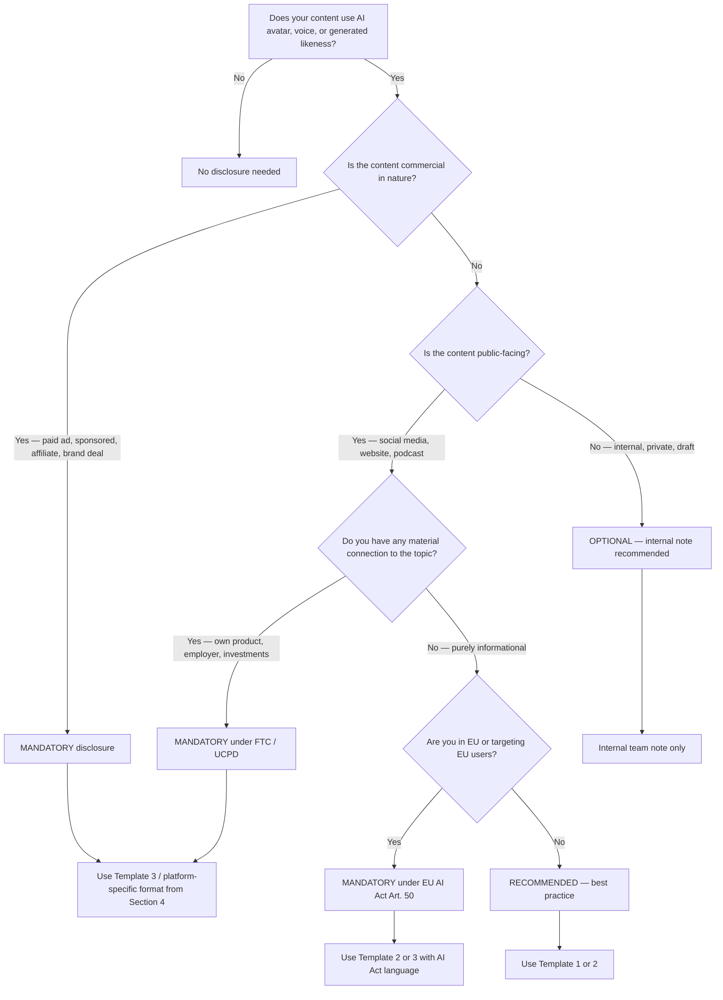

# AI Video Disclosure — Global Reference

> **Disclaimer:** This document is for general informational purposes only. It is **NOT legal advice**. AI disclosure laws, FTC/ASA guidance, and platform policies evolve rapidly and vary by jurisdiction, industry, and business model. Always consult a qualified attorney licensed in the relevant jurisdiction before launching campaigns that use AI-generated voice, likeness, or content.

> **Reference file** — Load when using `22-ai-avatar-pb-global`, `23-voice-clone-pb-global`, `24-video-ai-batch-global`, or any personal brand skill that produces AI-generated content.
> Last updated: 2026-Q1. Review cadence: every 6 months.

---

## 1. Legal Framework By Region

### United States — FTC Endorsement Guides (16 CFR Part 255)

The FTC's Endorsement Guides require **disclosure of any material connection** between an endorser and the advertiser. As of 2023 revisions and 2024-2026 FTC guidance, this explicitly covers AI-generated endorsements, synthetic testimonials, and deepfake-style content.

- **Material connection** = anything that could affect the weight of the endorsement (payment, free product, employment, family relationship, AI-generated likeness of a paid spokesperson, etc.)
- **Clear and conspicuous** standard: a reasonable consumer must notice the disclosure without effort
- **AI-specific guidance (FTC 2024):** Fake AI-generated reviews and testimonials are deceptive practices under Section 5 of the FTC Act. Civil penalties up to $51,744 per violation (2025 inflation-adjusted).
- **In-stream disclosure required** for sponsored content on TikTok, YouTube, Instagram, etc.
- **Influencer disclosure:** #ad, #sponsored, "Paid partnership with [Brand]" — placed where the viewer cannot miss it

**Resource:** FTC.gov "Disclosures 101 for Social Media Influencers"

### European Union — AI Act Article 50 (effective Aug 2024 / phased)

The EU AI Act establishes the world's first comprehensive AI regulation. Article 50 addresses transparency obligations.

- **Article 50(2):** Providers of generative AI systems must ensure outputs are **marked as artificially generated** in a machine-readable format (e.g., watermark, metadata)
- **Article 50(4):** Deployers of AI systems that generate or manipulate image, audio, or video content constituting **deepfakes must disclose** that the content has been artificially generated
- **Exception:** Authorized criminal investigations; artistic/satirical works (but still must disclose in a manner that does not hamper enjoyment)
- **Scope:** Applies to anyone placing AI systems on the EU market or whose output is used in the EU, regardless of where the provider is established
- **Penalties:** Up to EUR 15M or 3% of global annual turnover for general transparency violations; up to EUR 35M or 7% for prohibited practices
- **Disclosure standard:** Must be "clear and distinguishable at the latest at the time of the first interaction or exposure"

### European Union — Unfair Commercial Practices Directive (UCPD, 2005/29/EC)

Independent of the AI Act, the UCPD prohibits misleading commercial practices across all 27 EU member states.

- **Article 6:** Misleading actions — false information about main characteristics, results, endorsements
- **Article 7:** Misleading omissions — failing to disclose material information including the commercial intent
- **Annex I (blacklist):** Always prohibited practices including "Falsely claiming or creating the impression that the trader is not acting for purposes relating to his trade"
- **AI implications:** Undisclosed AI-generated testimonials, fake AI influencers presented as real, or AI avatars without disclosure of artificial nature can fall under misleading practices

### European Union — GDPR (voice and face data)

Under GDPR, biometric data including voice patterns and facial features qualify as **personal data** (and **special category data** under Article 9 when used for unique identification).

- **Voice cloning consent:** Cloning a real person's voice requires lawful basis under Article 6, typically explicit consent (Article 9(2)(a) for biometric identification)
- **Face/likeness:** Same standard — written consent recommended, with the right to withdraw at any time
- **Documentation:** Maintain a consent log including scope (which content, which campaigns, which platforms), duration, withdrawal mechanism
- **Cross-border transfer:** If AI tool processes data outside EU/EEA, ensure SCCs or adequacy decision applies
- **Data Protection Impact Assessment (DPIA):** Likely required for systematic voice/face cloning operations

### Southeast Asia

| Country | Body | Key Rule |
|---------|------|----------|
| **Singapore** | ASAS (Advertising Standards Authority of Singapore) | 2024 guidelines: clearly disclose AI-generated endorsements; PDPA applies to voice/face data |
| **Indonesia** | AKARI / KPI | Broadcasting law requires disclosure of digitally manipulated content in commercial broadcasts |
| **Malaysia** | MCMC + ASA Malaysia | Content Code requires honesty; AI-generated content in ads should be disclosed |
| **Thailand** | NBTC + Consumer Protection Act | PDPA (similar to GDPR) governs voice/face data; misleading ads prohibited |
| **Philippines** | DTI + Data Privacy Act | Consumer Act prohibits deceptive sales practices; AI disclosure recommended |
| **Vietnam** | Ministry of Information and Communications (MIC) | Decree 147/2024 — AI-generated content for commercial advertising must indicate origin |

### Latin America

| Country | Body | Key Rule |
|---------|------|----------|
| **Brazil** | CONAR (Conselho Nacional de Autorregulamentacao Publicitaria) | 2024 guidelines on AI in advertising require identification; LGPD governs voice/face data |
| **Mexico** | PROFECO + IFT | Consumer protection law prohibits misleading ads; emerging AI disclosure norms |
| **Argentina** | AAIP + CONARP | AAIP enforces data protection; CONARP recommends disclosure of AI-generated endorsements |
| **Chile** | SERNAC | Consumer rights law applies; new data protection law (effective 2026) aligns with GDPR |
| **Colombia** | SIC | Habeas Data law governs biometric data; misleading advertising prohibited |

### Other Major Markets

- **UK:** ASA CAP Code rules 3.1 (misleading) and 3.7 (material information) — AI ads must be clearly identifiable. UK GDPR mirrors EU GDPR for biometric data.
- **Canada:** Competition Act prohibits false/misleading representations; PIPEDA covers biometric data; CRTC oversees broadcasting
- **Australia:** ACCC enforces Australian Consumer Law (false/misleading conduct); Privacy Act 1988 covers biometric information
- **India:** ASCI guidelines + Consumer Protection Act 2019 + DPDP Act 2023 (biometric data)

---

## 2. Three-Tier Disclosure Rules

### MANDATORY (always disclose)

- **Paid advertising** using AI avatar, AI voice, or AI-generated likeness
- **Sponsored content** where a creator received compensation, free products, or other consideration
- **Affiliate marketing** with revenue share, commissions, or referral fees
- **Brand partnerships** of any form (long-term contracts, gifting, "ambassador" programs)
- **Comparative advertising** featuring AI representations of competitors or their products
- **Health, financial, or legal claims** delivered via AI avatar (additional disclaimers required)

### RECOMMENDED (best practice)

- **Organic content** with any material connection (your own product, employer, investments)
- **Educational/informational content** on a topic where you have undisclosed financial interest
- **Personal brand content** building thought leadership when using AI to scale production
- **B2B content** where audience may assume direct human delivery
- **Long-form content** (podcasts, courses, webinars) where AI generation could be missed

### OPTIONAL (use judgment)

- **Pure entertainment / parody** clearly labeled as such (e.g., satire account)
- **Internal team training** not distributed externally
- **Concept tests and A/B drafts** never published
- **Private communications** within a defined small group with prior disclosure
- **Artistic works** clearly framed as creative AI exploration

---

## 3. When To NEVER Use AI Avatar

### Impersonation of real people without consent
Violates: defamation law, right of publicity (US states), Article 8 ECHR (privacy), GDPR (biometric data), copyright on voice/likeness in many jurisdictions.
**Risk:** Civil damages, criminal fraud charges, permanent platform bans.

### Political deepfakes
Many jurisdictions (US states like Texas, California; EU under AI Act prohibited practices Article 5; UK Online Safety Act) now prohibit or heavily restrict synthetic political content.
**Risk:** Criminal penalties, election law violations, platform-wide bans, civil liability.

### Fake testimonials and reviews
Violates: FTC Act Section 5, EU UCPD Annex I, consumer protection acts in nearly every jurisdiction.
**Risk:** Civil penalties up to USD 51,744 per violation (FTC); EUR-denominated fines under UCPD; class action exposure.

### Unauthorized medical, health, or financial advice
Beyond AI disclosure, these often require licensed professional involvement.
**Risk:** Regulatory action by FDA, FTC, SEC, MHRA, EFSA, or local equivalents; possible criminal liability for unlicensed practice.

### Content featuring minors without verifiable guardian consent
GDPR Article 8, COPPA (US), Online Safety Act (UK), and similar laws impose elevated protections.

---

## 4. Per-Platform Disclosure Templates

### TikTok

- **In-video text overlay** (first 3 seconds, contrasting color, minimum 24px equivalent): "AI-generated voice and avatar"
- **Caption disclosure** (first line, before "more"): "This video uses AI avatar technology. #AIgenerated #SyntheticMedia"
- **TikTok AI-generated content label:** Use the built-in toggle in Post Settings when content is significantly altered or fully AI-generated
- **Profile bio note** (optional but recommended for AI-heavy accounts): "Some videos use AI avatar. Authentic content by [Your Name]"

### YouTube

- **Description box** (first paragraph, before fold): 
  ```
  Note: This video was created with AI avatar technology. The voice and likeness are based on the creator's verified consent. All content is reviewed and approved by [Your Name] before publication.
  ```
- **YouTube Studio "Altered content" disclosure:** Required toggle in Upload > Details for synthetic or significantly altered content (effective March 2024)
- **End screen note** (last 5 seconds): "AI-generated avatar | Content by [Your Name]"
- **Community Guidelines label:** Use the AI-generated content tag in YouTube's metadata

### Meta — Facebook and Instagram

- **Ad disclosure** (required for paid ads): Include disclosure in primary text within the first 125 characters
  ```
  Ad uses AI-generated voice and avatar. Content reflects [Brand]'s actual products and services.
  ```
- **Post caption** (organic, last paragraph): 
  ```
  This content uses AI avatar technology. Voice and likeness based on [Name]'s consent.
  ```
- **Story sticker:** Use the "Made with AI" text sticker
- **Reels:** Add in-video text overlay matching TikTok format
- **Meta AI-generated label:** Use the platform's built-in labeling when uploading clearly synthetic content

### LinkedIn

- **Post note** (final paragraph in italics):
  ```
  *Note: This video uses AI avatar technology to streamline content production. The opinions and analysis are mine.*
  ```
- **Featured section / About:** Add a line in your profile About section if AI content represents a substantial portion of your feed

### Personal Website / Blog

- **Footer disclaimer** on every page with AI content:
  ```
  Some content on this site is produced with AI avatar and voice technology. All content is reviewed and approved by [Your Name] prior to publication.
  ```
- **About page** dedicated section:
  ```
  About this site's technology: I use AI avatar and AI voice as production tools. All editorial decisions, opinions, and content direction are mine. AI assists with delivery format only.
  ```

### Podcast Platforms (Spotify, Apple Podcasts)

- **Show description:** Note in the standing description if voice is AI-generated
- **Episode notes** (first line): "This episode uses AI voice technology. Authentic script by [Host Name]."

---

## 5. Five Disclosure Copy Templates

### Template 1 — Short (overlay, story, character-limited)
```
AI-generated voice and avatar
```

### Template 2 — Medium (post caption, video description)
```
This content uses AI Avatar technology. Voice and likeness based on [Name]'s consent. Content authored and reviewed by [Name].
```

### Template 3 — Long (paid advertising, compliance-heavy industries)
```
NOTICE: This advertisement uses AI Avatar and AI Voice technology to generate the visual presentation. The depicted likeness is based on actual photography of [Name] used with consent. All claims, product information, and recommendations reflect the actual products and services of [Brand]. Content has been reviewed and approved by [Name] prior to publication.
```

### Template 4 — English standard (international audiences)
```
This content was created with AI avatar technology. Voice and likeness are based on a real person with verified consent. All content is reviewed and approved by the creator prior to publication.
```

### Template 5 — Bilingual (EN + local language note)
```
This video uses AI technology | Authentic content by [Your Name]
[Local language repetition of the same message]
```
Example for Spanish: `This video uses AI technology | Este video utiliza tecnologia de IA | Contenido autentico por [Nombre]`

---

## 6. Decision Tree — "Do I Need To Disclose?"



---

## 7. Update Log

- **2026-Q1:** Initial global reference released. EU AI Act Article 50 phased application details added.
- **2025-Q3 (planned):** Update with first wave of EU AI Act enforcement decisions and FTC AI-specific rulemaking outcomes.
- **Review cadence:** Every 6 months or upon major regulatory change (EU AI Act milestones, FTC final rules, major national AI laws).
