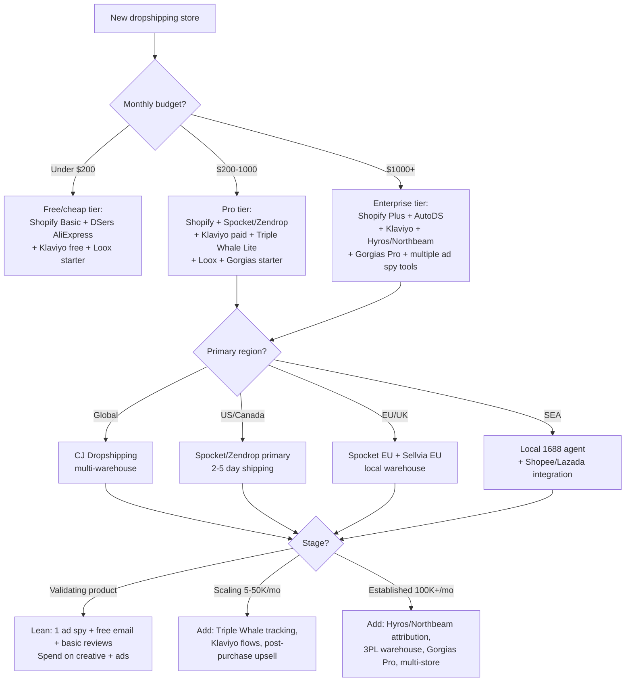

# Dropshipping Tools — Global Stack Reference

> Last updated: 2026-Q1. Review cadence: every 3 months. Pricing in USD unless noted; verify on vendor websites — pricing changes frequently. Affiliate disclosure: links not affiliated; recommendations based on operational fit.

---

## 1. Decision Tree — Picking Your Starter Stack

### Quick decision rules
- **Under $5K/mo revenue:** Don't pay for advanced attribution; Shopify reports are enough
- **$5-50K/mo:** Add Klaviyo + Triple Whale; reviews are critical (Loox/Judge.me)
- **$50K+/mo:** Need real attribution (Hyros/Northbeam) — Meta + Google + TikTok numbers diverge
- **$200K+/mo:** Move from drop to 3PL hybrid; AutoDS or branded supplier; Gorgias Pro

---

## 2. Tool Deep Dive

### Stores (E-commerce platforms)

#### Shopify
- **Pricing:** Basic $39/mo, Shopify $105/mo, Advanced $399/mo, Plus from $2,500/mo (2026)
- **Pros:** Largest app ecosystem (10K+ apps), reliable, fast checkout, Shop Pay accelerator, native global markets feature, B2B catalog on Plus
- **Cons:** Transaction fees if not using Shopify Payments (0.5-2% extra), monthly cost, Liquid templating limits flexibility
- **Best for:** 95% of dropshippers. Default choice.

#### WooCommerce
- **Pricing:** Free plugin; hosting ~$10-50/mo (SiteGround, Kinsta), themes $50-200, plugins $50-400
- **Pros:** Full control, no transaction fees, unlimited customization, owns data, WordPress ecosystem
- **Cons:** Self-hosted = security/maintenance burden, slower for non-technical users, plugin compatibility issues
- **Best for:** Technical operators, content-heavy stores (blog + commerce), brands wanting cost control at scale

#### Wix
- **Pricing:** Light $17/mo, Core $29/mo, Business $36/mo, Business Elite $159/mo
- **Pros:** Easiest builder, beautiful templates, all-in-one
- **Cons:** Smaller dropshipping app ecosystem, harder to scale, transaction fees on lower plans
- **Best for:** Solopreneurs, single-product stores, beginners overwhelmed by Shopify

---

### Suppliers / Sourcing

#### AliExpress / DSers
- **Pricing:** AliExpress free; DSers free up to 3 stores / 75 products, $19.90/mo Advanced, $49.90/mo Pro
- **Pros:** Huge catalog, free, easy import to Shopify
- **Cons:** 15-30 day shipping (without ePacket killed), unreliable suppliers, generic packaging, quality variance
- **Best for:** Validating products only — should not be long-term solution

#### CJ Dropshipping
- **Pricing:** Free signup; pay per order. App $0/mo. Premium subscriptions for advanced features.
- **Pros:** Multiple global warehouses (US, EU, AU, JP), 2-7 day shipping in major markets, white-label options, sourcing agents available, custom packaging, video creation services
- **Cons:** Inventory varies by warehouse, customer service variable, learning curve
- **Best for:** Scaling beyond AliExpress, need faster shipping or branded packaging

#### Spocket
- **Pricing:** Free 14-day trial; Starter $39.99/mo, Pro $59.99/mo, Empire $99.99/mo, Unicorn $299/mo
- **Pros:** US/EU suppliers (60-70% inventory), 2-7 day shipping, branded invoicing, premium products
- **Cons:** Higher COGS than AliExpress, smaller catalog, limited categories
- **Best for:** US/EU stores wanting fast shipping and quality control

#### Zendrop
- **Pricing:** Free starter; Pro $79/mo, Plus $199/mo
- **Pros:** US warehouse fulfillment, automated processes, custom branding, integration with Shopify, blind dropshipping
- **Cons:** US-focused (less ideal for EU/SEA), some users report inventory sync issues
- **Best for:** US-focused dropshippers ready to scale

#### AutoDS
- **Pricing:** Trial $1; Standard $26.90/mo (200 products), Advanced $59.90/mo (1K products), Pro $79.90/mo, Enterprise custom
- **Pros:** Multi-supplier (AliExpress, Amazon, Walmart, CJ, Costco, more), automated price/stock monitoring, automated order fulfillment, AI product research
- **Cons:** Steep learning curve, marketplace dropshipping has TOS risks (Amazon/Walmart)
- **Best for:** Multi-marketplace operators, eBay/Facebook Marketplace dropshippers, automation-focused operators

---

### Ad Spy (Competitor Research)

#### Minea
- **Pricing:** Lite $49/mo, Premium $99/mo, Business $399/mo
- **Pros:** Meta + TikTok + Pinterest spy, search by engagement metrics, Shopify store database, influencer lookup
- **Cons:** TikTok data sometimes lags, EU/global emphasis (less granular for some niches)
- **Best for:** Multi-platform research, EU dropshippers

#### PiPiAds
- **Pricing:** VIP $77/mo, VIP Plus $155/mo, Pro $263/mo (annual discounts ~30%)
- **Pros:** Largest TikTok ad library, country/spend filters, store URL extraction, daily fresh ads
- **Cons:** TikTok-only (no Meta), some data gaps in non-US regions
- **Best for:** TikTok-first dropshippers

#### AdSpy
- **Pricing:** $149/mo (no free tier)
- **Pros:** Comprehensive Meta library since 2014, Instagram + Facebook, 200M+ ads indexed, advanced filters (text, demographic, country)
- **Cons:** Expensive, dated UI, no TikTok
- **Best for:** Serious Meta-first operators, agencies

#### BigSpy
- **Pricing:** Free basic; Pro $99/mo, Pro Plus $199/mo, VIP Enterprise $359/mo
- **Pros:** 1B+ ads across Meta, TikTok, Twitter, YouTube, Pinterest, multi-platform single tool, generous free tier
- **Cons:** Some platforms more shallow than dedicated tools, search relevance varies
- **Best for:** Generalist research, beginners, agencies covering many platforms

---

### Tracking / Attribution

#### Triple Whale
- **Pricing:** Lite $129/mo, Pro $349/mo, Pro+ $799/mo (volume tiers above)
- **Pros:** Native Shopify, Meta + Google + TikTok dashboards, post-purchase survey for self-reported attribution, AI insights ("Moby"), creative analytics
- **Cons:** Pricey at low revenue, Shopify-only, some attribution still uses platform-reported data
- **Best for:** Shopify dropshippers $50K+/mo wanting unified dashboards

#### Hyros
- **Pricing:** Custom — typically $499-2,000/mo based on ad spend volume
- **Pros:** Server-side attribution (cookie-less), best for high-spend operators ($50K+/mo ad spend), call tracking, pixel improvements for Meta/Google
- **Cons:** Expensive, technical setup, sales-led (no self-serve), focused on info/coaching/agencies
- **Best for:** Info marketers, coaches, agencies, high-spend e-com brands

#### Northbeam
- **Pricing:** Custom — entry typically $1,000+/mo based on revenue
- **Pros:** ML-driven multi-touch attribution, marketing mix modeling (MMM), creative analytics, headless commerce friendly
- **Cons:** Enterprise-priced, requires meaningful spend/revenue to ROI
- **Best for:** $1M+/year DTC brands with multi-channel spend

---

### Reviews / Social Proof

#### Loox
- **Pricing:** Beginner $9.99/mo, Scale $34.99/mo, Unlimited $299/mo (volume-based)
- **Pros:** Photo/video reviews, automated review request emails, beautiful display widgets, referral feature
- **Cons:** Shopify-only, photo emphasis means lower review volume than text-only
- **Best for:** DTC brands prioritizing visual social proof

#### Judge.me
- **Pricing:** Free (with Judge.me branding); Awesome $15/mo
- **Pros:** Excellent free tier, fast performance, photo/video reviews, Q&A, Google Shopping integration
- **Cons:** Free tier branding, fewer customization options than Loox/Stamped
- **Best for:** Cost-conscious operators, beginners, stores with high review volume

#### Stamped
- **Pricing:** Lite free; Basic $29/mo, Premium $79/mo, Business $279/mo, Enterprise custom
- **Pros:** Reviews + Q&A + loyalty + referrals + visual UGC in one platform, multi-store
- **Cons:** More expensive at scale, complex feature set
- **Best for:** Brands wanting consolidated post-purchase experience

---

### Email & SMS

#### Klaviyo
- **Pricing:** Free up to 250 contacts; Email scales by list size (e.g., 5K contacts ~$100/mo); Email + SMS combined plans available
- **Pros:** Best DTC ecosystem, deep Shopify integration, predictive analytics, segmentation depth, abandoned cart/post-purchase/winback flows pre-built
- **Cons:** Cost grows fast with list size, learning curve for advanced flows
- **Best for:** Default for any serious DTC store

#### Omnisend
- **Pricing:** Free up to 250 contacts/500 emails per month; Standard from $16/mo, Pro from $59/mo
- **Pros:** Email + SMS + push in one platform, cheaper at small scale than Klaviyo, simpler UI
- **Cons:** Less mature ecosystem than Klaviyo, fewer advanced segmentation options
- **Best for:** Small-to-mid stores, beginners, multi-channel needs at one price

---

### Customer Service

#### Gorgias
- **Pricing:** Starter $10/mo (50 tickets), Basic $60/mo (300), Pro $360/mo (2K), Advanced $900/mo (5K), Enterprise custom
- **Pros:** Native Shopify (order data in tickets), AI auto-responses, macros, multi-channel (email, chat, SMS, social DMs), revenue tracking from support
- **Cons:** Per-ticket pricing penalizes growth, expensive at scale
- **Best for:** DTC stores wanting Shopify-native support helpdesk

#### Tidio
- **Pricing:** Free tier (50 conversations); Starter $29/mo, Growth $59/mo, Plus from $749/mo
- **Pros:** Live chat + chatbots + email + tickets, AI automation, easy setup
- **Cons:** Less Shopify-native than Gorgias, AI chatbot quality varies
- **Best for:** Small stores, chat-heavy support, lean teams

#### Zendesk
- **Pricing:** Suite Team $69/agent/mo, Suite Growth $115/agent/mo, Suite Professional $149/agent/mo, Enterprise custom
- **Pros:** Most mature platform, scales to enterprise, Sunshine CRM, deep integrations
- **Cons:** Per-agent pricing expensive, less e-commerce-specific than Gorgias, complex setup
- **Best for:** Multi-brand operators, enterprise volume, omnichannel beyond e-commerce

---

## 3. Cost Breakdown by Tier

### Starter Tier ($100-200/mo total)
| Tool | Cost |
|------|------|
| Shopify Basic | $39 |
| DSers AliExpress (free) | $0 |
| Klaviyo (free up to 250) | $0 |
| Judge.me (free) | $0 |
| Tidio (free tier) | $0 |
| BigSpy (free basic) | $0 |
| Domain | $1 |
| **Total** | **$40** |

Add 1-2 paid: Shopify domain $1, basic theme $80 one-time, Loox $10. Real total ~$50-70/mo + ad spend.

### Scale Tier ($500-1,000/mo)
| Tool | Cost |
|------|------|
| Shopify | $105 |
| Spocket Pro | $60 |
| Klaviyo (5K contacts) | $100 |
| Loox Scale | $35 |
| Triple Whale Lite | $129 |
| Gorgias Basic | $60 |
| Minea Premium | $99 |
| Misc apps (upsells, currency, popups) | $50-100 |
| **Total** | **$640-690** |

### Established Tier ($2,000+/mo)
| Tool | Cost |
|------|------|
| Shopify Plus | $2,500 |
| AutoDS Pro | $80 |
| Klaviyo (50K contacts + SMS) | $700 |
| Triple Whale Pro+ or Northbeam | $799-1,500 |
| Hyros (volume tier) | $1,000+ |
| Gorgias Pro | $360 |
| Multiple ad spy (PiPiAds + AdSpy) | $226 |
| Stamped Premium | $79 |
| 3PL warehousing | $1,500-5,000 |
| **Total** | **$7,200+** |

Note: Established tier excludes ad spend, COGS, and labor.

---

## 4. Tool Stack Examples by Experience

### Beginner stack (validating, <$10K/mo)
- Shopify Basic
- DSers + AliExpress
- Klaviyo (free)
- Judge.me (free)
- BigSpy (free basic) for ad research
- Vitals all-in-one app ($30/mo) for upsells/popups/currency
- **Monthly tools cost: ~$70-100**

### Intermediate stack ($10-50K/mo)
- Shopify ($105)
- Spocket or Zendrop ($60-80)
- Klaviyo paid ($100-200)
- Loox ($35)
- Gorgias Basic ($60)
- Triple Whale Lite ($129) once at $30K+/mo
- Minea ($99) or PiPiAds ($77)
- **Monthly tools cost: ~$600-800**

### Advanced stack ($100K+/mo)
- Shopify Plus ($2,500) or scaled Shopify Advanced ($399)
- AutoDS Pro + dedicated sourcing agent
- Klaviyo + SMS ($500-1,500)
- Hyros or Northbeam ($1,000-2,000)
- Gorgias Pro ($360-900)
- Stamped Premium ($79-279)
- Multiple ad spy tools
- 3PL transition (ShipBob, ShipMonk, or branded warehouse)
- Custom packaging supplier
- **Monthly tools cost: $5,000-10,000+** (excluding 3PL/COGS)

---

## 5. Tool Selection Watchpoints

1. **Avoid app bloat** — every Shopify app adds load time. Audit quarterly.
2. **Don't pay for attribution at <$30K/mo** — Shopify analytics + Meta/Google reports are enough early
3. **Reviews matter from day 1** — install free Judge.me on launch; switch to Loox at $10K/mo if photos help
4. **Klaviyo beats every other email tool for DTC** — switch from Mailchimp ASAP
5. **Test 2-3 ad spy tools** — each has gaps; the "best" depends on your niche
6. **CJ + Spocket combo** is often optimal — CJ for global, Spocket for US fast-ship SKUs
7. **Watch transaction fee math** — Shopify Payments saves the 2% extra; Stripe outside means 2% Shopify fee

---

## Update Log
- 2026-01: Initial release for Global Cluster v2.5.0. Klaviyo pricing updated. Shopify Plus minimum confirmed $2,500. Triple Whale tier names current. AutoDS pricing reflects 2026 plans. Sellvia EU mention added for EU operators.
