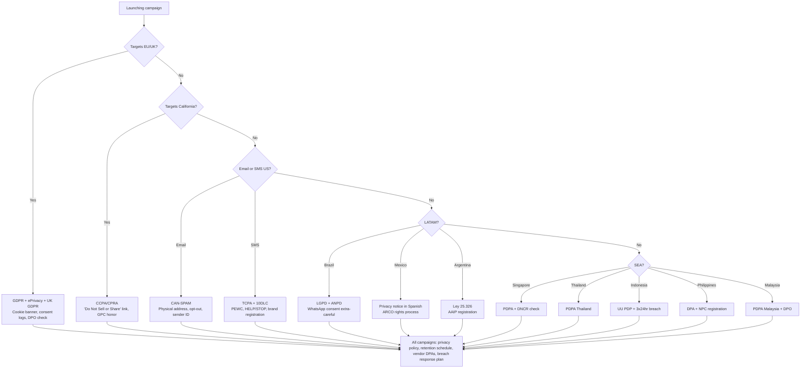

# Global Marketing Legal & Privacy Compliance

> **Disclaimer:** This document is for general informational purposes only. It is **not legal advice**. Privacy and marketing laws change frequently and vary by jurisdiction, industry, and business model. Always consult a qualified attorney licensed in the relevant jurisdiction before launching campaigns, processing personal data, or finalizing privacy policies.

> Last updated: 2026-Q1. Review cadence: every 6 months.

---

## 1. GDPR — General Data Protection Regulation (EU/EEA + UK GDPR)

**Applies to:** Any business processing personal data of individuals located in the EU/EEA, regardless of where the business is established. UK GDPR mirrors GDPR for UK data subjects.

### Seven principles (Article 5)
1. **Lawfulness, fairness, transparency** — process lawfully and inform data subjects
2. **Purpose limitation** — collect for specified purposes only
3. **Data minimization** — process only what is necessary
4. **Accuracy** — keep data accurate and up to date
5. **Storage limitation** — retain only as long as needed
6. **Integrity and confidentiality** — secure against unauthorized access
7. **Accountability** — controller must demonstrate compliance

### Lawful basis for processing (Article 6)
You must rely on at least one:
- (a) **Consent** — freely given, specific, informed, unambiguous; opt-in; easy to withdraw
- (b) **Contract performance** — necessary to fulfill a contract with the data subject
- (c) **Legal obligation** — required by law
- (d) **Vital interests** — to protect life
- (e) **Public task** — official authority
- (f) **Legitimate interests** — balanced against data subject rights (cannot override fundamental rights)

For marketing, **consent (a)** or **legitimate interests (f)** are most common. ePrivacy Directive ("cookie law") requires opt-in consent for non-essential cookies and tracking pixels regardless of GDPR basis.

### Consent requirements
- **Granular:** Separate consents for separate purposes (e.g., analytics vs. advertising vs. email)
- **Active:** Pre-ticked boxes are invalid (CJEU Planet49 ruling)
- **Documented:** Maintain consent logs (timestamp, version of policy, what was agreed)
- **Withdrawable:** As easy to withdraw as to give
- **Soft opt-in (PECR/UK):** Existing customers may receive marketing for similar products if they were told and given an opt-out at collection

### Data subject rights (Articles 15-22)
1. **Right to access** (Art 15) — copy of their data
2. **Right to rectification** (Art 16) — correct inaccurate data
3. **Right to erasure / "right to be forgotten"** (Art 17) — delete on request
4. **Right to restrict processing** (Art 18) — pause processing
5. **Right to data portability** (Art 20) — machine-readable export
6. **Right to object** (Art 21) — to direct marketing always; to legitimate interests with grounds
7. **Rights related to automated decision-making and profiling** (Art 22)

Response deadline: **1 month** (extendable by 2 months for complex requests). Free of charge except for repeated/excessive requests.

### Data Protection Officer (DPO)
Required if: (a) public authority; (b) core activities involve large-scale regular monitoring; (c) core activities process special categories at scale. Otherwise voluntary.

### Penalties
- Tier 1: up to **€10M or 2%** of annual global turnover (whichever is higher) — administrative violations
- Tier 2: up to **€20M or 4%** of annual global turnover (whichever is higher) — violations of principles, data subject rights, transfers

### International transfers — Schrems II + SCCs
After Schrems II (CJEU 2020), transfers to "third countries" (e.g., US) require:
- **Standard Contractual Clauses (SCCs)** — 2021 modular SCCs from European Commission
- **Transfer Impact Assessment (TIA)** — analyze destination country surveillance laws
- **Supplementary measures** — encryption, pseudonymization, contractual safeguards
- **EU-US Data Privacy Framework (DPF)** — replaced Privacy Shield; valid for certified US importers as of July 2023

UK has its own International Data Transfer Agreement (IDTA) and UK Addendum to EU SCCs.

---

## 2. CCPA / CPRA — California Consumer Privacy Act / Privacy Rights Act

**Applies to:** For-profit businesses doing business in California meeting any of: $25M+ annual revenue; buy/sell/share personal info of 100,000+ CA consumers/households; or 50%+ revenue from selling/sharing personal info.

### Personal information definition
Broad — includes identifiers, commercial info, biometrics, internet activity, geolocation, professional info, education, inferences. Excludes publicly available info and aggregated/de-identified data.

### Consumer rights (CPRA, effective Jan 2023)
- **Right to know** what personal info is collected, used, shared, sold
- **Right to delete** personal info
- **Right to correct** inaccurate info (CPRA addition)
- **Right to opt-out** of sale OR sharing for cross-context behavioral advertising
- **Right to limit** use of sensitive personal info (CPRA addition)
- **Right to non-discrimination** for exercising rights
- **Right to data portability**

### "Do Not Sell or Share My Personal Information" link
Required on homepage if business sells/shares personal info. Global Privacy Control (GPC) signal must be honored as a valid opt-out.

### Penalties
- **$2,500 per unintentional violation**
- **$7,500 per intentional violation or violation involving minors**
- Private right of action for data breaches involving non-encrypted personal info: $100-$750 per consumer per incident (or actual damages)

### Other US state laws (similar but distinct)
Virginia (VCDPA), Colorado (CPA), Connecticut (CTDPA), Utah (UCPA), Texas (TDPSA), Oregon, Montana, Iowa, Indiana, Tennessee, Delaware, New Jersey, New Hampshire, Kentucky, Maryland, Minnesota, Rhode Island. As of 2026, ~20 states have comprehensive privacy laws — track via IAPP US State Privacy Tracker.

---

## 3. CAN-SPAM Act (US Email Marketing)

**Applies to:** Commercial electronic mail messages to US recipients.

### Required for every commercial email
1. **Don't use false or misleading header information** — "From," "To," "Reply-To," routing must accurately identify sender
2. **Don't use deceptive subject lines** — must reflect message content
3. **Identify the message as an ad** — disclosure can be subtle but must be present
4. **Tell recipients where you're located** — valid physical postal address (PO Box is OK)
5. **Tell recipients how to opt out** — clear, conspicuous mechanism
6. **Honor opt-outs promptly** — within **10 business days**; opt-out must work for at least 30 days after sending
7. **Monitor what others do on your behalf** — you remain liable for ESPs/agencies you hire

### Key difference from GDPR
CAN-SPAM is **opt-out** — you can email US recipients without prior consent provided you honor opt-outs and meet requirements. GDPR is **opt-in** for EU recipients.

### Penalties
- Up to **$50,120 per violation** (each non-compliant email is a separate violation, 2024 inflation-adjusted)
- Additional penalties for aggravated violations (harvesting, dictionary attacks, false header info)
- Criminal penalties possible for fraud, unauthorized access, falsified registration

---

## 4. TCPA — Telephone Consumer Protection Act (US SMS/Calls)

**Applies to:** Marketing calls and texts to US wireless and landline numbers, including SMS.

### Consent requirements
- **Marketing SMS:** Requires **prior express written consent** (PEWC) — clear and conspicuous disclosure that consumer agrees to receive marketing texts and that consent is not required for purchase
- **Informational/transactional SMS** (e.g., shipping updates, account alerts): Requires prior express consent — can be oral, written, or via dialed-in confirmation
- **Autodialed calls:** Same standards apply

### Required SMS disclosures
- Sender identity in message
- Frequency disclosure ("up to 4 msgs/month")
- Pricing ("Msg & data rates may apply")
- HELP and STOP keyword instructions
- Link to terms and privacy policy

### Penalties
- **$500 per violation** (negligent)
- **$1,500 per violation** (willful/knowing)
- Private right of action — class actions are common, settlements often $5M-$50M

### CTIA + carrier rules
Beyond TCPA, US carriers (T-Mobile, AT&T, Verizon) require A2P 10DLC registration for business SMS. Non-compliant traffic is filtered. Throughput tied to brand vetting (Standard, Low, High trust scores).

### National Do Not Call (DNC) Registry
Marketing calls to DNC-registered numbers prohibited unless prior business relationship (18 months) or written consent. Same FTC penalties apply.

---

## 5. PDPA Singapore — Personal Data Protection Act 2012 (amended 2020)

**Applies to:** Organizations collecting/using/disclosing personal data in Singapore.

### Core obligations
- **Consent obligation** — must obtain consent (with deemed consent and legitimate interests exceptions added in 2020 amendments)
- **Purpose limitation** — only purposes communicated
- **Notification** — inform individuals of purposes
- **Access and correction** — respond within 30 days
- **Accuracy, protection, retention limitation, transfer limitation, openness, accountability**

### DNC Registry (DNCR)
Telemarketing to Singapore numbers requires DNCR check. Penalties up to **SGD 1M** for telemarketing violations; data protection breaches up to **10% of annual turnover or SGD 1M (whichever higher)** under 2022 amendments.

### Data Protection Officer required for all organizations.

---

## 6. PDPA Thailand — Personal Data Protection Act B.E. 2562 (2019, fully effective 2022)

**Applies to:** Data controllers/processors in Thailand or processing data of subjects in Thailand.

### Modeled on GDPR — similar 7 principles, lawful bases, data subject rights.

### Key differences
- Explicit consent often required even where GDPR allows legitimate interests
- Cross-border transfers require adequacy or appropriate safeguards
- DPO required for large-scale, sensitive, or systematic monitoring
- Penalties: criminal (up to **THB 5M + 1 year imprisonment**) and administrative (up to **THB 5M**)

---

## 7. UU PDP Indonesia — Personal Data Protection Law (Law No. 27 of 2022)

**Applies to:** Personal data controllers/processors with subjects in Indonesia (extraterritorial).

### Key provisions
- 8 lawful bases similar to GDPR (consent, contract, legal obligation, vital interest, public interest, legitimate interest)
- 8 data subject rights including access, correction, deletion, portability, objection
- Mandatory breach notification: **3x24 hours** to authority and data subjects
- DPO required for public bodies, large-scale processing, or sensitive data

### Cross-border transfer
Permitted to countries with equivalent protection, or with adequate safeguards (BCRs, SCCs equivalent).

### Penalties
- Administrative: up to **2% of annual revenue**
- Criminal: imprisonment up to **6 years** + fines up to **IDR 6 billion** for unlawful collection/disclosure

Effective in full as of October 2024 with 2-year transition period.

---

## 8. DPA Philippines — Data Privacy Act of 2012 (R.A. 10173)

**Applies to:** Personal information controllers/processors in or processing data of Philippines subjects.

### Aligned with APEC Privacy Framework + GDPR concepts.

### Key requirements
- Registration with National Privacy Commission (NPC) for certain data processing
- DPO required for entities processing personal data
- Privacy Impact Assessments for high-risk processing
- Breach notification: **72 hours** if likely to result in serious harm

### Penalties
- Imprisonment up to **6 years** + fines up to **PHP 5M** depending on offense (unauthorized processing, malicious disclosure, concealment of breach)

---

## 9. PDPA Malaysia — Personal Data Protection Act 2010 (amended 2024)

**Applies to:** Commercial transactions involving personal data in Malaysia.

### 7 principles aligned with OECD: General, Notice and Choice, Disclosure, Security, Retention, Data Integrity, Access.

### 2024 amendments (effective 2025-2026 phased)
- Mandatory data breach notification
- Mandatory DPO appointment for certain controllers
- Cross-border transfer rules tightened
- Penalties increased: up to **MYR 1M + 3 years imprisonment**

---

## 10. LGPD Brazil — Lei Geral de Proteção de Dados (Law 13.709/2018, effective 2020)

**Applies to:** Processing of personal data in Brazil or of subjects in Brazil, regardless of where the business is located.

### 10 lawful bases (broader than GDPR)
Consent, contract, legal obligation, public administration, research, regular exercise of rights, vital interests, health protection, legitimate interests, credit protection.

### Data subject rights (9 rights)
Confirmation of processing, access, correction, anonymization/blocking/deletion, portability, deletion of consented data, info about sharing, info about non-consent option, revocation of consent.

### ANPD — National Data Protection Authority
Issues regulations, investigates complaints, imposes sanctions.

### Cross-border transfers
Adequacy decisions, SCCs (LGPD-specific), BCRs, specific consent, contracts.

### Penalties
- Warning, public disclosure
- Fine up to **2% of revenue from previous fiscal year in Brazil**, capped at **BRL 50M per violation**
- Daily fines for ongoing non-compliance
- Suspension or prohibition of database/processing activity

### Brazil-specific watchpoints
WhatsApp marketing extremely common — still requires consent. Conversational commerce dominant in retail. ANPD increasingly active in enforcement against ad-tech.

---

## 11. LFPDPPP Mexico — Federal Law on Protection of Personal Data Held by Private Parties

**Applies to:** Private parties processing personal data in Mexico.

### Privacy notice (aviso de privacidad) is core requirement
Must be provided at point of collection, comprehensive (full version) or short (abbreviated), and available in Spanish.

### ARCO Rights
**A**ccess, **R**ectification, **C**ancellation, **O**pposition. Response deadline: 20 business days.

### Sensitive personal data requires explicit written consent.

### Penalties
Up to **MXN 32M+ (~USD 1.6M)** depending on offense, with criminal penalties (3-10 years imprisonment) for fraudulent data handling.

### INAI is regulator (under restructuring as of 2026 — verify current authority).

---

## 12. Argentina — Ley 25.326 de Protección de Datos Personales (2000, modernization pending)

**Applies to:** Public and private databases of personal data in Argentina.

### EU-recognized adequacy since 2003 — first Latin American country to receive adequacy decision.

### Core rights
Access, rectification, suppression, confidentiality, security. Response deadline: 10 days for access requests.

### Database registration with AAIP (Agencia de Acceso a la Información Pública) required.

### Penalties
- Warnings, suspension, fines (up to ARS 100,000 — outdated due to inflation; modernization bill pending)
- Civil and criminal liability for serious violations

### Note: Argentina is updating its data protection framework to align with GDPR. Expect substantial changes 2026-2027.

---

## 13. Compliance Decision Tree

---

## 14. Common Pitfalls

1. **Treating "global cookie banner" as enough** — GDPR requires granular, EU-specific consent; one-size-fits-all banners fail compliance
2. **Assuming DPF replaces all transfer obligations** — DPF only covers certified US importers; you still need TIAs for non-DPF vendors
3. **Buying email lists** — illegal under GDPR/PDPA Singapore; risky under CAN-SPAM (sender liability for harvested lists)
4. **Pre-ticked consent checkboxes** — invalid under GDPR (Planet49), LGPD, PDPA Thailand
5. **Missing physical address in emails** — CAN-SPAM requires it; PO Box is acceptable
6. **No SMS opt-out keyword** — TCPA + carrier rules require STOP; HELP must also work
7. **Lookalike audiences from non-consented data** — uploading customer emails to Meta/Google requires lawful basis covering that purpose
8. **Cross-border transfers without safeguards** — assuming consent alone covers transfers fails GDPR Schrems II analysis
9. **Failure to honor GPC signal** — California, Colorado, Connecticut all require browser GPC honor
10. **Marketing to children under 13/16** — COPPA (US, under 13), GDPR (under 16, varies by member state) require parental consent

---

## Update Log
- 2026-01: Initial release for Global Cluster v2.5.0
