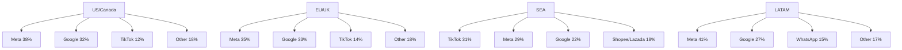
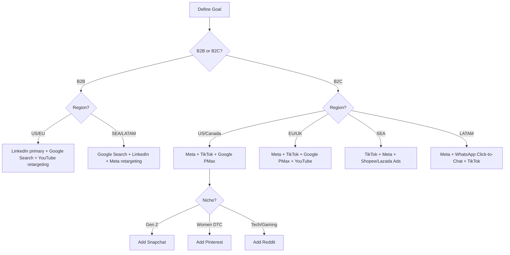

# Global Ad Platforms Comparison

> Last updated: 2026-Q1. Review cadence: every 3 months. Sources: eMarketer, Statista, Meta Investor Reports, TikTok for Business, LinkedIn Marketing Solutions, Insider Intelligence.

---

## 1. Platform Usage by Region (Active Users + Ad Reach)

| Platform | US/Canada | EU/UK | SEA | LATAM |
|----------|-----------|-------|-----|-------|
| Facebook | High (180M MAU) | High (310M MAU) | Very High (530M MAU) | Very High (440M MAU) |
| Instagram | Very High (170M MAU) | High (270M MAU) | High (250M MAU) | Very High (290M MAU) |
| TikTok | High (150M MAU) | High (200M MAU) | Very High (340M MAU) | High (175M MAU) |
| YouTube | Very High (250M MAU) | Very High (370M MAU) | Very High (430M MAU) | Very High (340M MAU) |
| LinkedIn | High (220M users) | High (240M users) | Medium (130M users) | Medium (90M users) |
| Twitter/X | High (95M MAU) | Medium (75M MAU) | Low (40M MAU) | Low (35M MAU) |
| Snapchat | Very High Gen Z | Medium Gen Z | Low | Low |
| Pinterest | Very High women 25-54 | High women 25-44 | Low | Low |
| Reddit | Very High tech/gaming | Medium | Low | Low |
| WhatsApp | Medium (95M MAU) | High (300M MAU) | Very High (560M MAU) | Very High (480M MAU) |

---

## 2. Per-Platform Deep Dive

### Meta (Facebook + Instagram)
- **Best for:** B2C e-commerce, lead-gen, retargeting, lookalike audiences
- **Geography strength:** Strongest in US/EU/LATAM; very strong in SEA (especially Vietnam, Philippines, Indonesia)
- **CPM range:**
  - US/Canada: $8-22
  - EU/UK: $5-18
  - SEA: $1.50-7
  - LATAM: $1-5
- **Notes:** Advantage+ Shopping campaigns dominate 2026 playbook. iOS 14.5+ tracking still impacts attribution — use Conversions API. Best creative: short UGC video, carousels for catalog.

### Google Ads
- **Best for:** Search intent, YouTube reach, Performance Max for e-commerce, lead-gen
- **Geography strength:** Universal — works everywhere with sufficient search volume
- **CPM range:**
  - US/Canada: $7-15 (Display); $35-90 (Search CPC for competitive niches)
  - EU/UK: $5-12 (Display); $20-60 (Search CPC)
  - SEA: $1.50-6 (Display); $0.30-3 (Search CPC)
  - LATAM: $1-4 (Display); $0.20-2 (Search CPC)
- **Notes:** Performance Max consolidates all inventory. Demand Gen campaigns (formerly Discovery) for visual social-style placements. YouTube Shorts ads now bidded separately.

### TikTok Ads
- **Best for:** Brand awareness, Gen Z/Millennial reach, viral product launches, dropshipping
- **Geography strength:** Dominant in SEA (Indonesia, Vietnam, Thailand, Philippines); growing fast in US/EU; weaker in LATAM but rising
- **CPM range:**
  - US/Canada: $6-14
  - EU/UK: $4-11
  - SEA: $1-5
  - LATAM: $1.50-6
- **Notes:** Spark Ads (boosting organic creator content) outperform standard ads 2-3x. TikTok Shop attribution now native in EU/SEA/US. Banned in some markets — confirm before launch.

### LinkedIn Ads
- **Best for:** B2B lead-gen, recruitment, professional services, high-ticket SaaS
- **Geography strength:** Universal for B2B but strongest in US, UK, Germany, India, Singapore, Australia
- **CPM range:**
  - US/Canada: $30-90
  - EU/UK: $25-75
  - SEA: $12-40
  - LATAM: $10-35
- **Notes:** Highest CPMs of any major platform but unmatched B2B targeting (job title, seniority, company size). Conversation Ads + Document Ads outperform single-image. Min budget $10/day per campaign.

### Twitter/X Ads
- **Best for:** Real-time conversation, news, tech/crypto, US political/cultural moments
- **Geography strength:** US-heavy (~50% of ad revenue); secondary in UK, Japan, India
- **CPM range:**
  - US: $5-12
  - EU/UK: $4-9
  - SEA: $2-6
  - LATAM: $1.50-5
- **Notes:** Volatile post-2022 ownership change — many advertisers paused. Verified accounts get distribution boost. Best for brands with strong cultural commentary.

### YouTube Ads
- **Best for:** Brand awareness, product demos, long-form storytelling, retargeting
- **Geography strength:** Universal — top platform globally for video consumption
- **CPM range:**
  - US/Canada: $9-20 (in-stream); $4-10 (Shorts)
  - EU/UK: $7-16 (in-stream); $3-8 (Shorts)
  - SEA: $2-7 (in-stream); $0.80-3 (Shorts)
  - LATAM: $2-6 (in-stream); $0.70-2.50 (Shorts)
- **Notes:** Bought through Google Ads (Video campaigns or PMax). Skippable in-stream is workhorse format. CTV (Connected TV) inventory growing rapidly — premium pricing.

### Snapchat Ads
- **Best for:** US Gen Z (13-24), AR try-on, app installs
- **Geography strength:** US dominant; meaningful UK, France, Saudi Arabia, India
- **CPM range:**
  - US: $3-8
  - EU/UK: $2-6
  - SEA: $1-4
  - LATAM: $1-4
- **Notes:** AR Lenses are signature format — branded filters can drive 1-3M+ organic plays. Story Ads + Spotlight (their TikTok-clone) for video. Niche but cheap reach for young audiences.

### Pinterest Ads
- **Best for:** E-commerce (women 25-54), home/decor, wedding, beauty, food, fashion
- **Geography strength:** US (60% of revenue), UK, Germany, France; weak in SEA/LATAM
- **CPM range:**
  - US/Canada: $5-12
  - EU/UK: $3-9
  - Other: $2-7 (limited inventory)
- **Notes:** Pinterest Trends tool shows what's emerging 6 months early. Idea Pins (formerly Story Pins) for organic. Shopping ads + Catalog Sales for DTC brands. Long sales cycle — users plan purchases.

### Reddit Ads
- **Best for:** Tech, gaming, finance, B2B SaaS, niche enthusiast communities
- **Geography strength:** US (~50% of users); UK, Canada, Australia secondary
- **CPM range:**
  - US: $4-10
  - Other English markets: $3-8
- **Notes:** Subreddit targeting is unique value — reach r/personalfinance, r/buildapc, etc. Conversation ads (in-feed) + Promoted Posts. Audience hates ads — needs native, helpful tone.

### WhatsApp Business / Click-to-WhatsApp Ads
- **Best for:** Customer service-driven sales, LATAM/SEA conversational commerce, lead nurturing
- **Geography strength:** Dominant in LATAM (Brazil, Mexico, Argentina), SEA (India, Indonesia, Malaysia); growing EU
- **CPM range:** N/A — bought as Meta Ads "Click-to-WhatsApp" objective, prices match Meta CPMs in region
- **Notes:** Cheapest CAC channel in LATAM/India for many DTC brands. Requires WhatsApp Business API for >50 conversations/day. Template messages need pre-approval. Conversation pricing model (utility/marketing/authentication tiers).

---

## 3. Decision Tree by Use Case

### Quick rules
- **B2B SaaS/services:** LinkedIn + Google Search are 70-80% of budget; supplement with retargeting on Meta/YouTube
- **DTC e-commerce:** Meta + TikTok + Google PMax are core; add Pinterest if audience skews female/lifestyle
- **Local services:** Google Search + Meta + Local listings (Google Business Profile)
- **Apps:** Meta App Ads + Google App Campaigns + TikTok App; ASA on iOS
- **Regulated industries (finance, health, alcohol):** LinkedIn + Google + retargeting; TikTok/Snap restrict

---

## 4. CPM Benchmarks per Region (USD, 2026 estimates)

| Platform | US/Canada | EU/UK | SEA | LATAM |
|----------|-----------|-------|-----|-------|
| Meta Feed | $8-22 | $5-18 | $1.50-7 | $1-5 |
| Meta Reels | $4-12 | $3-10 | $1-4 | $0.80-3.50 |
| Instagram Stories | $6-15 | $4-13 | $1.50-6 | $1-4.50 |
| TikTok In-Feed | $6-14 | $4-11 | $1-5 | $1.50-6 |
| TikTok Spark Ads | $4-10 | $3-9 | $0.80-4 | $1-5 |
| Google Display | $7-15 | $5-12 | $1.50-6 | $1-4 |
| Google Search CPC (avg) | $3-8 | $2-6 | $0.30-2 | $0.20-1.50 |
| YouTube In-Stream | $9-20 | $7-16 | $2-7 | $2-6 |
| YouTube Shorts | $4-10 | $3-8 | $0.80-3 | $0.70-2.50 |
| LinkedIn Sponsored | $30-90 | $25-75 | $12-40 | $10-35 |
| Twitter/X | $5-12 | $4-9 | $2-6 | $1.50-5 |
| Snapchat | $3-8 | $2-6 | $1-4 | $1-4 |
| Pinterest | $5-12 | $3-9 | $2-7 | $2-6 |
| Reddit | $4-10 | $3-8 | N/A | N/A |

> Ranges reflect Q1 2026. Auction prices fluctuate ±30% by quarter and vertical. Premium verticals (insurance, legal, finance, B2B SaaS) command 2-5x higher CPMs.

---

## Update Log
- 2026-01: Initial release for Global Cluster v2.5.0
