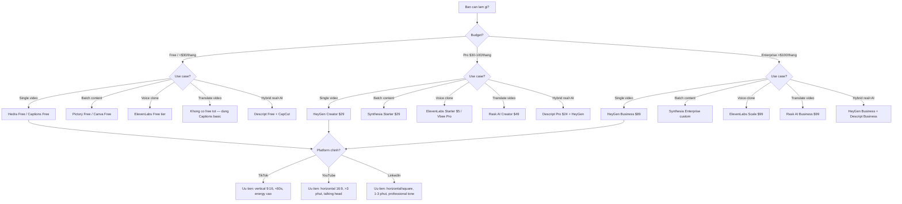

# AI Avatar Tools VN — Ma Tran Cong Cu AI Video & Voice 2025-2026

> **CAP NHAT CUOI:** 2026-05-08
> Gia tool co the da thay doi. Kiem tra trang chinh thuc truoc khi mua.
> Re-review file nay 3 thang/lan.

> **Reference file** — Load khi dung `16-ai-avatar-personal-brand`, `17-voice-clone-brand`, `18-video-ai-batch`.
> Thi truong: Viet Nam 2025-2026. Gia: USD (quy doi VND voi ty gia 1 USD ~ 25,500 VND).

---

## 1. Decision Tree Chon Tool

---

## 2. Ma Tran 3 Tier x 5 Use Case

| Tier | Single Video | Batch Content | Translate Video | Voice Clone | Hybrid (Real + AI) |
|------|-------------|---------------|-----------------|-------------|---------------------|
| **Free** | Hedra (0$) — 1 phut/video, watermark | Pictory Free — 3 video/thang | Captions Free — limited | ElevenLabs Free — 10 phut/thang | Descript Free + CapCut — limited export |
| **Pro** ($30-100) | HeyGen Creator ($29) — 15 phut/thang | Synthesia Starter ($29) — 10 video/thang | Rask AI Creator ($49) — 25 phut/thang | ElevenLabs Starter ($5) + Vbee Pro (~$15) | Descript Pro ($24) + HeyGen Creator ($29) |
| **Enterprise** (>$100) | HeyGen Business ($89) — 60 phut/thang | Synthesia Enterprise (custom) — unlimited | Rask AI Business ($99) — 100 phut/thang | ElevenLabs Scale ($99) — 200K+ ky tu/thang | HeyGen Business ($89) + Descript Business ($33) |

> **Ghi chu:** Gia tren la billing thang. Annual billing giam 20-40%.

---

## 3. Tool Deep Dive

### VIDEO AI — Tao Video Tu Avatar

#### HeyGen
- **URL:** heygen.com
- **Gia:** Free (1 credit) | Creator $29/thang (15 phut) | Business $89/thang (60 phut)
- **VN support:** Co — giong VN co san, custom voice upload
- **Uu diem:** Avatar chat luong cao, lip-sync tot, nhieu template, API manh
- **Nhuoc diem:** Gia cao cho batch, giong VN chua tu nhien bang tieng Anh
- **Best for:** Personal brand video, talking head, product demo
- **Key limit:** Free chi 1 video, watermark. Credit het = khong render duoc

#### Synthesia
- **URL:** synthesia.io
- **Gia:** Starter $29/thang (10 video) | Creator $89/thang (30 video) | Enterprise custom
- **VN support:** Co — 140+ ngon ngu, giong VN co san
- **Uu diem:** Enterprise-grade, avatar da dang nhat, training video xuat sac
- **Nhuoc diem:** Avatar co the tray nhu "robot" neu script dai, gia cao
- **Best for:** Corporate training, education content, batch production
- **Key limit:** Starter gioi han 10 video/thang. Khong ho tro custom avatar o Starter

#### D-ID
- **URL:** d-id.com
- **Gia:** Free trial | Lite $5.90/thang | Pro $29.99/thang | Advanced $49.99/thang
- **VN support:** Han che — giong VN qua text-to-speech, khong native
- **Uu diem:** Gia re, API tot cho developer, animate anh tinh thanh video
- **Nhuoc diem:** Chat luong thap hon HeyGen/Synthesia, lip-sync khong tot bang
- **Best for:** Quick talking head tu 1 tam anh, prototype nhanh
- **Key limit:** Free chi 5 phut. Chat luong giam ro khi video >2 phut

#### Captions
- **URL:** captions.ai
- **Gia:** Free (watermark) | Pro $9.99/thang | Business $29.99/thang
- **VN support:** Han che — auto subtitle co VN, voice chua tot
- **Uu diem:** Edit video bang text, auto subtitle rat tot, gia re
- **Nhuoc diem:** AI avatar han che hon, chu yeu manh ve subtitle/edit
- **Best for:** Edit video co san, them subtitle, social media clip
- **Key limit:** Free co watermark. Avatar feature chi o Business tier

#### Hedra
- **URL:** hedra.com
- **Gia:** Free (1 phut/video) | Creator $9/thang | Pro $29/thang
- **VN support:** Han che — chu yeu tieng Anh, VN qua text-to-speech
- **Uu diem:** Gia re nhat, animate anh tinh thanh video nhanh
- **Nhuoc diem:** Chat luong trung binh, it customize, video ngan
- **Best for:** Test nhanh AI avatar, social media short clip
- **Key limit:** Free chi 1 phut, chat luong 720p

---

### VIDEO GENERATION — Tao Video Tu Prompt/Anh

#### Runway Gen-3
- **URL:** runwayml.com
- **Gia:** Free (limited) | Standard $15/thang | Pro $35/thang | Unlimited $95/thang
- **VN support:** Khong — khong co VN voice, chi tao video tu prompt tieng Anh
- **Uu diem:** Chat luong video AI cao nhat, gen-3 Alpha rat an tuong
- **Nhuoc diem:** Dat, video ngan (4-16 giay), khong phai talking head
- **Best for:** B-roll AI, visual effect, creative content
- **Key limit:** Moi video chi 4-16 giay. Khong phu hop cho talking head

#### Pika Labs
- **URL:** pika.art
- **Gia:** Free (limited) | Standard $10/thang | Pro $35/thang | Unlimited $70/thang
- **VN support:** Khong — prompt tieng Anh only
- **Uu diem:** Gia re hon Runway, lip-sync feature moi, style da dang
- **Nhuoc diem:** Chat luong kem hon Runway, video ngan
- **Best for:** Social media clip, visual creative, experiment
- **Key limit:** Video 3-8 giay. Chat luong khong du cho professional use

#### Pictory
- **URL:** pictory.ai
- **Gia:** Free trial (3 video) | Starter $25/thang | Professional $49/thang | Teams $99/thang
- **VN support:** Han che — auto subtitle co VN, voice chua co
- **Uu diem:** Chuyen blog/script thanh video tu dong, batch production
- **Nhuoc diem:** Video tu stock footage, khong phai AI avatar thuc su
- **Best for:** Repurpose blog thanh video, batch social content
- **Key limit:** Free chi 3 video. Chat luong phu thuoc stock library

---

### VOICE AI — Tao Giong Noi AI

#### ElevenLabs
- **URL:** elevenlabs.io
- **Gia:** Free (10 phut/thang) | Starter $5/thang | Creator $22/thang | Pro $99/thang
- **VN support:** Co — giong VN kha, voice clone tot
- **Chat luong giong VN:** 7/10 — tu nhien kha, accent chua hoan hao
- **Uu diem:** Voice clone tot nhat, nhieu giong, API manh, da ngon ngu
- **Nhuoc diem:** Giong VN chua bang tieng Anh, gia tang nhanh theo usage
- **Best for:** Voice clone, podcast AI, audiobook, dubbing
- **Key limit:** Free 10 phut. Voice clone can Starter tro len

#### PlayHT
- **URL:** play.ht
- **Gia:** Free trial | Creator $31.20/thang | Pro $99/thang | Enterprise custom
- **VN support:** Han che — co VN voice nhung it lua chon
- **Uu diem:** API tot, nhieu giong tieng Anh, integrations da dang
- **Nhuoc diem:** Giong VN it va chat luong trung binh, gia cao
- **Best for:** Podcast tieng Anh, API integration, SaaS product
- **Key limit:** Giong VN chi co 2-3 option. Khong co voice clone VN

#### Vbee
- **URL:** vbee.vn
- **Gia:** Free trial | Goi ca nhan ~380K/thang (~$15) | Doanh nghiep custom
- **VN support:** Co — NATIVE VN, tot nhat thi truong cho tieng Viet
- **Chat luong giong VN:** 9/10 — tu nhien nhat, nhieu giong vung mien
- **Uu diem:** Giong VN tot nhat, UI tieng Viet, thanh toan VND, support VN
- **Nhuoc diem:** Chi manh VN, it ngon ngu khac, it tinh nang advanced
- **Best for:** Content tieng Viet, IVR, audiobook VN, notification voice
- **Key limit:** Khong co voice clone tu audio. Chi dung giong co san

#### Murf
- **URL:** murf.ai
- **Gia:** Free trial | Creator $26/thang | Business $46/thang | Enterprise custom
- **VN support:** Han che — co VN voice nhung it giong
- **Uu diem:** UI than thien, voice-over studio tich hop, team collab
- **Nhuoc diem:** Giong VN han che, gia trung binh cao
- **Best for:** Voice-over cho video corporate, e-learning
- **Key limit:** Free chi trai nghiem. VN voice chi o Business tier

---

### AUDIO / PODCAST

#### Descript
- **URL:** descript.com
- **Gia:** Free (1 hour/thang) | Hobbyist $8/thang | Pro $24/thang | Business $33/thang
- **VN support:** Han che — transcription co VN, voice clone chi EN
- **Uu diem:** Edit audio/video bang text, cuc ky nhanh, remove filler words
- **Nhuoc diem:** Voice clone chi tieng Anh, VN transcription chua chinh xac 100%
- **Best for:** Podcast editing, video editing, hybrid content workflow
- **Key limit:** Free 1 gio. Voice clone khong ho tro VN

#### Riverside
- **URL:** riverside.fm
- **Gia:** Free (2 gio) | Standard $19/thang | Pro $29/thang | Business $49/thang
- **VN support:** Han che — recording OK, transcription VN co ban
- **Uu diem:** Record remote chat luong studio, separate track, auto clip
- **Nhuoc diem:** Khong co AI avatar, chi la recording tool
- **Best for:** Podcast recording, remote interview, video podcast
- **Key limit:** Free 2 gio/thang. Khong co AI voice feature

---

### TRANSLATION / DUBBING

#### Rask AI
- **URL:** rask.ai
- **Gia:** Free trial | Creator $49/thang (25 phut) | Business $99/thang (100 phut) | Enterprise custom
- **VN support:** Co — VN la 1 trong 130+ ngon ngu
- **Chat luong VN:** 6.5/10 — hieu duoc nhung accent chua tu nhien hoan toan
- **Uu diem:** Translate + dub video tu dong, giu giong goc, lip-sync
- **Nhuoc diem:** VN quality kem hon EN/ES/FR, gia cao, can edit manual
- **Best for:** Dich video sang nhieu ngon ngu, expand audience quoc te
- **Key limit:** Free rat han che. VN can review va edit manual sau khi dub

---

## 4. VN-Specific Notes

### UI Tieng Viet
- **Full VN UI:** Chi Vbee co giao dien tieng Viet hoan chinh
- **Partial VN:** HeyGen (menu chinh), Captions (subtitle VN)
- **EN only:** Synthesia, D-ID, Runway, ElevenLabs, Rask AI — tat ca UI tieng Anh

### Chat Luong Giong Viet Nam (Xep Hang)
1. **Vbee** — 9/10: Native VN, giong Bac/Trung/Nam, tu nhien nhat
2. **ElevenLabs** — 7/10: Voice clone VN kha, accent chua hoan hao
3. **HeyGen** — 6/10: Giong VN dung duoc, lip-sync OK
4. **Rask AI** — 6.5/10: Dub VN hieu duoc, can chinh manual
5. **Synthesia** — 5.5/10: Giong VN co nhung robotic
6. **Cac tool con lai** — <5/10: VN la afterthought

### Thanh Toan Tu Viet Nam
- **Visa/Mastercard quoc te:** Tat ca tool chap nhan — de nhat
- **MoMo / ZaloPay / VNPay:** Chua tool nao ho tro truc tiep
- **Workaround neu khong co the quoc te:**
  - Wise (TransferWise): Mo tai khoan online, co the ao Visa, phi 1-2%
  - Payoneer: Nhan the Mastercard, phi rut ATM ~$3
  - Nho nguoi than co the quoc te thanh toan ho
- **Vbee:** Thanh toan VND qua chuyen khoan ngan hang, QR code — thuan tien nhat cho nguoi VN

### Luu Y Phap Ly
- Voice clone nguoi khac can xin phep bang van ban
- Su dung hinh anh nguoi that lam avatar can consent
- Xem chi tiet: `skills/references/ai-video-disclosure-vn.md`

---

## 5. Cap Nhat Log

| Ngay | Thay doi |
|------|---------|
| 2026-05-08 | Tao file — 15 tools reviewed, VN market pricing verified |
