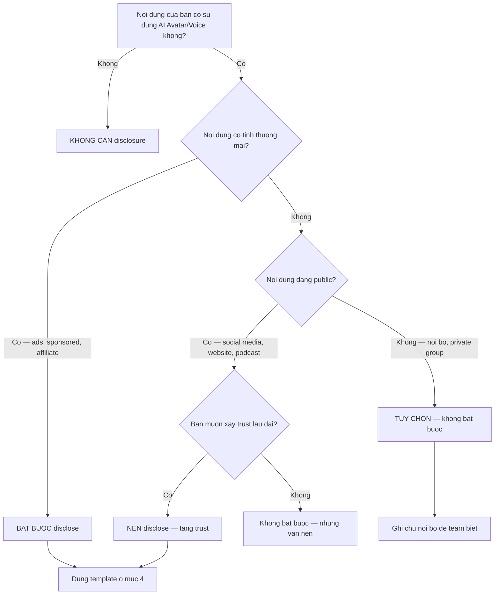

# AI Video Disclosure VN — Quy Tac Cong Khai Khi Dung AI Avatar

> **Reference file** — Load khi dung `16-ai-avatar-personal-brand`, `17-voice-clone-brand`, `18-video-ai-batch`.
> Thi truong: Viet Nam 2025-2026. Cap nhat theo phap ly VN hien hanh.
> **KHONG PHAI TU VAN PHAP LY.** Tham khao luat su neu can y kien chinh thuc.

---

## 1. Boi Canh Phap Ly VN 2025-2026

### Van ban phap luat lien quan

**Nghi dinh 147/2024/ND-CP** (Co hieu luc 2025)
- Quy dinh ve quan ly, cung cap, su dung dich vu internet va thong tin tren mang
- Yeu cau: noi dung do AI tao ra dung cho quang cao thuong mai phai ghi ro nguon goc
- Pham vi: ap dung cho to chuc, ca nhan hoat dong tren khong gian mang tai VN

**Luat Quang cao 2012 (sua doi, bo sung 2024)**
- Dieu 8: Cam quang cao co noi dung khong trung thuc, gay nham lan ve nguon goc
- Dieu 19: Quang cao phai ro rang ve chu the quang cao va san pham
- Lien quan AI: su dung hinh anh/giong noi AI ma khong cong khai = co the vi pham dieu 8

**FTC Guidelines (My) — Tham khao, khong bat buoc tai VN**
- Yeu cau disclose khi dung AI-generated content trong quang cao
- "Material connection" phai duoc cong khai ro rang
- VN chua co quy dinh chi tiet bang nhung xu huong se theo

**GDPR (EU) — Ap dung neu target khach EU**
- AI Act 2024: Yeu cau gan nhan "AI-generated" cho noi dung tao boi AI
- Neu ban ban hang/dich vu cho nguoi EU: PHAI tuan thu

**Tinh hinh hien tai:**
- VN dang trong giai doan hoan thien khung phap ly ve AI
- Bo Thong tin & Truyen thong (Bo TT&TT) dang soan Nghi dinh rieng ve AI
- Khuyen nghi: follow tin tuc tu Bo TT&TT va Hoi Truyen thong So Viet Nam
- An toan nhat: disclose som con hon bi phat sau

---

## 2. Quy Tac 3 Tang Disclose

| Tang | Khi nao | Vi du | Bat buoc? |
|------|---------|-------|-----------|
| **BAT BUOC** | Quang cao thuong mai, sponsored content, affiliate marketing | Ads Facebook/TikTok, product review tra tien, sponsored post | Co — Nghi dinh 147/2024 + Luat Quang cao |
| **NEN** | Content thuong khong tra tien, personal brand building | Bai chia se kien thuc, podcast, video giao duc | Khong bat buoc nhung KHUYEN NGHI manh — tang trust |
| **TUY CHON** | Test noi bo, draft chua publish, private group kin | A/B test creative, internal review, group noi bo cong ty | Khong can — nhung nen ghi chu noi bo de team biet |

### Chi tiet tung tang

**Tang BAT BUOC:**
- Moi quang cao dung AI avatar/voice PHAI co disclosure
- Vi tri: noi nguoi dung thay TRUOC khi tuong tac (dau video, dau caption)
- Ngon ngu: tieng Viet ro rang, khong an/giau

**Tang NEN:**
- Khong bat buoc nhung 73% nguoi tieu dung VN (khao sat 2025) tin tuong hon khi brand minh bach
- Disclosure = competitive advantage, khong phai bat loi
- Dat cuoi video hoac trong bio/description la du

**Tang TUY CHON:**
- Chi ap dung cho noi dung noi bo
- Van nen ghi chu de doi ngu biet dau la AI, dau la thuc

---

## 3. Khi Nao TUYET DOI KHONG Dung AI Avatar

### Truong hop 1: Impersonate nguoi khac
- **Vi pham:** Luat So huu tri tue 2005, Bo luat Hinh su 2015 (dieu 174 — lua dao)
- **Vi du:** Tao avatar giong nguoi noi tieng de ban hang
- **Hau qua:** Truy to hinh su, boi thuong thiet hai, mat uy tin vinh vien

### Truong hop 2: Tin gia / Deepfake chinh tri
- **Vi pham:** Nghi dinh 15/2020 (xu phat hanh chinh), Bo luat Hinh su
- **Vi du:** Tao video gia chinh tri gia de lan truyen
- **Hau qua:** Phat tien 20-30 trieu VND, co the bi truy to hinh su

### Truong hop 3: Testimonial gia
- **Vi pham:** Luat Quang cao 2012, Luat Bao ve quyen loi nguoi tieu dung 2023
- **Vi du:** Tao AI avatar gia danh khach hang review san pham
- **Hau qua:** Phat tien 60-80 trieu VND, go quang cao, mat trust khach hang

### Truong hop 4: Noi dung y te / tai chinh khong disclaimer
- **Vi pham:** Luat Quang cao (quang cao y te), Nghi dinh 96/2023
- **Vi du:** AI avatar tu van suc khoe, khuyen mua co phieu ma khong ghi disclaimer
- **Hau qua:** Phat nang, co the bi truy cuu trach nhiem neu khach hang thiet hai

---

## 4. Template Disclosure Cho Tung Nen Tang

### TikTok

**Bio line:**
```
Mot so video su dung cong nghe AI Avatar | Noi dung chinh chu
```

**Video tag:** Dung hashtag #AIAvatar #AIGenerated

**In-video text overlay (3 giay dau):**
```
Video nay su dung cong nghe AI
Hinh anh & giong noi dua tren [Ten ban] thuc te
```

---

### YouTube

**Description box (dong dau):**
```
Luu y: Video nay duoc tao voi su ho tro cua cong nghe AI Avatar.
Hinh anh va giong noi dua tren [Ten ban] thuc te.
Noi dung duoc kiem duyet va phe duyet boi [Ten ban].
```

**End screen note (text card 5 giay cuoi):**
```
Video su dung AI Avatar — Noi dung chinh chu boi [Ten ban]
```

**Community Guidelines:** Tick chon "Altered content" trong YouTube Studio neu co

---

### Facebook / Instagram

**Post text (cuoi bai):**
```
Noi dung nay duoc tao voi ho tro cong nghe AI Avatar.
Giong noi va hinh anh dua tren toi (nguoi that), noi dung do toi bien soan.
```

**Story sticker:** Dung text sticker "Made with AI" hoac "AI Avatar"

**Ad disclosure (bat buoc cho ads):**
```
Quang cao nay su dung cong nghe AI de tao hinh anh/giong noi.
Noi dung phan anh san pham/dich vu thuc te cua [Ten thuong hieu].
```

---

### LinkedIn

**Post note (cuoi bai):**
```
*Luu y: Video nay su dung cong nghe AI Avatar de toi uu hoa quy trinh
san xuat noi dung. Noi dung va quan diem la cua toi.*
```

**Profile banner:** Them dong "Content co su ho tro cua AI" trong phan About

---

### Personal Website

**Footer disclaimer (moi trang co AI content):**
```
Mot so noi dung tren website su dung cong nghe AI Avatar va AI Voice.
Tat ca noi dung duoc [Ten ban] kiem duyet va phe duyet truoc khi dang.
```

**About page (doan rieng):**
```
Ve cong nghe: Toi su dung AI Avatar va Voice AI nhu cong cu ho tro san
xuat noi dung. Moi bai viet, video, podcast deu do toi bien soan noi
dung. AI chi ho tro phan hinh anh va giong noi de tang hieu qua san xuat.
```

---

## 5. Case Study VN 2025 (Fictional — Minh Hoa)

### Case 1: Coach Tuan — AI Avatar bi khach complain

**Boi canh:** Coach Tuan dung HeyGen lam video kien thuc marketing, dang TikTok 3 video/ngay.
Khong co disclosure nao.

**Van de:** Sau 2 thang, follower phat hien video la AI vi lip-sync loi. Comment tieu cuc
tang 40%, un-follow 15%. Mot so khach DM hoi "Anh co that khong hay la bot?"

**Fix:** Coach Tuan them disclosure vao bio, ghim comment giai thich, lam 1 video real face
giai thich ly do dung AI. Ket qua: retention phuc hoi sau 3 tuan, trust tang vi minh bach.

**Bai hoc:** Disclose som = khach hang ton trong. An giau = mat trust khi bi phat hien.

### Case 2: Creator Linh — Voice clone khong xin phep

**Boi canh:** Creator Linh clone giong cua mot KOL noi tieng de lam podcast, khong xin phep.
Upload len Spotify va YouTube, thu hut 50K luot nghe.

**Van de:** KOL phat hien, report. YouTube go video, Spotify go podcast. Linh bi cam
monetization 6 thang. KOL doa kien vi vi pham quyen hinh anh va giong noi.

**Fix:** Khong co fix — damage da xay ra. Linh phai xin loi cong khai va bat dau lai tu dau.

**Bai hoc:** KHONG BAO GIO clone giong nguoi khac khi chua co van ban dong y.

### Case 3: Founder Mai — Hybrid approach thanh cong

**Boi canh:** Founder Mai dung cach ket hop: 60% video real face (livestream, Q&A, behind the
scenes) + 40% AI avatar (kien thuc ngan, tip nhanh, recap). Luon co disclosure ro rang.

**Van de:** Khong co van de. Khach hang biet ro dau la real, dau la AI.

**Ket qua:** Trust score cao (survey 8.5/10), content output tang 3x, chi phi giam 50%.
Khong bi flag boi bat ky nen tang nao.

**Bai hoc:** Hybrid + minh bach = cong thuc tot nhat cho personal brand.

---

## 6. Decision Tree: "Toi Co Can Disclose Khong?"



---

## 7. Disclosure Copy Template — 5 Mau San Dung

### Mau 1 — Ngan (Story, Reels, TikTok overlay)
```
Video su dung cong nghe AI Avatar
```

### Mau 2 — Trung (Post caption, description)
```
Noi dung nay duoc tao voi ho tro AI. Giong noi va hinh anh dua tren [Ten ban] thuc te.
```

### Mau 3 — Dai (Cho quang cao thuong mai)
```
THONG BAO: Video quang cao nay su dung cong nghe AI Avatar va AI Voice de tao hinh
anh va giong noi. Noi dung phan anh san pham/dich vu thuc te cua [Ten thuong hieu].
Moi thong tin trong video da duoc [Ten ban] kiem duyet va xac nhan. Hinh anh dai dien
duoc tao tu anh chup thuc te cua [Ten ban] voi su ho tro cua cong nghe AI.
```

### Mau 4 — Tieng Anh (International audience)
```
This content was created with AI avatar technology. Voice and likeness are based on
a real person. All content is reviewed and approved by the creator.
```

### Mau 5 — Song ngu VN + EN (Da ngon ngu)
```
Video su dung cong nghe AI | Noi dung chinh chu boi [Ten ban]
This video uses AI technology | Authentic content by [Your name]
```
