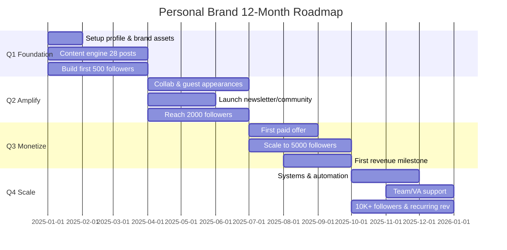

# Personal Brand Strategy (12-Month Plan) — Global

> "Personal brand isn't what you think you are — it's what others recognize you as when you're not in the room."
>
> This skill produces a complete 12-month plan: niche selection, positioning, story arc, content pillars, authority ladder, and a quarter-by-quarter growth roadmap. Read the context file from skill 22 first.

---

## Newbie section

### Who this skill is for

| Audience | Concrete example |
|----------|-----------------|
| Founder / CEO | Wants a 12-month plan to grow a personal brand alongside the company |
| Coach / Consultant | Needs a roadmap from "no one knows me" to "expert booked solid" |
| Creator / KOL | Wants strategic follower growth, not random posting |

### Who this skill is NOT for

- **Product marketing for a company** -> use skill `00-marketing-plan-global`
- **Agencies serving clients** -> use `20-client-intake-brief-global`
- **No personal context yet** -> run skill `22-personal-brand-context-global` first

### Before invoking

**Required:** the file `.agents/personal-brand-context-global.md` must exist — run skill 22 first. It contains niche, audience, north star, brand voice — skill 23 reads it so you don't re-answer.

### Troubleshooting

1. **"Context file not found"** -> run `skill 22-personal-brand-context-global` first
2. **"Niche too broad"** -> narrow with the 3x3 grid (see Niche Selection)
3. **"Don't know how to write story arc"** -> use the 3 fill-in prompts in Story Arc
4. **"12 months feels overwhelming"** -> focus Q1 only, review every quarter

---

## Step 0: Read context (skill 22)

Check whether `.agents/personal-brand-context-global.md` exists:

- **Yes** -> read fully, extract 4 essentials:
  1. **Niche** — chosen domain of expertise
  2. **Audience** — specific target persona
  3. **North Star** — 12-month goal
  4. **Monetization goal** — how the brand earns
- **No** -> ask the user to run `22-personal-brand-context-global` first.
  If they want to continue anyway, ask 3 minimum questions:
  1. What do you do, and what are you best at?
  2. What do you want to be known for?
  3. What is your goal for the next 12 months?

---

## Niche Selection Framework

### Personal Ikigai — 4 overlapping zones

```
        Passion (What do you love?)
              |
  Skill ------+------ Demand
(What are you      (What does the
 great at?)         market want?)
              |
        Uniqueness
   (What makes you different?)
```

**Strong niche = intersection of all 4 zones.** Missing one -> weak niche.

### 3x3 Grid — Choose niche from 9 candidates

**Step 1:** List 3 passions + 3 skills.

| | Skill 1: [___] | Skill 2: [___] | Skill 3: [___] |
|---|---|---|---|
| Passion 1: [___] | Niche A | Niche B | Niche C |
| Passion 2: [___] | Niche D | Niche E | Niche F |
| Passion 3: [___] | Niche G | Niche H | Niche I |

**Step 2:** Score each niche.

| Niche | Demand (1-5) | Uniqueness (1-5) | Total |
|-------|-------------|------------------|-------|
| A | ? | ? | ? |
| B | ? | ? | ? |
| ... | ... | ... | ... |

**Step 3:** Pick the top 1-2 niches with the highest score (minimum 6/10).

### Global niche examples (2025–2026)

> "A niche must be big enough to have an audience, small enough that you are the expert."

| Example niche | Demand | Notes |
|---------------|--------|-------|
| AI for SMBs (Western Europe) | 5 | Hot, but high competition |
| Healthcare marketing (US) | 4 | Small niche, fewer rivals, premium fees |
| Personal finance for Gen Z (US/UK) | 5 | Huge audience, multiple formats |
| B2B sales coaching (LATAM) | 3 | Narrow, high-ticket willingness |
| Content strategy for SaaS (global) | 3 | Emerging, still few specialists |
| Conversational English (SEA) | 4 | Constant demand, competitive |
| Startup team-building (global) | 3 | Founder audience, monetizes well |
| Cross-border ecommerce (EU/SEA) | 4 | 2025 trend, strong demand |
| Workplace mental health (US/EU) | 4 | Post-COVID growth |
| Personal finance for freelancers (global) | 3 | Small niche, high loyalty |

---

## Positioning Statement

### Formula

```
"I help [AUDIENCE] achieve [OUTCOME] through [UNIQUE METHOD] in [TIMELINE]."
```

### 3 real examples (international)

**Founder:**
> "I help early-stage SaaS founders reach 1,000 LinkedIn followers in 90 days
> using a systematic Build-in-Public framework."

**Coach:**
> "I help mid-level managers boost team performance by 30% in 6 months
> through 1:1 coaching combined with internal workshops."

**Creator:**
> "I help working Gen Z professionals master personal finance in 30 days
> through short-form videos that explain concepts with everyday examples."

### Positioning sanity check — 4 questions

| Question | Must be answerable |
|----------|--------------------|
| **Who?** | A specific audience (not "everyone") |
| **What problem?** | Clear pain point or desire |
| **How?** | A distinctive method or approach |
| **Different how?** | A clear edge over 3-5 peers |

If you can't answer all four — you're not ready to position. Return to Niche Selection.

---

## Story Arc — 3 Chapters

> A story arc is the narrative spine of your personal brand — not a CV but a JOURNEY. People remember stories, not lists of credentials.

### Hero's Journey adapted for personal brand

```
Chapter 1: ORIGIN              Chapter 2: TURNING POINT       Chapter 3: NOW
(Why did you start?)      ->   (What changed you?)        ->  (What are you doing?)
- Personal pain point          - "Aha" moment                  - Current mission
- Background (family/career)   - Biggest failure               - Who you help, how
- Original motivation          - Core lesson                   - Future vision
```

### 3 fill-in prompts

**Prompt 1 — Origin:**
> "Before I worked in [current field], I was [former role/situation].
> What pushed me to start was [specific event/emotion]."

**Prompt 2 — Turning point:**
> "The biggest pivot was when [specific event].
> I realized [lesson], and that's when I decided [action]."

**Prompt 3 — Now:**
> "Today I help [specific audience] by [method].
> What I believe most strongly is [core philosophy]."

### Important guidelines

- Story arc **must be authentic** — no fabrication, no embellishment
- You don't need a "rags to riches" arc — any genuine journey has value
- The Chapter 2 failure doesn't have to be huge — it can be a "dead end"
- Story arc shows up in: bio, About page, podcast intro, foundational essays
- Update Chapter 3 every 6 months (where are you now?)

---

## Content Pillars (4 × 7 = 28 topics)

> 4 pillars × 7 topics each = 28 topics for 12 months. Enough to post 2-3× per week without ever running out of ideas.

### The 4 pillars

| Pillar | Name | Description | Examples |
|--------|------|-------------|----------|
| 1 | **Industry Expertise** | What you KNOW | Frameworks, trend analysis, case studies |
| 2 | **Behind the Scenes** | How you WORK | Process, tools, mistakes + lessons |
| 3 | **Personal Philosophy** | What you BELIEVE | Contrarian takes, personal values |
| 4 | **Community Value** | What you GIVE | Free templates, checklists, Q&A |

### 28 topics (4 × 7)

| # | Pillar 1: Expertise | Pillar 2: Behind Scenes | Pillar 3: Philosophy | Pillar 4: Community |
|---|---|---|---|---|
| 1 | 2025 industry trends | A day in my work | Industry's biggest mistake | Free template |
| 2 | Framework for solving X | Tools I use daily | Advice I disagree with | Beginner checklist |
| 3 | Client case study | End-to-end process | Lessons from failure | FAQ — 10 common questions |
| 4 | Comparing 2 methods | Behind project X | What I wish I knew sooner | Step-by-step guide |
| 5 | Industry data analysis | This month's results | Contrarian opinion | Best resource list |
| 6 | Knowledge synthesis | Learning a new skill | Working philosophy | Live Q&A |
| 7 | Predictions for next year | Tool/book review | Reflection on the field | Community challenge |

### Pillar -> Platform mapping

| Platform | Primary pillar | Why |
|----------|---------------|-----|
| LinkedIn | Pillar 1 (Expertise) | Professional audience, long-form gets read |
| TikTok / Reels | Pillar 2 (Behind Scenes) | Short, visual, behind-the-scenes wins views |
| Twitter/X | Pillar 3 (Philosophy) | Hot takes, threads spread fast |
| Substack / Newsletter | Pillar 3 (Philosophy) | Long-form, deep thinking |
| Discord / Skool / Circle | Pillar 4 (Community) | High interaction, community-driven |

---

## Authority Ladder (5 Stages)

> Going from "regular person" to "thought leader" doesn't happen overnight. Here's a 12-month roadmap split into 5 stages.

### 5 escalating stages

| Stage | Name | Timeline | Main activity | KPI |
|-------|------|----------|---------------|-----|
| 1 | **Observer** | Weeks 1-4 | Follow 50 experts, curate good content, leave thoughtful comments | 100 quality comments |
| 2 | **Contributor** | Months 2-3 | Original posts, share experience, first case study | 20 originals, 200 followers |
| 3 | **Specialist** | Months 4-6 | Niche deep-dives, build a framework, deep-series | 1 framework, 1,000 followers |
| 4 | **Authority** | Months 7-9 | Guest podcasts, collabs, media mentions, first product | 3 collabs, 3,000 followers |
| 5 | **Thought Leader** | Months 10-12 | Invited speaker, mentoring, course/ebook | 5,000+ followers, recurring revenue |

### Content type by stage

| Stage | Content types | Platform focus |
|-------|--------------|----------------|
| Observer | Curated comments, share-with-notes, curation threads | LinkedIn, Twitter/X |
| Contributor | Short posts, carousels, short videos | LinkedIn, TikTok |
| Specialist | Long series, visual frameworks, case studies | LinkedIn, Blog, YouTube |
| Authority | Podcast guesting, collab videos, newsletters | Podcast, YouTube, Email |
| Thought Leader | Keynotes, courses, books, media interviews | Multi-platform + offline |

---

## 12-Month Growth Plan

### Quarterly overview



### Quarter detail

**Q1 (Months 1-3): FOUNDATION — Build the base**

| Month | Main work | KPI |
|-------|-----------|-----|
| 1 | Profile setup (avatar, bio, banner), choose 2 main platforms | 100% profile completion |
| 2 | Post 10 pieces (Pillars 1+2), comment on 50 expert posts | 200 followers, 10 posts |
| 3 | Post 18 pieces (all 4 pillars), publish first case study | 500 followers, 28 posts total |

**Q2 (Months 4-6): AMPLIFY — Expand reach**

| Month | Main work | KPI |
|-------|-----------|-----|
| 4 | Reach out to 10 collab partners, launch newsletter | 2 collabs, 100 subscribers |
| 5 | Guest podcast/livestream, deep series | 1 podcast, 1 series of 4 posts |
| 6 | Build a lead magnet (ebook/template) | 2,000 followers, 300 emails |

**Q3 (Months 7-9): MONETIZE — Earn**

| Month | Main work | KPI |
|-------|-----------|-----|
| 7 | Launch first offer (1:1, workshop, mini course) | First 5 paying customers |
| 8 | Collect testimonials, refine the offer | 10 testimonials, 3,500 followers |
| 9 | Run paid promotion (optional), raise pricing | 5,000 followers, steady revenue |

**Q4 (Months 10-12): SCALE — Expand**

| Month | Main work | KPI |
|-------|-----------|-----|
| 10 | Build content systems (batch, schedule, repurpose) | 50% time saved |
| 11 | Hire VA/editor, launch second product | 1 team member, 8,000 followers |
| 12 | Annual review, plan year 2 | 10K+ followers, recurring revenue |

### Monthly milestone checklist

- [ ] Posts this month >= 8
- [ ] New followers >= quarterly target
- [ ] Engagement rate >= 3%
- [ ] At least 1 new collab/connection
- [ ] Reviewed and updated content calendar
- [ ] Updated story arc if anything has shifted (Chapter 3)

---

## Risk & Ethics

### 5 common risks

| Risk | Severity | Prevention |
|------|----------|-----------|
| **Burnout** | High | Batch content, take 1 week off per quarter, don't chase the algorithm |
| **Fake authority** | High | Only claim what you've DONE, not what you've READ |
| **Over-promising** | Medium | Commit to realistic outcomes, never "guarantee success" |
| **Privacy loss** | Medium | Distinguish "share" vs "expose"; family is not content |
| **AI dependency** | Low-Medium | AI assists, doesn't replace your voice |

### Ethical principles

1. **No fake expert** — don't claim experience you don't have
2. **No AI deception** — if AI wrote it, don't say "I wrote this"
3. **AI disclosure** — note AI assistance when content is materially generated
4. **No copying others' frameworks** — credit sources or build your own
5. **Don't sell courses before you have results** — sell experience, not promises

### Global market context

> "The US/EU LinkedIn ecosystem is mature, but emerging markets (LATAM, SEA, India) are growing fastest. For founders/coaches outside Tier 1 markets: building a personal brand now is an early-mover advantage. Cross-border content (English-first with localized examples) reaches the widest audience."

---

## Output template

```markdown
# Personal Brand Strategy — [Full name]
Date: [YYYY-MM-DD]
Variant: [Founder / Coach / Creator]

## 1. Chosen niche
Niche: [___]
Demand score: [1-5]
Uniqueness score: [1-5]
Reason for choosing: [___]

## 2. Positioning Statement
"I help [audience] achieve [outcome] through [method] in [timeline]."

## 3. Story Arc
- Chapter 1 (Origin): [___]
- Chapter 2 (Turning point): [___]
- Chapter 3 (Now): [___]

## 4. Content Pillars (28 topics)
| Pillar | 7 topics |
|--------|---------|
| Expertise | [___] |
| Behind Scenes | [___] |
| Philosophy | [___] |
| Community | [___] |

## 5. Authority Ladder — Current position
Current stage: [1-5]
Target stage in 12 months: [___]

## 6. 12-Month Plan
| Quarter | Main objective | KPI |
|---------|---------------|-----|
| Q1 | [___] | [___] |
| Q2 | [___] | [___] |
| Q3 | [___] | [___] |
| Q4 | [___] | [___] |

## 7. Main platforms
Platform 1: [___] — Pillar [___]
Platform 2: [___] — Pillar [___]

## 8. Risk mitigation
[Top 3 risks + mitigation]
```

---

## Quality checklist

Before finishing:

- [ ] Read context file from skill 22 first
- [ ] Niche validated (demand score >= 3)
- [ ] Positioning statement answers all 4 questions (Who? What? How? Different?)
- [ ] Story arc has 3 chapters — authentic, no fabrication
- [ ] 28 topics (4 pillars × 7) listed
- [ ] Authority ladder identifies current stage + target stage
- [ ] 12-month plan has concrete milestones per quarter
- [ ] Main platforms chosen + pillar mapping
- [ ] Output saved to `personal-brand-strategy-[name]-[YYYYMMDD].md`

---

## Skill links

- **`22-personal-brand-context-global`** — Foundation skill, MUST run before this one
- **`26-thought-leadership-content-global`** — Produce thought leadership content from this strategy
- **`27-personal-brand-monetize-global`** — Monetize once you reach Q3
- **`09-customer-insight-global`** — Deepen audience persona

---

*Skill 23 (Global) | v1.0.0*
