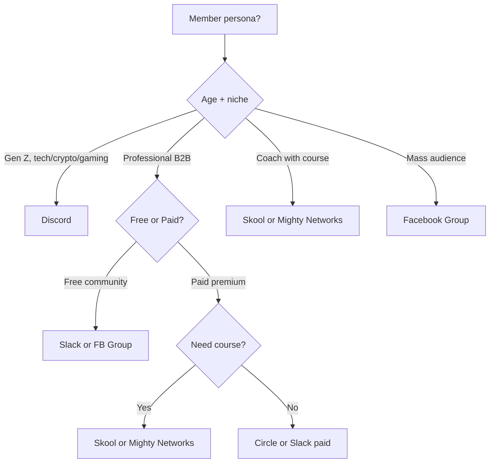

# Community Building — Global Personal Brand

> Audience = people who follow you. **Community = people who talk to each other** around you. The core difference: audience scales by count, community scales by connection. This skill builds community as a **moat** for your personal brand — uncopyable.

---

## 1. Newbie section

### Audience vs Community — the critical distinction

| Criterion | Audience | Community |
|-----------|----------|-----------|
| Relationship | 1-many (you -> follower) | many-many (member <-> member) |
| Owner | You | You + members co-create |
| Scale | Works at tens of thousands | Capped ~150-1000 chat |
| Monetization | Course, brand deal | Membership, mastermind |
| Defensibility | Easy to copy | Hard to copy (network effect) |

### When to start a community

DO NOT start too early. Wait for 3 conditions:

1. **Audience >2,000 quality followers** — enough to seed an initial community of 50-100
2. **At least 1 successful product/offer** — community is a retention moat, NOT your first sales channel
3. **Time available >5 hrs/week for 6 months** — community needs the host present daily

### 5 common mistakes building community

1. **Build the group then walk away** — 1 month later it's dead, members spam ads -> close
2. **1,000 members but 90% lurkers** — only 50-100 active -> low ROI
3. **Spam selling inside the group** — admin posts offers daily -> trust erodes -> members leave
4. **No clear rules** — toxic members run wild -> good members leave -> only toxic stays
5. **Wrong platform** — picking Discord for a 50+ professional audience -> 80% drop out at onboarding

### Real time investment

- **Initial setup**: 2-4 weeks (pick platform, write rules, onboard 50 founding members)
- **Daily check-in**: 30-60 min/day in months 1-3
- **Weekly events**: 1-2 hrs/week (livestream, AMA, workshop)
- **Total**: 8-15 hrs/week in the first 6 months, then delegate to a moderator team

---

## 2. Information collection

Ask up to 4 questions:

1. **Current audience size and main platform?** Total followers + main channel (drives platform choice)
2. **Member persona?** Young / mid-career / senior, B2B/B2C, paid/free? (Decides platform and monetization)
3. **Community goal?** Free retention community / Paid community as primary income / High-end mastermind (3 different paths)
4. **Resources?** Solo or team? Budget for platform/moderators? (Drives scale and platform choice)

---

## 3. Platform Comparison (Global) 2026

| Platform | Cost | UX | Max members | Monetization | Pros | Cons | Best for | Setup time |
|----------|------|----|--------------|---------------|------|------|----------|-----------|
| **Skool** | $99/mo base | 9/10 | Unlimited (paid plan) | Paid course + community combo, $9-499/mo/member | All-in-one (course + community + classroom), gamification leaderboard | English-first, payment via Stripe only | Coach/creator with course + community | 2-4 weeks |
| **Mighty Networks** | $39-179/mo | 8/10 | Unlimited | Subscription, course, event tickets | Customizable, native course, branded mobile app | Steep learning curve, US/EU payment focus | Multi-product personal brand | 3-5 weeks |
| **Discord** | Free | 7/10 | 500K | Premium Memberships ($5-100/mo), Boosts | Voice channels + threads + role permissions, Gen Z native | Setup complex, weaker for non-tech audiences | Gen Z gaming/crypto/dev/creative | 2-3 weeks |
| **Circle** | $49-199/mo | 9/10 | Unlimited | Memberships, paid events, courses | Polished UI, threads, native mobile app | Pricier than Skool, no leaderboard out-of-box | Professional creators, B2B coaches | 2-3 weeks |
| **Slack Communities** | Free / paid | 8/10 | 10K active | Paid Slack workspace, sponsorship | Familiar to professionals, message threading | DMs hidden after free quota, no native course | B2B professional communities | 1-2 weeks |
| **Facebook Group** | Free | 9/10 | Unlimited | Subscription Group ($5-30/mo), member-only post | Reach existing FB audience, search, threaded | Reach declining, FB algorithm dependent, spam-prone | Mass audience, beginner communities | 1 week |

### Quick decision tree

---

## 4. Community Blueprint — 3 Layers

> 3 layers = different access levels by depth of engagement. Each layer has a different content type and goal.

### Layer 1: Public (open content, free, mass)

- **Goal**: Awareness — convert outsider to follower
- **Channels**: SEO blog, social media (LinkedIn / Twitter/X / TikTok / YouTube), podcast
- **Content**: Long-form essays, how-to videos, podcast interviews, public case studies
- **Volume**: 5-7 posts/week
- **Metric**: Reach, follows, traffic
- **Direct monetization**: 0 (only contributes to brand awareness)

### Layer 2: Member (free signup, warm)

- **Goal**: Trust — convert follower to "member" with direct contact
- **Channels**: Email newsletter, free Slack/FB Group/Discord/Skool free tier
- **Content**: Weekly deep newsletter, monthly AMA, quarterly free workshop
- **Volume**: 1-3 pieces/week
- **Metric**: Email open rate (>25%), member active rate (>30%)
- **Direct monetization**: Affiliate, soft offers; 5-10% conversion to paid

### Layer 3: Inner (paid, hot)

- **Goal**: Activation — convert trust to revenue + deeper connection
- **Channels**: Paid community (Skool / Mighty / Circle), 1:1 mastermind, retreats
- **Content**: Weekly office hours, monthly mastermind, quarterly retreat, exclusive course
- **Volume**: 1-2 high-touch events/week
- **Metric**: Retention >70% at 6 months, NPS >50
- **Direct monetization**: 100% — primary revenue source

### Example: Coach with 5,000 LinkedIn followers

- Public: 5 LinkedIn posts/week + 1 podcast/month -> 1,000 reach/post avg
- Member: 1,500 newsletter subs + 800-member free Slack -> monthly AMA
- Inner: 80-member Skool community at $99/mo = **$7,920/mo MRR**

---

## 5. Onboarding Flow — 7 Days

> These 7 days decide stay vs leave. >50% of communities die from poor onboarding.

### Day 0 (before joining)

- Welcome page with personal 60s welcome video (you, NOT generic)
- Form to capture: name, niche, this month's goal
- 1 calendar link (weekly Zoom onboarding call)

### Day 1

- **Auto DM/email welcome**: introduces rules + 3 things to do now (post intro, read pinned post, fill profile)
- **Pinned intro post**: asks new members to introduce themselves (template: name, niche, goal, one question)
- **Founder responds**: you MUST reply 100% to intros in the first 24h (builds strong trust)

### Day 2-3

- **Quick first win**: send free PDF checklist / template (so members feel "I already received value")
- **Tag a buddy**: tag 2-3 active veteran members to greet new ones (reduces awkwardness)

### Day 4-5

- **Invite to event**: livestream / AMA next week (creates a reason to return)
- **Open question**: post a discussion-sparker, easy for new members to engage

### Day 6

- **Soft pitch Layer 3**: introduce paid tier (NOT hard sell, just "there's a deeper layer if you need it")
- **Short survey**: 3 questions (how is the community feeling, what's missing, which content do you like most)

### Day 7

- **Collective welcome call** (10-30 new members from the same week): 30 min, you introduce the community + Q&A
- After the call: 30-50% of new members engage strongly the following week

### Onboarding metrics target

- **Day 7 retention**: >70% (still active after 1 week)
- **Day 30 retention**: >50%
- **First post within 7 days**: >40% of new members

---

## 6. Engagement Rituals (weekly + monthly cadence)

> Ritual = an event repeating on a schedule. NO ritual = community dies in 3 months.

### Weekly cadence

| Day | Ritual | Owner | Time |
|-----|--------|-------|------|
| Mon | "Monday Goals" — members share their week's goal | Members post, you react | 5 min |
| Tue | Founder long-form post (lesson/insight) | You write | 30 min |
| Wed | "Wins Wednesday" — members share recent wins | Members post | 5 min |
| Thu | AMA / Office hours 30 min | You livestream | 30 min |
| Fri | "Friday Wrap" — week recap, top contributor | You post | 15 min |
| Sun | Weekly newsletter (community digest) | You send | 30 min |

### Monthly cadence

- **Week 1**: Workshop/training ~60 min (you teach a specific topic)
- **Week 2**: Member spotlight (showcase 1 member with strong progress)
- **Week 3**: Networking event (Zoom hangout, breakout rooms)
- **Week 4**: Retro + planning (member feedback, you share roadmap)

### Quarterly

- 1 retreat / mastermind day (offline best — popular international destinations: Bali, Lisbon, Mexico City, Austin)
- Lifetime event creates very strong bonds, retention >85% post-retreat

### Engagement metric targets (global) 2026

| Metric | Poor | Average | Good | Excellent |
|--------|------|---------|------|-----------|
| DAU/MAU | <10% | 10-25% | 25-40% | >40% |
| Posts per active member/week | <0.5 | 0.5-1.5 | 1.5-3 | >3 |
| Retention at 6 months | <40% | 40-60% | 60-75% | >75% |
| NPS | <30 | 30-50 | 50-70 | >70 |

---

## 7. Moderation Playbook

> No moderation = toxic community. 5 cardinal rules.

### 5 core rules (pinned, members agree on join)

1. **No spam selling/affiliate links** in main feed — except in pinned "Self-Promo Friday" thread
2. **No personal attacks** — disagreeing on ideas is fine, attacking people is not
3. **No NSFW / political / religious flame content**
4. **No sharing paid course material** of others publicly
5. **Introduce yourself before posting questions** — new members must intro before asking

### 3-step escalation

- **Step 1 — Warning**: first violation, mod DMs privately, removes post (NO public shaming)
- **Step 2 — 7-day mute**: second violation, member can't post for 7 days
- **Step 3 — Permanent ban**: third violation or serious offense (toxic, scam) -> ban + announce in group "a member violated rules and has been removed"

### Insta-ban policy (no warning)

- Spam scams (claiming "$100K/month no-work" schemes)
- Toxic doxxing (leaking other members' personal info)
- Selling competitors' products directly
- Bots/fake accounts

### Mod team setup at >300 members

- 1 lead mod (paid, $200-500/mo equivalent)
- 2-3 volunteer mods (highly engaged veterans, free + access to Layer 3)
- Mod meeting bi-weekly, 30 min

---

## 8. Activation Metrics + Anti-patterns

### 8.1 Health metrics tracking

Weekly tracker (Notion / Sheet dashboard):

| Metric | Formula | Target |
|--------|---------|--------|
| Total members | Headcount | Growth 5-15%/month |
| DAU | Active 1 day | 25-40% of MAU |
| MAU | Active 30 days | >50% of total |
| Posts/week | Total posts (members + admin) | 30+ posts/week per 100 members |
| Reply rate | Questions answered within 24h | >80% |
| 6-month retention | Members active at 6 months | >60% |
| NPS | Quarterly survey | >50 |

### 8.2 Activation events (signals a member is "active")

A member counts as "active" if they have done one of:

1. Posted a meaningful question/comment (>20 chars)
2. Attended a live event for >50% of the duration
3. Replied to someone else's post with their own perspective
4. DMed founder/mod with a specific question

### 8.3 Anti-patterns — 7 things NOT to do

1. **Spam selling** — admin posts offers 5x/day -> trust dies -> members leave
2. **High follower count, no engagement** — 5,000 members, 50 active -> meaningless
3. **Sales lasso** — admin tags every question into "you can solve that with my course" -> toxic
4. **No moderation** — 3 months later it's a billboard for crypto/MLM/forex spam
5. **Too many sub-region groups** — splits community -> each group of 100 anemic
6. **Public member ranks creating comparison** — leaderboard drama, low-rank members silently leave
7. **Founder vanishes for 2 weeks** — community depends on founder personality, absence = death

### 8.4 KPI rollup — first 6-12 months

| Milestone | Time | Target |
|-----------|------|--------|
| MVP launch | Weeks 1-4 | 50 founding members, retention >80% at 30 days |
| Healthy core | Months 2-3 | 200 members, DAU/MAU >25%, 1 ritual running smoothly |
| Scale | Months 4-6 | 500 members, mod team set up, paid tier launched |
| Self-sustaining | Months 7-12 | 1,000+ members, mods handle 70% of tasks, retention >65% |

---

## 9. Quality checklist

- [ ] Audience >2,000 followers before starting community
- [ ] At least 1 successful product/offer in market
- [ ] Platform fits audience persona (NOT chosen for fanciness)
- [ ] 5 clear rules + members sign agreement on join
- [ ] 7-day onboarding flow with automation (DM/email + pinned post)
- [ ] Weekly rituals set up (>=3 repeating rituals)
- [ ] Founder present in months 1-3 (>5 hrs/week)
- [ ] Mod team in place when members >300
- [ ] Tracking dashboard: DAU/MAU/retention/NPS
- [ ] Avoiding the 7 anti-patterns (spam, sales lasso, founder vanish)

---

*Skill 28 (Global) | v1.0.0*
