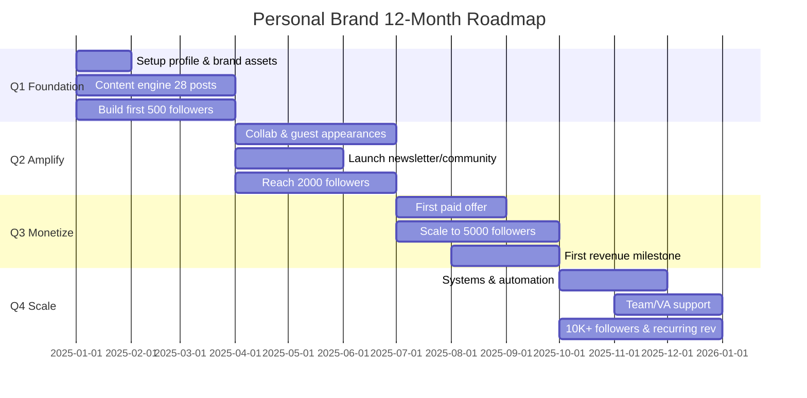

# Personal Brand Strategy (12-Month Plan)

> "Thuong hieu ca nhan khong phai ve ban NGHI ban la ai — ma la ve nguoi khac NHAN RA ban la ai khi ban khong co mat."
>
> Skill nay tao chien luoc 12 thang day du: chon niche, dinh vi, story arc, content pillars, authority ladder, va growth plan theo tung quy. Doc context file tu skill 22 truoc khi bat dau.

---

## Cho nguoi moi (Newbie section)

### Skill nay danh cho ai?

| Doi tuong | Vi du cu the |
|-----------|-------------|
| Founder / CEO | Muon ke hoach 12 thang xay thuong hieu ca nhan song song cong ty |
| Coach / Consultant | Muon lo trinh tu "chua ai biet" → "expert duoc moi noi" |
| Creator / KOL | Muon tang follower co chien luoc, khong phai dang dai |

### Skill nay KHONG danh cho ai?

- **Marketing san pham doanh nghiep** → Dung skill `00-ke-hoach-mkt` thay the
- **Agency lam cho khach hang** → Dung `20-brief-client-intake`
- **Chua co context ca nhan** → Chay skill `22-personal-brand-context` truoc

### Truoc khi go command

**Bat buoc:** Phai co file `.agents/personal-brand-context.md` — chay skill 22 truoc.
File nay chua niche, audience, north star, brand voice — skill 23 doc de khong hoi lai.

### Khi gap loi — troubleshooting

1. **"Khong tim thay context file"** → Chay `skill 22-personal-brand-context` truoc
2. **"Niche qua rong"** → Thu hep bang 3x3 grid (xem phan Niche Selection)
3. **"Khong biet viet story arc"** → Dung 3 prompts fill-in o phan Story Arc
4. **"12 thang dai qua, khong biet bat dau"** → Tap trung Q1 truoc, review moi quy

---

## Buoc 0: Doc context (skill 22)

Kiem tra co file `.agents/personal-brand-context.md` khong:

- **Co** → Doc toan bo, extract 4 thong tin chinh:
  1. **Niche** — linh vuc chuyen mon da chon
  2. **Audience** — doi tuong muc tieu ca nhan
  3. **North Star** — muc tieu 12 thang
  4. **Monetization goal** — cach kiem tien tu brand
- **Khong co** → De nghi user chay skill `22-personal-brand-context` truoc.
  Neu user muon tiep tuc, hoi 3 cau toi thieu:
  1. Ban lam gi va gioi gi nhat?
  2. Ban muon nguoi khac biet den ban vi dieu gi?
  3. Muc tieu 12 thang toi la gi?

---

## Niche Selection Framework

### Ikigai ca nhan — 4 vung giao

```
        Passion (Ban thich gi?)
              |
  Skill ------+------ Demand
(Ban gioi gi?)       (Thi truong can gi?)
              |
        Uniqueness
    (Ban khac gi doi thu?)
```

**Niche tot = giao diem cua 4 vung.** Thieu 1 vung → niche yeu.

### 3x3 Grid — Chon niche tu 9 ung vien

**Buoc 1:** Liet ke 3 passion + 3 skill

| | Skill 1: [___] | Skill 2: [___] | Skill 3: [___] |
|---|---|---|---|
| Passion 1: [___] | Niche A | Niche B | Niche C |
| Passion 2: [___] | Niche D | Niche E | Niche F |
| Passion 3: [___] | Niche G | Niche H | Niche I |

**Buoc 2:** Cham diem tung niche

| Niche | Demand (1-5) | Uniqueness (1-5) | Tong |
|-------|-------------|------------------|------|
| A | ? | ? | ? |
| B | ? | ? | ? |
| ... | ... | ... | ... |

**Buoc 3:** Chon top 1-2 niche co tong cao nhat (toi thieu 6/10).

### VN context

> "Niche phai du lon de co audience, du nho de ban la expert."

| Niche vi du (VN 2025-2026) | Demand | Ghi chu |
|----------------------------|--------|---------|
| AI ung dung cho SME | 5 | Hot nhat, nhung canh tranh cao |
| Marketing cho phong kham | 4 | Niche nho, it doi thu, gia cao |
| Tai chinh ca nhan Gen Z | 5 | Audience lon, nhieu format |
| Coaching ban hang B2B | 3 | Niche hep nhung san sang tra gia cao |
| Content strategy cho SaaS VN | 3 | Moi noi, it nguoi lam |
| Day tieng Anh giao tiep | 4 | Luon co nhu cau, canh tranh |
| Xay dung doi nhom startup | 3 | Founder audience, monetize tot |
| E-commerce cross-border | 4 | Xu huong 2025, nhieu nguoi can |
| Suc khoe tinh than workplace | 4 | Tang manh hau COVID |
| Personal finance cho freelancer | 3 | Niche nho, loyalty cao |

---

## Positioning Statement

### Formula

```
"Toi giup [AUDIENCE] dat [OUTCOME] thong qua [UNIQUE METHOD] trong [TIMELINE]."
```

### 3 vi du thuc te VN

**Founder:**
> "Toi giup founder startup Viet dat 1000 nguoi theo doi LinkedIn trong 90 ngay
> thong qua phuong phap 'Build in Public' co he thong."

**Coach:**
> "Toi giup quan ly cap trung tang 30% hieu suat doi nhom trong 6 thang
> thong qua mo hinh coaching 1-1 ket hop workshop noi bo."

**Creator:**
> "Toi giup nguoi di lam Gen Z hieu tai chinh ca nhan trong 30 ngay
> thong qua series video ngan giai thich bang vi du doi thuong."

### Kiem tra positioning — 4 cau hoi

| Cau hoi | Phai tra loi duoc |
|---------|-------------------|
| **Ai?** | Audience cu the (khong phai "moi nguoi") |
| **Van de gi?** | Pain point / mong muon ro rang |
| **Cach nao?** | Phuong phap / approach doc dao cua ban |
| **Khac gi?** | Diem khac biet so voi 3-5 nguoi cung lam |

Neu chua tra loi du 4 cau → chua san sang dinh vi. Quay lai Niche Selection.

---

## Story Arc 3 Chuong

> Story arc la cot truyen thuong hieu ca nhan — khong phai tieu su, ma la HANH TRINH. Nguoi ta nho cau chuyen, khong nho danh sach thanh tich.

### Hero's Journey — Adapt cho VN

```
Chuong 1: NGUON GOC          Chuong 2: KHUC QUANH         Chuong 3: HIEN TAI
(Vi sao ban bat dau?)   →   (Dieu gi thay doi ban?)   →   (Ban dang lam gi?)
- Pain point ca nhan         - Khoảnh khắc "aha"          - Su menh hien tai
- Boi canh gia dinh/xa hoi  - That bai lon nhat           - Giup ai, bang cach nao
- Dong luc goc               - Bai hoc cot loi             - Tam nhin tuong lai
```

### 3 prompts giup ban viet story arc

**Prompt 1 — Nguon goc:**
> "Truoc khi lam [linh vuc hien tai], toi tung [cong viec/tinh huong cu].
> Dieu khien toi bat dau la [su kien/cam xuc cu the]."

**Prompt 2 — Khuc quanh:**
> "Buoc ngoat lon nhat la khi [su kien cu the].
> Toi nhan ra [bai hoc], va tu do toi quyet dinh [hanh dong]."

**Prompt 3 — Hien tai:**
> "Hom nay toi giup [audience cu the] bang cach [phuong phap].
> Dieu toi tin nhat la [triet ly cot loi]."

### Luu y quan trong

- Story arc **PHAI chan thuc** — khong bua dat, khong phu phep
- Khong can "tu ngheo kho vuon len" — bat ky hanh trinh nao cung co gia tri
- That bai trong Chuong 2 khong nhat thiet la that bai lon — co the la "ngo cut"
- Story arc se dung trong: bio, about page, podcast intro, bai viet goc
- Moi 6 thang nen cap nhat Chuong 3 (ban dang o dau bay gio?)

---

## Content Pillars (4 Cot)

> 4 pillars x 7 chu de moi pillar = 28 chu de cho 12 thang. Du de post 2-3 lan/tuan ma khong bao gio het y tuong.

### 4 pillars

| Pillar | Ten | Mo ta | Vi du |
|--------|-----|-------|-------|
| 1 | **Industry Expertise** | Kien thuc chuyen mon ban BIET | Framework, phan tich xu huong, case study |
| 2 | **Behind the Scenes** | Cach ban LAM VIEC | Quy trinh, tool, sai lam + bai hoc |
| 3 | **Personal Philosophy** | Dieu ban TIN | Quan diem gay tranh luan, gia tri ca nhan |
| 4 | **Community Value** | Dieu ban CHO DI | Template mien phi, checklist, hoi dap |

### 28 chu de (4 x 7)

| # | Pillar 1: Expertise | Pillar 2: Behind Scenes | Pillar 3: Philosophy | Pillar 4: Community |
|---|---|---|---|---|
| 1 | Xu huong nganh 2025 | 1 ngay lam viec cua toi | Sai lam lon nhat nganh | Template mien phi |
| 2 | Framework giai quyet X | Tool toi dung hang ngay | Loi khuyen toi khong dong y | Checklist cho nguoi moi |
| 3 | Case study khach hang | Quy trinh tu A-Z | Bai hoc tu that bai | FAQ tra loi 10 cau hoi |
| 4 | So sanh 2 phuong phap | Hau truong du an X | Dieu toi uoc biet som hon | Guide buoc-by-buoc |
| 5 | Phan tich du lieu nganh | Ket qua thang nay | Quan diem nguoc dong | Resource list tot nhat |
| 6 | Tong hop kien thuc | Hanh trinh hoc skill moi | Triet ly lam viec | Livestream Q&A |
| 7 | Du doan xu huong nam toi | Review tool/sach | Cam nhan ve nganh | Challenge cong dong |

### Mapping pillar → platform

| Platform | Pillar chinh | Ly do |
|----------|-------------|-------|
| LinkedIn | Pillar 1 (Expertise) | Audience chuyen nghiep, content dai duoc doc |
| TikTok / Reels | Pillar 2 (Behind Scenes) | Format ngan, visual, behind-the-scenes hut view |
| Facebook Group | Pillar 4 (Community) | Tuong tac cao, community-driven |
| Blog / Newsletter | Pillar 3 (Philosophy) | Long-form, deep thinking |

---

## Authority Ladder (5 Nac)

> Tu "nguoi binh thuong" den "thought leader" khong xay ra 1 dem. Day la lo trinh 12 thang chia 5 giai doan.

### 5 nac tang dan

| Nac | Ten | Thoi gian | Hoat dong chinh | KPI |
|-----|-----|-----------|----------------|-----|
| 1 | **Observer** | Tuan 1-4 | Follow 50 experts, curate noi dung hay, comment gia tri | 100 comment chat luong |
| 2 | **Contributor** | Thang 2-3 | Dang bai original, chia se kinh nghiem, case study dau tien | 20 bai original, 200 followers |
| 3 | **Specialist** | Thang 4-6 | Deep dive niche, tao framework, series chuyen sau | 1 framework, 1000 followers |
| 4 | **Authority** | Thang 7-9 | Guest podcast, collab, media mention, first product | 3 collab, 3000 followers |
| 5 | **Thought Leader** | Thang 10-12 | Invited speaker, mentoring, khoa hoc/ebook | 5000+ followers, doanh thu |

### Content type theo nac

| Nac | Content types | Platform focus |
|-----|--------------|---------------|
| Observer | Comment, share + ghi chu, thread curate | LinkedIn, Twitter/X |
| Contributor | Bai viet ngan, carousel, video ngan | LinkedIn, TikTok |
| Specialist | Series dai, framework visual, case study | LinkedIn, Blog, YouTube |
| Authority | Podcast guest, collab video, newsletter | Podcast, YouTube, Email |
| Thought Leader | Keynote, course, book, media interview | Da nen tang + offline |

---

## 12-Month Growth Plan

### Tong quan 4 quy



### Chi tiet tung quy

**Q1 (Thang 1-3): FOUNDATION — Xay nen mong**

| Thang | Viec chinh | KPI |
|-------|-----------|-----|
| 1 | Setup profile (avatar, bio, banner), chon 2 platform chinh | Profile hoan chinh 100% |
| 2 | Dang 10 bai (Pillar 1+2), comment 50 bai cua expert | 200 followers, 10 bai |
| 3 | Dang 18 bai (du 4 pillar), first case study | 500 followers, 28 bai tong |

**Q2 (Thang 4-6): AMPLIFY — Khuyech dai**

| Thang | Viec chinh | KPI |
|-------|-----------|-----|
| 4 | Lien he 10 nguoi de collab, launch newsletter | 2 collab, 100 subscribers |
| 5 | Guest podcast/livestream, series chuyen sau | 1 podcast, 1 series 4 bai |
| 6 | Tao lead magnet (ebook/template mien phi) | 2000 followers, 300 email |

**Q3 (Thang 7-9): MONETIZE — Kiem tien**

| Thang | Viec chinh | KPI |
|-------|-----------|-----|
| 7 | Ra mat offer dau tien (1-1, workshop, khoa hoc mini) | 5 khach hang dau tien |
| 8 | Thu thap testimonial, toi uu offer | 10 testimonial, 3500 followers |
| 9 | Chay ads cho offer (tuy chon), tang gia | 5000 followers, doanh thu on dinh |

**Q4 (Thang 10-12): SCALE — Mo rong**

| Thang | Viec chinh | KPI |
|-------|-----------|-----|
| 10 | Xay system content (batch, schedule, repurpose) | Tiet kiem 50% thoi gian |
| 11 | Tuyen VA / editor, launch san pham thu 2 | 1 team member, 8000 followers |
| 12 | Review ca nam, lap ke hoach nam 2 | 10K+ followers, recurring revenue |

### Monthly milestone checklist

- [ ] So bai dang thang nay >= 8
- [ ] So follower moi >= target quy
- [ ] Engagement rate >= 3%
- [ ] Co it nhat 1 collab/connection moi
- [ ] Review va cap nhat content calendar
- [ ] Cap nhat story arc neu co thay doi (Chuong 3)

---

## Risk & Ethics

### 5 rui ro thuong gap

| Rui ro | Muc do | Cach phong tranh |
|--------|--------|-----------------|
| **Burnout** | Cao | Batch content, nghi 1 tuan/quy, khong chase algorithm |
| **Fake authority** | Cao | Chi noi nhung gi ban DA LAM, khong phai nhung gi ban DOC DUOC |
| **Over-promise** | Trung binh | Cam ket ket qua kha thi, khong "dam bao thanh cong" |
| **Mat privacy** | Trung binh | Phan biet "chia se" vs "pho bay", gia dinh khong phai content |
| **AI dependency** | Thap-Trung binh | AI ho tro, khong thay the giong noi ca nhan |

### Nguyen tac dao duc

1. **Khong lam gia expert** — Khong claim kinh nghiem ban chua co
2. **Khong dung AI de lua** — Neu content do AI viet, khong noi "toi viet"
3. **Disclosure AI content** — Ghi chu khi dung AI generate noi dung quan trong
4. **Khong copy framework nguoi khac** — Credit nguon, hoac tao framework rieng
5. **Khong ban khoa hoc truoc khi co ket qua** — Ban kinh nghiem, khong ban hua hen

### VN context

> "Viet Nam chua co nen tang support strong personal brand nhu LinkedIn US — nhung dang thay doi nhanh. LinkedIn VN tang 40% user 2024, TikTok giao duc bung no. Doi voi founder/coach VN: xay personal brand bay gio la 'early mover advantage'."

---

## Output template

```markdown
# Personal Brand Strategy — [Ho ten]
Ngay: [YYYY-MM-DD]
Variant: [Founder / Coach / Creator]

## 1. Niche da chon
Niche: [___]
Demand score: [1-5]
Uniqueness score: [1-5]
Ly do chon: [___]

## 2. Positioning Statement
"Toi giup [audience] dat [outcome] thong qua [method] trong [timeline]."

## 3. Story Arc
- Chuong 1 (Nguon goc): [___]
- Chuong 2 (Khuc quanh): [___]
- Chuong 3 (Hien tai): [___]

## 4. Content Pillars (28 chu de)
| Pillar | 7 chu de |
|--------|---------|
| Expertise | [___] |
| Behind Scenes | [___] |
| Philosophy | [___] |
| Community | [___] |

## 5. Authority Ladder — Vi tri hien tai
Nac hien tai: [1-5]
Nac muc tieu 12 thang: [___]

## 6. 12-Month Plan
| Quy | Muc tieu chinh | KPI |
|-----|---------------|-----|
| Q1 | [___] | [___] |
| Q2 | [___] | [___] |
| Q3 | [___] | [___] |
| Q4 | [___] | [___] |

## 7. Platform chinh
Platform 1: [___] — Pillar [___]
Platform 2: [___] — Pillar [___]

## 8. Risk mitigation
[Top 3 rui ro + cach phong tranh]
```

---

## Checklist chat luong

Truoc khi ket thuc:

- [ ] Doc context file skill 22 truoc khi bat dau
- [ ] Niche da validated (demand score >= 3)
- [ ] Positioning statement tra loi du 4 cau hoi (Ai? Van de gi? Cach nao? Khac gi?)
- [ ] Story arc 3 chuong day du — chan thuc, khong bua dat
- [ ] 28 chu de (4 pillars x 7) da duoc liet ke
- [ ] Authority ladder xac dinh nac hien tai + nac muc tieu
- [ ] 12-month plan co milestone cu the theo tung quy
- [ ] Platform chinh da chon + mapping pillar
- [ ] File output luu vao `personal-brand-strategy-[ten]-[YYYYMMDD].md`

---

## Lien ket skill

- **`22-personal-brand-context`** — Foundation skill, PHAI chay truoc skill nay
- **`26-thought-leadership-content`** — Tao noi dung thought leadership tu strategy nay
- **`09-insight-khach-hang`** — Hieu sau audience ca nhan
- **`17-pricing-strategy`** — Dinh gia offer khi den giai doan monetize (Q3)

---

*Skill 23 | Over Powers Agency | v1.0.0*
