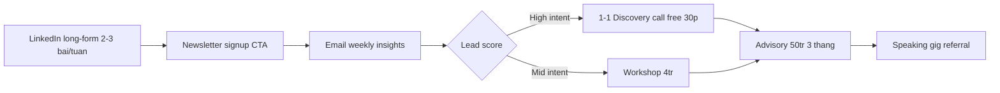
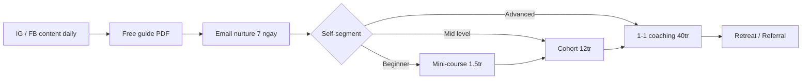
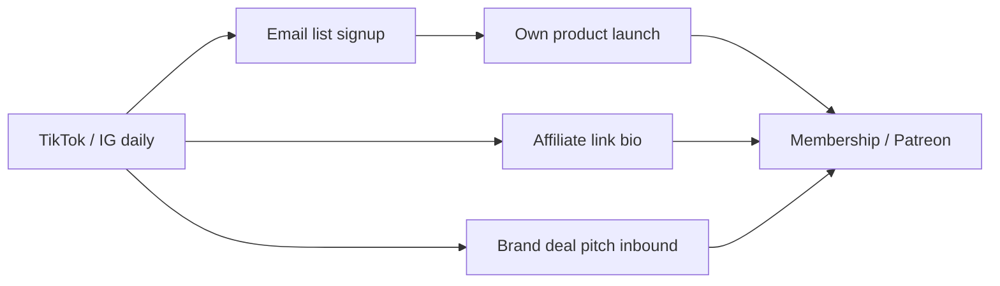

# Personal Brand Monetize — Funnel Kiem Tien Tu Personal Brand

> Build authority → mua trust → chot tien. Skill nay focus vao **buoc 3** (chot tien) sau khi da co context (skill 22), chien luoc (skill 23), va content (skill 26). 3 funnel khac nhau cho founder/coach/creator.

---

## 1. Cho nguoi moi (Newbie section)

### Khi nao bat dau monetize

KHONG monetize qua som. Cho 3 dieu kien sau truoc khi mo offer dau tien:

1. **Audience tu 1000 follower co chat luong** — engagement >3%, comment co chieu sau, DM hoi cau cu the
2. **Da chot ro pillar va niche** — biet ban "ai cho ai giai phap gi" (skill 22). Vi du: "Coach pricing cho coach 1-1 dang gia rich" — KHONG noi chung chung "kien tao thuong hieu"
3. **Co bang chung that** — tung lam project tao ROI cho khach, tung quan ly ngan sach >100M, tung viet 50+ bai long-form

### 5 loi sai pho bien khi monetize personal brand

1. **Ra offer truoc khi co audience** — pre-launch course chua co follower → 0 san pham ban
2. **Pricing qua thap** — 99K khoa hoc 4 buoi → audience nghi "do re tien" → khong tin
3. **Khong co offer ladder** — chi co 1 san pham 2tr, audience chua san sang chi, mat lead
4. **Lien tuc giam gia** — pre-order 50% off → late buyer cho sale → audience training thanh cho sale
5. **Mat tap trung** — vua coaching, vua course, vua affiliate, vua brand deal → khong cai gi den noi

### Time investment thuc te

- **Build audience giai doan 1**: 6-12 thang (tu 0 → 1000 follower chat luong)
- **Soft launch offer dau tien**: 2-3 thang sau khi audience da on
- **Monetize on dinh**: 12-18 thang sau khi bat dau personal brand
- **Do KHONG phai "kiem tien nhanh"** — la tai san dai han, ROI cao sau nam thu 2-3

### 3 archetype monetize khac nhau

| Archetype | Audience size de monetize | Income chinh | Time to first $1K |
|-----------|--------------------------|--------------|-------------------|
| Founder | 500-2000 (chat) | 1-on-1 advisory, speaking | 6-9 thang |
| Coach | 1000-5000 | Course, cohort, 1-on-1 | 4-8 thang |
| Creator | 5000-20000+ | Brand deal, affiliate, course | 8-12 thang |

> Founder co the monetize voi audience nho hon vi don gia cao (1 deal advisory = 20-50tr). Creator can audience lon hon vi don gia thap (1 brand deal = 5-20tr cho 5000-20000 follower).

---

## 2. Thu thap thong tin

Hoi toi da 4 cau truoc khi tu van funnel:

1. **Audience hien tai bao nhieu?** Total follower + email list + nen tang chinh (LinkedIn / FB / TikTok / IG / Newsletter)
2. **Niche cu the?** Topic bao tru (vi du "marketing cho SME f&b VN" — KHONG noi "marketing")
3. **Doanh thu hien tai tu personal brand?** Co dang ban gi chua? Don gia? Volume? (de biet xuat phat tu dau)
4. **Target 12 thang?** Income muc tieu/thang (vi du 50tr/thang) + so gio/tuan san sang dau tu

---

## 3. Offer Ladder Template — 3 Phien Ban

### Phien ban A: Founder Ladder (B2B, advisory)

| Bac | Offer | Gia VN 2026 | Volume/thang | Thoi gian/khach |
|-----|-------|-------------|--------------|-----------------|
| Free | Long-form LinkedIn + Newsletter | 0 | Unlimited | 0 |
| Low | Workshop B2B (4-8 nguoi) | 2-5tr/nguoi | 2-4 buoi/thang | 3 gio |
| Mid | 1-on-1 Advisory (3 thang) | 30-80tr/khach | 2-3 khach | 6 buoi |
| High | Speaking Gig / Keynote | 30-100tr/buoi | 1-2 buoi | 1 ngay |
| Top | Investment / Equity Advisory | 200tr-1ty+ | 1-2 deal/nam | Long-term |

**Income mau (founder co 2000 LinkedIn follower):** 4 workshop x 4tr (16tr) + 2 advisory x 50tr (100tr) + 1 speaking x 50tr = **166tr/thang**.

### Phien ban B: Coach Ladder (1-1 + course)

| Bac | Offer | Gia VN 2026 | Volume/thang |
|-----|-------|-------------|--------------|
| Free | Free guide (lead magnet) | 0 | 200-500 download |
| Low | Mini-course self-paced | 990K-1.9tr | 30-80 nguoi |
| Mid | Cohort course (4-8 tuan) | 8-15tr | 20-40 nguoi/cohort |
| High | 1-on-1 coaching (3 thang) | 30-50tr | 5-8 khach |
| Top | Retreat / Mastermind | 50-150tr | 1 lan/quy, 8-15 nguoi |

**Income mau (coach co 5000 follower IG/FB):** 50 mini-course x 1.5tr (75tr) + 30 cohort x 12tr / 2 thang (180tr/2 = 90tr) + 5 coaching x 40tr / 3 thang (200tr/3 = 67tr) = **232tr/thang**.

### Phien ban C: Creator Ladder (audience large)

| Bac | Offer | Gia VN 2026 | Volume/thang |
|-----|-------|-------------|--------------|
| Free | Daily content (TikTok / IG / YouTube) | 0 | Unlimited |
| Low | Affiliate commission | Avg 200K-500K/sale | 50-200 sale |
| Mid | Brand deal / Sponsored post | 5-20tr/post | 4-8 deal |
| High | Own product (course / merch / tool) | 990K-5tr/sp | 50-300 unit |
| Top | Subscription / Patreon / Membership | 99K-500K/thang | 200-1000 sub |

**Income mau (creator 50K follower TikTok + 20K IG):** Affiliate 100 sale x 300K (30tr) + 5 brand deal x 10tr (50tr) + 100 course x 1.9tr (190tr/3 thang = 63tr) + 500 sub x 200K (100tr) = **243tr/thang**.

---

## 4. Funnel Cu The Tung Nhom

### 4.1 Founder Funnel



**Conversion benchmark VN:** LinkedIn → Newsletter 5-12%, Newsletter → Discovery call 1-3%, Discovery call → Advisory 30-50%.

### 4.2 Coach Funnel



**Conversion benchmark VN:** Content → Lead magnet 3-8%, Lead → Mini-course 2-5%, Mini-course → Cohort 15-25%, Cohort → 1-1 coaching 10-20%.

### 4.3 Creator Funnel



**Conversion benchmark VN:** View → Affiliate click 0.5-2%, Click → Sale 2-8%, View → Email 0.3-1%, Email → Course buyer 2-6%.

---

## 5. Pricing Psychology Ca Nhan

### Authority pricing (premium)

KHI ban da co bang chung (case study, testimonial, media mention), pricing **theo authority** — KHONG theo gio cong.

- 1-1 coaching 3 thang KHONG = 12 buoi x 1tr/buoi = 12tr
- 1-1 coaching 3 thang = "Thay doi cuoc song / business cua ban" = **40-80tr**

Cong thuc: Outcome value / Time saved / Risk removed. Khach KHONG mua gio, ho mua **ket qua**.

### Value-based pricing (B2B advisory)

Cho founder advisory:

```
Pricing = 5-10% gia tri ROI ma khach kha nang dat duoc trong 12 thang
```

Vi du: Khach co cong ty doanh thu 5ty/nam, advisory giup tang 30% (1.5ty). Pricing fair = 75-150tr/quy = **25-50tr/thang**.

### Anchor pricing (course)

Khi launch course, dat 3 tier:
- Tier A (anchor cao): 9.9tr — full mentorship + cohort + 1-1
- Tier B (target ban): 4.9tr — full course + community
- Tier C (entry): 1.9tr — full course self-paced

**70% buyer chon Tier B** vi co Tier A lam anchor. Khong co Tier A → buyer thay Tier B dat.

### VN context: USD vs VND

| Audience | Currency | Reasoning |
|----------|----------|-----------|
| B2B VN startup / SME | VND | Quen, de quy doi ngan sach |
| Coach VN audience | VND | Don nhat, tranh confusion |
| Creator co audience global | USD + VND | Stripe/PayPal global, VND cho VN |
| Founder advisory cho corp | VND co the cao | Corp budget tinh USD nhung pay VND |

> Pricing trong USD ($497, $997) co cam giac premium hon voi audience tre VN co exposure quoc te. Pricing VND (12tr, 19tr) on hon voi audience trung nien VN.

### 3 anti-pattern pricing

1. **Hourly rate cap** — coach 500K/buoi → khach mua 4 buoi het 2tr → audience nghi "coach re" → khong gia tri
2. **Fix gia chung 1 lan** — KHONG bao gio tang gia → audience moi vao thay = audience cu → khong tao urgency
3. **Discount > 30%** — sale 50% off thuong xuyen → audience training cho sale, khong bao gio mua full price

---

## 6. Outreach Inbound vs Outbound

### Inbound (warm — content driven)

- **SEO long-form**: bai 2000 tu rank top Google → 3-12 thang ROI
- **Social content**: LinkedIn / FB / IG / TikTok → 1-3 thang co lead
- **Referral**: cu khach gioi thieu → free, conversion >50%
- **Newsletter**: warm list, conversion 5-15% cho offer mid-tier

**Conversion chung:** Inbound lead → Buyer **3-15%** (cao vi da pre-qualify).

### Outbound (cold — proactive)

- **Cold DM LinkedIn**: 50-100 DM/tuan → 5-15% reply → 1-2% book call
- **Cold email**: 100-200 email/tuan → 3-8% reply → 0.5-1% book call
- **Paid ads**: Meta/TikTok ads → 1-3% landing CVR → 10-20% nurture buyer

**Conversion chung:** Outbound lead → Buyer **0.5-3%** (thap vi cold).

### Khi nao dung cai nao

| Tinh huong | Inbound | Outbound |
|-----------|---------|----------|
| Audience da co >2000 | Yes | No can |
| Audience <500, can lead nhanh | No | Yes |
| Don gia >50tr (advisory) | Yes (chinh) | Yes (bo sung) |
| Don gia <2tr (course) | Yes (chinh) | Paid ads ngon |
| Niche B2B nho | Yes | Cold email tot |
| Niche B2C mass | Yes | Paid ads chinh |

> **Combo tot nhat VN 2026:** Inbound content xay tin (12 thang) + Outbound cold DM cho deal lon (advisory) + Paid ads cho course launch (booster).

---

## 7. Brand Deal Negotiation Cho Creator

### Floor price formula (cong thuc gia san)

```
Floor price (VND) = CPM × Follower / 1000 × Engagement multiplier × Format multiplier
```

- **CPM VN 2026**: 100K-300K (TikTok), 80K-250K (IG), 50K-200K (FB)
- **Engagement multiplier**: 0.5x (ER<2%), 1x (ER 2-5%), 1.5x (ER 5-10%), 2x (ER>10%)
- **Format multiplier**: 1x (story), 2x (post feed), 3x (reel/video), 4x (livestream)

**Vi du:** Creator 50K TikTok, ER 6%, brand muon 1 video. Floor = 200K × 50 × 1.5 × 3 = **45tr**. Brand chao 15tr → KHONG nhan, counter 35tr.

### Cac dieu khoan can dam phan

| Dieu khoan | Bao ve creator | Bao ve brand |
|-----------|---------------|---------------|
| Exclusivity | Toi 7-30 ngay (KHONG vinh vien) | Brand muon 90 ngay |
| Usage rights | 30-90 ngay organic, +50% cho ads | Brand muon vinh vien + ads |
| Whitelisting (chay ads tren acc) | +30-50% gia | Brand thich vi authentic |
| Revision | Toi 2 round | Brand muon unlimited |
| Cancellation | Phi cancel 50% neu <7 ngay | Brand muon free cancel |
| Payment terms | 50% truoc, 50% sau post | Brand muon NET 30-60 |

### 5 negotiation tactic VN

1. **Khong bao gia truoc** — hoi brand budget truoc ("Anh chi co budget bao nhieu cho deal nay?")
2. **Co rate card** — gui media kit + price list → trong nghiem tuc, khong "tra gia bua"
3. **Bundle deal** — 1 video reel + 3 story = 1.3x gia 1 video (KHONG 4x — fair cho brand)
4. **Tang gia 20-30% moi quy** sau khi co 2-3 deal → train brand quen voi tang gia
5. **Tu choi deal duoi floor** — neu chap nhan duoi floor 1 lan, brand network share rate thap → nguoi sau cung tra thap

### VN reality: brand pay 30-50% less than US/SG

- US creator 50K = $1500-3000/post (~37-75tr VND)
- SG creator 50K = SGD 800-1500 (~15-28tr VND)
- VN creator 50K = **8-20tr VND** (uoc tinh)

**Ly do:** Budget brand VN thap, agency middleman lay 20-30% cut, creator supply nhieu. Cach tang gia: build niche authority (B2B / fintech / luxury) → CPM cao gap 3-5x mass entertainment.

---

## 8. Lead Inbound Tracking + Tax & Legal VN 2026

### 8.1 Inbound DM tracking spreadsheet

Cot can co (Google Sheet / Notion):

| Cot | Vi du |
|-----|-------|
| Date | 2026-05-08 |
| Source | LinkedIn DM / IG DM / Email / Referral |
| Name | Nguyen Van A |
| Company | Cong ty XYZ |
| Niche fit | Yes / No |
| Stage | Cold / Warm / Hot / Booked / Closed / Lost |
| Offer interested | Workshop / Advisory / Course / Coaching |
| Estimated value | 50tr |
| Next action | Discovery call 2026-05-12 |
| Notes | Pain point: pricing |

> **Goal:** Nhin 1 line, biet phai lam gi tiep theo. Update tuan 1 lan toi thieu.

### 8.2 Conversion benchmark inbound DM VN

- DM → Reply: 70-90% (warm audience)
- Reply → Discovery call: 30-50%
- Discovery call → Proposal: 50-70%
- Proposal → Closed: 30-50%

**Tong:** DM → Closed ~ 5-15% (warm inbound).

### 8.3 Thue thu nhap ca nhan (TNCN) VN 2026

Khi monetize personal brand, ban se co income tu nhieu nguon (course, coaching, brand deal). Phan loai:

- **Tien luong** (full-time job): bieu thue luy tien 5-35%
- **Tien thu nhap khac** (freelance, brand deal, advisory): khau tru 10% tai nguon (>2tr/lan)
- **Tien hoa hong / affiliate**: 5-10% khau tru tai nguon
- **Loi tuc kinh doanh** (course self-launch, ban san pham): 0.5-5% tren doanh thu (tuy nganh)

### 8.4 Khi nao can dang ky ho kinh doanh / cong ty

| Nguong doanh thu | Hinh thuc | Thue suat | Dac diem |
|------------------|-----------|-----------|----------|
| <100tr/nam | Ca nhan | TNCN khau tru tai nguon 10% | Don, khong can dang ky |
| 100tr - 1ty/nam | Ho kinh doanh ca the | Thue khoan / tren doanh thu 1.5-7% | Don, dang ky cap quan/huyen |
| >1ty/nam | Cong ty TNHH | TNDN 20% + GTGT 10% | Phai co ke toan |
| >5ty/nam | Cong ty co phan | TNDN 20% + management overhead | Cho team >5 nguoi |

### 8.5 Best practice tax VN cho personal brand

1. **Tach tai khoan ngan hang** rieng cho personal brand (KHONG dung tai khoan luong cong ty)
2. **Giu hoa don/contract** toi thieu 5 nam (luat thue VN)
3. **Khai bao quy** (ho kinh doanh) hoac thang (cong ty) — KHONG quen
4. **Thue ke toan part-time** khi vuot 500tr/nam — chi 1-3tr/thang, save thoi gian + sai sot
5. **Reference chinh thuc**: gdt.gov.vn (Tong cuc Thue) va Luat Thue TNCN sua doi 2024 (hieu luc 2025-2026)

### 8.6 Anti-pattern tax personal brand VN

1. **Nhan toan bo bang tien mat** → KHONG co bang chung doanh thu → kho len ngan hang vay khi can
2. **Pay all qua Momo/ZaloPay ca nhan** → moi ngan hang flag activity bat thuong → bi block
3. **Khong dang ky gi het** dù income >500tr/nam → bi truy thu thue + phat lai 0.03%/ngay
4. **Khai thieu doanh thu** → bi cuc thue inspection → phat 1-3 lan thue thieu

---

## 9. Checklist chat luong

- [ ] Audience >1000 chat luong truoc khi ra offer dau tien
- [ ] Co offer ladder >=3 bac (Low / Mid / High)
- [ ] Da xac dinh archetype (founder / coach / creator) → funnel phu hop
- [ ] Pricing co Anchor tier (cao) + Target tier (mid) + Entry tier (thap)
- [ ] Tracking spreadsheet inbound DM da setup
- [ ] Da hieu nguong thue (100tr / 1ty) va dang ky phu hop
- [ ] Tach tai khoan ngan hang ca nhan vs personal brand
- [ ] Co ke hoach tang gia 20-30% moi quy sau 2-3 deal
- [ ] KHONG discount >30% lien tiep — bao ve gia tri brand
