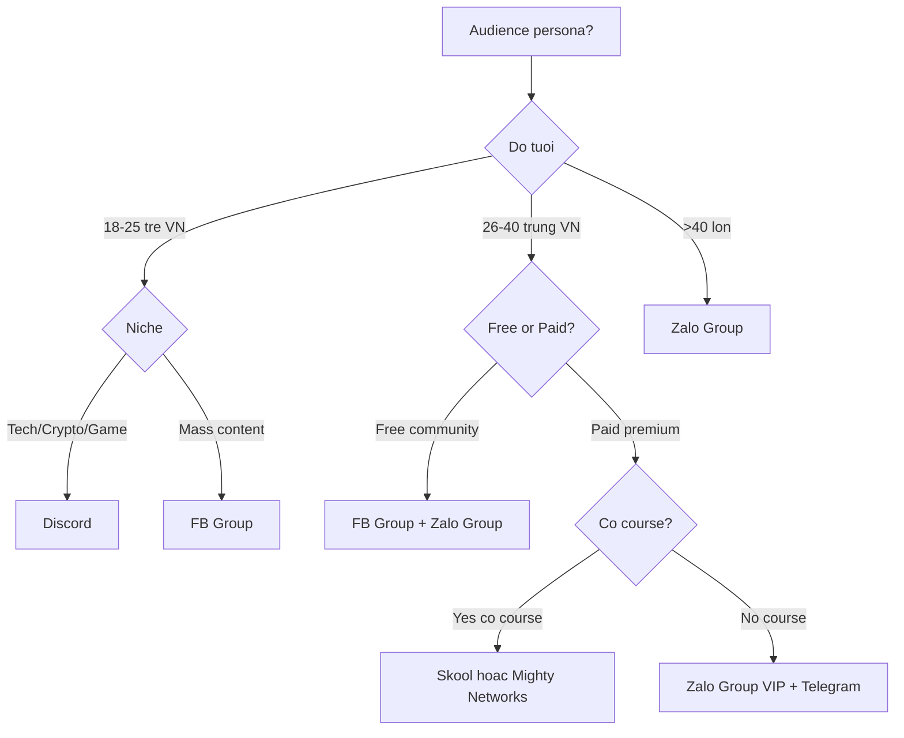

# Community Building — Cong Dong Quanh Personal Brand

> Audience = nguoi follow ban. **Community = nguoi noi chuyen voi nhau** quanh ban. Khac biet co ban: Audience scale theo so, community scale theo connection. Skill nay xay community lam **moat** cho personal brand — khong the copy.

---

## 1. Cho nguoi moi (Newbie section)

### Audience vs Community — khac biet quan trong

| Tieu chi | Audience | Community |
|----------|----------|-----------|
| Quan he | 1-many (ban → follower) | many-many (member ↔ member) |
| Owner | Ban | Ban + member co-create |
| Scale | Tot voi vai chuc nghin | Bi gioi han ~150-1000 chat |
| Monetize | Course, brand deal | Membership, mastermind |
| Defensibility | De copy | Kho copy (network effect) |

### Khi nao bat dau xay community

KHONG xay qua som. Cho 3 dieu kien:

1. **Audience >2000 follower** chat luong — du nhom 50-100 nguoi tham gia community dau tien
2. **Da co 1 san pham/offer** thanh cong — community la rao chan giu khach hang, KHONG phai cau dau tien ban hang
3. **Co thoi gian danh ra >5 gio/tuan** trong 6 thang dau — community can chu nha hien dien hang ngay

### 5 loi sai pho bien khi xay community VN

1. **Tao group roi de tu chay** — 1 thang sau group chet, member spam quang cao → close
2. **Member 1000 nhung 90% lurker** — chi 50-100 active → ROI thap
3. **Spam ban hang trong group** — admin lien tuc post offer → member mat trust → leave
4. **Khong co rules ro** — toxic member chui boi → community tot bo di → toxic stay
5. **Chon platform sai** — chon Discord cho audience trung nien VN → 80% bo cuoc onboard

### Time investment thuc te

- **Setup ban dau**: 2-4 tuan (chon platform, setup rules, onboard 50 founding members)
- **Daily check-in**: 30-60 phut/ngay trong 3 thang dau
- **Weekly events**: 1-2 gio/tuan (livestream, AMA, workshop)
- **Total**: 8-15 gio/tuan trong 6 thang dau, sau do delegate cho moderator team

---

## 2. Thu thap thong tin

Hoi toi da 4 cau:

1. **Audience hien tai bao nhieu va o dau?** Total follower + nen tang chinh (de chon platform community phu hop)
2. **Persona member?** Tre/trung nien, B2B/B2C, paid/free? (Quyet dinh platform va monetize model)
3. **Muc tieu community?** Free community giu khach hang / Paid community la income chinh / Mastermind cao cap (3 huong khac nhau)
4. **Resource**: 1 minh hay co team? Co budget cho platform/moderator khong? (Anh huong scale va platform chon)

---

## 3. Platform Comparison VN 2026

| Platform | Cost | VN UX | Max members | Monetize options | Pros | Cons | Best for | Setup time |
|----------|------|-------|-------------|------------------|------|------|----------|-----------|
| **Zalo Group** | Free | 10/10 | 1000 (free), 5000 (paid) | Manual collect via bank | Native VN, push noti tot, chat realtime | Khong searchable, khong threaded, kho moderate | Coach/founder VN audience trung nien | 1 tuan |
| **Telegram** | Free | 7/10 | Unlimited (chanel), 200K (group) | Bot payment, Stars | Bot powerful, search tot, file lon | Audience VN moi 30-40% xai, bot setup phuc tap | Crypto / tech / dev community | 1-2 tuan |
| **FB Group** | Free | 9/10 | Unlimited | Subscription Group ($5-30/thang), member-only post | Reach co quen audience VN, search tot, threaded | Reach giam, FB algorithm controlado, spam nhieu | Mass audience VN, community tre | 1 tuan |
| **Skool** | $99/thang base | 5/10 | Unlimited (paid plan) | Paid course + community combo, $9-499/thang/member | All-in-one (course + community + classroom), gamification leaderboard | Tieng Anh, payment Stripe, slow load VN | Coach/creator co course + cong dong tieng Anh | 2-4 tuan |
| **Mighty Networks** | $39-179/thang | 6/10 | Unlimited | Subscription, course, event ticket | Customizable, native course, mobile app brand | Hoc curve cao, payment overseas | Coach quoc te, multi-product personal brand | 3-5 tuan |
| **Discord** | Free | 6/10 | 500K | Premium Memberships ($5-100/thang), Boost | Voice channel + thread + role permission tot, gen Z thich | Setup phuc tap, audience trung nien VN khong quen | Gen Z gaming/crypto/dev/creative VN | 2-3 tuan |

### Quick decision tree

---

## 4. Community Blueprint 3 Lop

> 3 lop = phai han access theo do gan ket. Moi lop co content type khac va goal khac.

### Lop 1: Public layer (open content, free, mass)

- **Goal**: Awareness — convert outsider thanh follower
- **Channels**: SEO blog, social media (FB / IG / TikTok / LinkedIn / YouTube), podcast
- **Content**: Long-form bai hoc, video huong dan, podcast interview, case study cong khai
- **Volume**: 5-7 bai/tuan
- **Metric**: Reach, follow, traffic
- **Monetize direct**: 0 (chi giup brand awareness)

### Lop 2: Member layer (free signup, warm)

- **Goal**: Trust — convert follower thanh "thanh vien" co contact direct
- **Channels**: Email newsletter, FB Group free, Zalo Group free, Discord free
- **Content**: Weekly newsletter sau, AMA monthly, free workshop quarterly
- **Volume**: 1-3 noi dung/tuan
- **Metric**: Email open rate (>25%), member active rate (>30%)
- **Monetize direct**: Affiliate, soft offer 5-10% subscriber convert to paid

### Lop 3: Inner layer (paid, hot)

- **Goal**: Activation — chuyen tin thanh tien + ket noi sau
- **Channels**: Paid community (Skool / Mighty / Zalo VIP), mastermind 1-1, retreat
- **Content**: Weekly office hour, monthly mastermind, quarterly retreat, exclusive course
- **Volume**: 1-2 high-touch event/tuan
- **Metric**: Retention >70% sau 6 thang, NPS >50
- **Monetize direct**: 100% — la nguon thu chinh cua community

### Vi du minh hoa: Coach VN co 5000 IG follower

- Public: 5 IG post/tuan + 1 podcast/thang → 1000 reach moi/post
- Member: Newsletter 1500 sub + Zalo Group free 800 nguoi → AMA monthly
- Inner: Zalo Group VIP 80 nguoi x 500K/thang = **40tr/thang RMR**

---

## 5. Onboarding Flow 7 Ngay

> Day la 7 ngay quyet dinh member stay or leave. >50% community chet vi onboard kem.

### Day 0 (truoc khi join)

- Welcome page co video chao mung 60s ban (ca nhan, KHONG generic)
- Form thu thap thong tin: ten, niche, muc tieu thang nay
- 1 link group calendar (zoom call onboard hang tuan)

### Day 1

- **Auto DM/email chao mung**: gioi thieu rules + 3 dieu nen lam ngay (post intro, doc pinned post, dien profile)
- **Pinned post intro**: yeu cau member moi tu gioi thieu (template co san: ten, niche, muc tieu, hoi 1 cau)
- **Founder respond**: Ban PHAI tra loi 100% intro post trong 24h dau (build trust manh)

### Day 2-3

- **First win quick**: gui PDF checklist / template free (de member co cam giac "da nhan duoc gia tri")
- **Tag mate**: tag 2-3 member cu tuong tac voi member moi (giam awkwardness)

### Day 4-5

- **Invite join event**: livestream / AMA tuan toi (tao reason de quay lai)
- **Cau hoi mo**: post cau hoi tao discussion, member moi de tham gia

### Day 6

- **Soft pitch lop 3**: gioi thieu paid tier (KHONG hard sell, chi mention "co lop sau hon neu can")
- **Survey ngan**: 3 cau (you ve nhom xa thay sao, can them gi, content nao thich)

### Day 7

- **Welcome call collective** (cho 10-30 member moi cung join 1 tuan): 30 phut, ban gioi thieu nhom + Q&A
- Sau call: 30-50% member moi engage manh nguyen tuan sau

### Onboarding metrics target

- **Day 7 retention**: >70% (member van active sau 1 tuan)
- **Day 30 retention**: >50%
- **First post within 7 days**: >40% member co post dau

---

## 6. Engagement Rituals (cadence weekly + monthly)

> Ritual = event lap lai theo lich. KHONG co ritual → community chet trong 3 thang.

### Weekly cadence

| Thu | Ritual | Nguoi lam | Time |
|-----|--------|-----------|------|
| Thu 2 | "Monday goal" — member share muc tieu tuan | Member tu post, ban react | 5 phut |
| Thu 3 | Founder long-form post (lesson/insight) | Ban viet | 30 phut |
| Thu 4 | "Wins Wednesday" — member share thanh tuu | Member tu post | 5 phut |
| Thu 5 | AMA / Office hour 30 phut | Ban livestream | 30 phut |
| Thu 6 | "Friday wrap" — recap tuan, top contributor | Ban post | 15 phut |
| CN | Weekly newsletter (community digest) | Ban gui | 30 phut |

### Monthly cadence

- **Tuan 1**: Workshop/training ~ 60 phut (ban day chu de cu the)
- **Tuan 2**: Member spotlight (showcase 1 member co progress tot)
- **Tuan 3**: Networking event (zoom hangout, breakout room)
- **Tuan 4**: Retro + planning (member feedback, ban share roadmap)

### Quarterly

- 1 retreat / mastermind day (offline tot nhat — VN noi nhu Da Lat / Phu Quoc)
- Lifetime event tao bond rat manh, retention >85% post-retreat

### Engagement metric target VN 2026

| Metric | Kem | Trung binh | Tot | Xuat sac |
|--------|-----|------------|-----|----------|
| DAU/MAU | <10% | 10-25% | 25-40% | >40% |
| Post per active member/tuan | <0.5 | 0.5-1.5 | 1.5-3 | >3 |
| Retention 6 thang | <40% | 40-60% | 60-75% | >75% |
| NPS | <30 | 30-50 | 50-70 | >70 |

---

## 7. Moderation Playbook

> Community KHONG co moderation = community toxic. 5 quy tac vang.

### 5 rules cot loi (post pinned, member sign agreement khi join)

1. **Khong spam ban hang/affiliate link** trong post chinh — tru pinned thread "self-promo Friday"
2. **Khong cong kich ca nhan** — phan bien y kien OK, khong attack nguoi
3. **Khong noi dung NSFW / chinh tri / ton giao**
4. **Khong share tai lieu paid course nguoi khac** ra cong
5. **Tu gioi thieu truoc khi post hoi** — neu thanh vien moi va post ngay 1 cau hoi → mod yeu cau intro truoc

### Escalation policy 3 buoc

- **Buoc 1 — Warning**: vi pham lan dau, mod DM rieng, xoa post (KHONG public shame)
- **Buoc 2 — Mute 7 ngay**: vi pham lan 2, member khong post duoc trong 7 ngay
- **Buoc 3 — Permanent ban**: vi pham lan 3 hoac vi pham nghiem trong (toxic, scam) — ban + thong bao trong group "co thanh vien vi pham rules da bi remove"

### Ban policy (khi nao ban ngay khong canh cao)

- Spam scam (claim duoc 100tr/thang khong lam gi)
- Toxic doxxing (le thong tin ca nhan member khac)
- Sale san pham doi thu truc tiep
- Bot/fake account

### Mod team setup khi >300 member

- 1 mod chinh (toi loi, tra luong 3-5tr/thang)
- 2-3 mod tinh nguyen (cu khach co engagement cao, free + benefit access lop 3)
- Mod meeting bi-weekly 30 phut

---

## 8. Activation Metrics + Anti-pattern VN

### 8.1 Health metrics tracking

Tracker hang tuan (dashboard Notion / Sheet):

| Metric | Cong thuc | Target VN |
|--------|-----------|-----------|
| Total member | Headcount | Tang 5-15%/thang |
| DAU | Active 1 ngay | 25-40% MAU |
| MAU | Active 30 ngay | >50% total |
| Posts/week | So post (member + admin) | 30+ post/tuan/100 member |
| Reply rate | Cau hoi co reply trong 24h | >80% |
| Retention 6 thang | Member >50% MAU sau 6 thang | >60% |
| NPS | Khao sat quy | >50 |

### 8.2 Activation event (de detect member "active")

Member duoc ghi nhan "active" khi co 1 trong:

1. Post 1 cau hoi/comment co chieu sau (>20 ky tu)
2. Tham gia event live >50% thoi gian
3. Reply 1 post nguoi khac voi y kien rieng
4. DM founder/mod hoi cau cu the

### 8.3 Anti-pattern VN — 7 dieu KHONG nen lam

1. **Spam ban hang** — admin post offer 1 ngay 5 lan → member mat trust → roi
2. **Follower count cao nhung KHONG engage** — 5000 member nhung 50 active → meaningless
3. **Vong tay ban** — admin tag bat ky cau hoi nao thanh "co the giai quyet bang khoa hoc cua minh" → toxic
4. **Khong moderate** — 3 thang sau group thanh nha tro (spam crypto, MMO, forex)
5. **Tao nhieu group sub-region** — group HCM, group HN, group DN — chia rang community → moi group 100 nguoi yeu
6. **Member ranks cong khai gay so sanh** — leaderboard drama, member rank thap silent quit
7. **Founder bien mat 2 tuan** — community phu thuoc personality founder, mat hien dien → tu chet

### 8.4 KPI tong hop community 6-12 thang dau

| Mile | Time | Target |
|------|------|--------|
| MVP launch | Tuan 1-4 | 50 founding member, retention >80% sau 30 ngay |
| Healthy core | Thang 2-3 | 200 member, DAU/MAU >25%, 1 ritual chay deu |
| Scale | Thang 4-6 | 500 member, mod team setup, paid tier launch |
| Self-sustain | Thang 7-12 | 1000+ member, mod handle 70% tasks, retention >65% |

---

## 9. Checklist chat luong

- [ ] Audience >2000 follower truoc khi xay community
- [ ] Da co >=1 san pham/offer thanh cong
- [ ] Chon platform fit voi audience persona (KHONG fancy)
- [ ] Setup 5 rules ro rang + member sign agreement
- [ ] Onboarding flow 7 ngay co automation (DM/email + pinned post)
- [ ] Weekly ritual setup (>=3 ritual lap lai)
- [ ] Founder PHAI hien dien trong 3 thang dau (>5 gio/tuan)
- [ ] Mod team setup khi >300 member
- [ ] Tracking dashboard DAU/MAU/retention/NPS
- [ ] Tranh 7 anti-pattern VN (spam, vong tay ban, founder bien mat)
