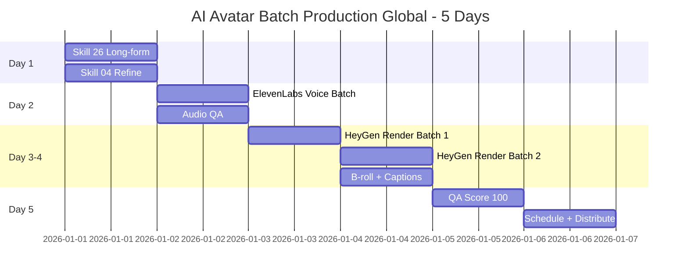

# Workflow: AI Avatar Batch Production Global (30 Videos / 5 Days)

> Batch produce 30 AI avatar videos in 5 days — day-by-day playbook for creators dumping a month of content in one focused sprint.

---

## 1. Who is this workflow for?

```
Audience: Creator / Agency / Founder batching 30 AI avatar videos in 5 days for global distribution
Outcome after 5 days:
  - 30 AI avatar videos ready to publish (30-60s each)
  - QA score average 85+/100
  - Cost per video <$3 USD (total <$90 USD)
  - Multi-region schedule across 1-3 platforms
Time: 5 days × 5 hours = 25 hours total
Skills used: 22 (or product context) → 26 → 04 (Personal Brand) → 24 → 25 → 01
Output: 30 video files + audio + scripts + tracking sheet
Default currency: USD; tools billed monthly in USD
```

**Suitable for:**
- Creators on a monthly batch cadence
- Agencies producing client deliverables (monthly retainer model)
- Founders dumping a month of content to free up focus

**Pre-requisite:**
- `.agents/personal-brand-context.md` (skill 22) OR detailed product context file
- HeyGen Creator $30/month (or Synthesia Starter $30/month / Captions Pro $24/month) — Pro tier required for batch quota
- Voice clone setup via skill 24 + 25, validated with 1 successful test render

**NOT for:**
- First-time AI avatar use — run skill 24 standalone first to learn the pipeline
- No Pro tier subscription — free tiers don't have batch quota
- No context / strategy file — content will lack consistency

---

## 2. Pre-flight Checklist

Complete these 10 items BEFORE Day 1:

- [ ] Skill 22 personal-brand-context-global complete OR product context file ready
- [ ] Skill 24 voice clone + avatar setup tested with 1 successful end-to-end pipeline
- [ ] HeyGen / Synthesia Pro tier active (≥10 video/month batch quota)
- [ ] 30 ideas drafted (run skill 26 thought-leadership or skill 04 in advance)
- [ ] Disclosure templates ready: FTC (US), EU AI Act Article 50, platform-specific rules
- [ ] 30GB+ free storage (~1GB/video × 30, 1080p MP4)
- [ ] Landing page or CTA destination ready (Linktree / Carrd / brand site)
- [ ] One full pipeline test passed (Workflow 1 in skill 24) — quality acceptable
- [ ] 5 consecutive days clear of meetings + travel
- [ ] Tracking sheet ready: Notion / Google Sheets / Airtable with cols ID / script / audio / video / QA / schedule

> **Skipping pre-flight = burning $90+ budget + 25 hours.** Don't.

---

## 3. Step-by-step: 5 Days × 25 Hours Total

### Day 1: Script Batch (5 hours)

**Day goal:** 30 short scripts (30-60s) drafted, QA-ed, ready for voice render.

**Morning (2.5 hours): Long-form ideas → Short scripts**
- Run `/skill 26-thought-leadership-content-global` with 15 long-form ideas
- Cut each long-form into 2 short angles → total 30 video scripts (30-60s)
- Structure target: Hook (3s) + Setup (10s) + Insight (25-30s) + CTA (5-10s)
- Output: `/scripts/batch-[date]/01.md` through `/scripts/batch-[date]/30.md`

**Afternoon (2.5 hours): Refine via Personal Brand structure**
- Run `/skill 04-script-video-global` Personal Brand Mode
- Refine 30 scripts: brand voice, tone, keyword consistency
- Final structure: Hook + Setup + Insight + CTA (≈30s template)
- Read aloud each script — does it sound natural in spoken English?

**End-of-day QA gate (10 min):**
- [ ] Each script has hook + setup + insight + CTA fully written
- [ ] Length 30-60s (≈100-150 words at 150 wpm spoken pace)
- [ ] Brand voice consistent across all 30 scripts
- [ ] Zero typos or unsafe / off-brand phrases

> Bad scripts on Day 1 = unsalvageable on Day 5. DO NOT rush past Day 2.

---

### Day 2: Voice Batch (5 hours)

**Day goal:** 30 high-quality MP3 audio files, QA-ed, ready for avatar render.

**Morning (3 hours): ElevenLabs API batch render**
- Upload 30 scripts to ElevenLabs (Pro tier $22/month)
- Cost estimate: 30 × 60s × ~150 char/s = ~270K chars
- Cost ≈ $25-30 USD (Pro tier base $22 + extra credits if over quota)
- Render in parallel — ElevenLabs API supports batch
- Output: `/audio/batch-[date]/01.mp3` through `/audio/batch-[date]/30.mp3`

**Afternoon (2 hours): Audio QA — 5 criteria**
- Clarity (1-10): every word distinct, no mumbling?
- Pace (1-10): natural speed, not too fast / slow?
- Pause (1-10): natural sentence breaks, not robotic?
- No clipping (pass/fail): audio peaks not exceeding -3dB?
- Emotion match (1-10): tone matches content (humor / serious / excited)?

**Re-render rule:**
- Audio scoring <7/10 OR failing clipping → re-render with adjusted prompt
- Max 2 re-renders per audio — if still failing, edit script and re-render

> Don't skip QA — bad audio = bad lipsync = wasted avatar render budget.

---

### Day 3: Avatar Render Batch Part 1 (5 hours)

**Day goal:** 15 AI avatar videos rendered, QA-ed.

**Morning (1 hour): Setup batch render**
- HeyGen → API Batch Render
- Upload first 15 audio files (01-15)
- Match to avatar templates: rotate 2-3 avatars (using 1 avatar for all 30 = uncanny valley)
- Aspect ratio: 9:16 for TikTok / Reels / YouTube Shorts; 16:9 for YouTube long-form / LinkedIn native video
- Start render → wait 2-3 hours

**Afternoon (4 hours): Wait + QA from render queue**
- During wait: do other work, check progress every 30 minutes
- As each video completes: QA against 4 criteria
  - Lipsync (1-10): mouth matches audio?
  - Gesture (1-10): hand / body movement natural?
  - Eye contact (1-10): eyes track camera naturally?
  - Background (pass/fail): no glitches / artifacts?
- Re-render rule: video <7/10 → re-render with different avatar OR trim audio

**Output:** 15 videos in `/videos/batch-[date]/01.mp4` through `15.mp4`

---

### Day 4: Avatar Render Batch Part 2 + B-roll (5 hours)

**Day goal:** 30 videos complete, with captions + brand overlay.

**Morning (3 hours): HeyGen render videos 16-30**
- Same flow as Day 3: upload → render → QA
- During render wait: prep B-roll assets (logo, CTA card, music bed)

**Afternoon (2 hours): B-roll batch — captions + branding**
- Tools:
  - Captions Pro $24/month (auto-caption, English-strong)
  - Descript Creator $24/month (auto-caption + edit)
  - CapCut (free, mobile + desktop)
- Workflow:
  1. Import video to Captions / Descript → auto-generate English subtitles
  2. Review captions (English ASR ~95% accuracy — still verify)
  3. Export to CapCut for branding
  4. Add: brand logo (top-right or bottom-left), CTA card (last 3s), background music low-volume (-20dB)
- Batch: 30 videos × 4 min = 2 hours (use CapCut template to speed up)

**Output:** 30 final videos in `/videos/final/01.mp4` through `30.mp4`

---

### Day 5: QA + Schedule + Distribution (5 hours)

**Day goal:** 30 videos QA score 100, disclosure compliant, scheduled for distribution.

**Morning (2.5 hours): QA Score 100**
- Run QA Score 100 on all 30 videos (skill 24, Chapter 12)
- 5 min/video × 30 = 2.5 hours
- 5 dimensions: Lipsync (20) + Voice (20) + Visual (20) + Script (20) + CTA (20)
- Target: average 85+/100, no video below 70

**Afternoon (1 hour): Disclosure check**
- Skill 24 Chapter 11 — disclosure rules per region / platform
- US (FTC): mandatory disclosure for sponsored or AI-generated content; #ad if monetized; "AI-generated" if content uses synthetic media
- EU (AI Act Article 50): always disclose AI-generated content visibly, regardless of sponsorship
- TikTok: AIGC label in setting + caption disclosure
- Instagram Reels: Meta AI label + caption disclosure
- LinkedIn: text disclosure in post body
- YouTube: "Altered or synthetic content" toggle in upload settings (mandatory since 2024)
- All platforms: caption "Created with AI assistance" or equivalent

**Afternoon (1.5 hours): Schedule + Distribution**
- Tools:
  - Buffer ($6-12/month per channel)
  - Hootsuite ($99/month)
  - Later ($25/month)
  - Native scheduler per platform (free, less convenient)
- Multi-region schedule:
  - TikTok: 30 videos × 1/day = 30 days
    - Audience timezone: schedule 7-9pm in primary region's local time
    - Multi-region: split posting between 2 timezones (e.g., 7pm EST + 7pm PST = 2 posts/day)
  - Instagram Reels: cross-post on same schedule
  - LinkedIn: pick top 10 by QA (>=80 score), post Tue/Wed/Thu 8-9am primary region time
  - YouTube Shorts: cross-post all 30 — Friday-Sunday upload preferred
- Tracking sheet update: post date, platform, expected reach, actual reach (fill after publishing)

**Final celebration:** 30 days of content done in 5 days. Time to focus on other work.

---

## 4. Skills Chain & Timeline

### Mermaid Gantt Chart



### Skills Chain (Text)

```
22 (Personal Brand Context Global) or product-marketing-context-global
  → 26 (Thought Leadership Global)
  → 04 (Video Script Global - Personal Brand Mode)
  → 24 (AI Avatar Production Global - batch workflow)
  → 25 (Voice Clone Global)
  → 01 (Content Calendar Global - schedule)
```

### Output Files Map

| Day | Skill | Output |
|-----|-------|--------|
| 1 | 26 | 15 long-form ideas (mental model) |
| 1 | 04 | `/scripts/batch-[date]/01-30.md` |
| 2 | 25 | `/audio/batch-[date]/01-30.mp3` |
| 3-4 | 24 | `/videos/batch-[date]/01-30.mp4` (raw) |
| 4 | — | `/videos/final/01-30.mp4` (with captions + branding) |
| 5 | 01 | Schedule sheet + distribution log |

---

## 5. Success Criteria

### 5-Day Batch Targets

| Criterion | Minimum | Good |
|-----------|---------|------|
| Videos completed | 25/30 | 30/30 |
| QA score average | 70 | 85+ |
| Cost per video | $5 USD | <$3 USD |
| Disclosure compliance | 100% (MANDATORY) | 100% |
| Schedule done | 80% scheduled | 100% scheduled |

### KPI Tracking After 30 Days of Distribution

After all 30 videos have been published, measure:

- **Avg view per video:** mean across all 30
- **Engagement rate per video:** (Like + Comment + Share) / View
- **Top 3 by reach:** highest 3 — replicate hook / angle in next batch
- **Bottom 3 by reach:** lowest 3 — diagnose script / hook / thumbnail issues
- **Best posting time:** which timezone / hour drove highest engagement?

> Use this data as baseline for next month's `personal-brand-monthly-global`.

---

## 6. Common Pitfalls (10 Mistakes Batch Producers Make)

### 1. Render fails midway
**Problem:** 5-10 videos fail render mid-batch, lost time re-uploading.
**Cause:** Voice file wrong format (sample rate / bit rate not matching API spec).
**Fix:** Check audio specs before upload — 44.1kHz, 16-bit, MP3 or WAV.

### 2. Lipsync drift on 50% of videos
**Problem:** Avatar mouth doesn't match audio, looks fake.
**Cause:** Voice clone too different from training sample, or speaking pace too fast.
**Fix:** Re-record voice training sample longer + slower. Validate 1 video before batch.

### 3. Avatar looks too "AI"
**Problem:** Audience comments "fake," "AI-generated," trust drops.
**Cause:** Same avatar template across all 30 videos → uncanny valley fatigue.
**Fix:** Rotate 2-3 avatars + small variations (background, outfit, lighting).

### 4. Cost overrun 3x budget
**Problem:** Estimated $90 USD, ended up $270+ USD.
**Cause:** Didn't budget for re-renders. Each re-render = full credit charge.
**Fix:** Reserve 30% budget for re-renders. Test 1 pipeline end-to-end before batch.

### 5. Forgot disclosure on 5 videos
**Problem:** Platform flags account, warning issued, reach drops 50%.
**Cause:** No checklist, posted in volume, skipped disclosure step.
**Fix:** Make disclosure a mandatory tracking sheet column — uncheck = don't post.

### 6. Captions wrong / typos
**Problem:** Captions have errors, audience comments laugh at typos.
**Cause:** ASR is ~95% accurate for English — still 5% wrong, on 1080p output.
**Fix:** Human review 5 min/video. Don't skip even with Captions Pro.

### 7. Hashtag spam pattern
**Problem:** Algorithm flags spam, reach drops abruptly.
**Cause:** Same 30-hashtag set copy-pasted across all 30 videos.
**Fix:** Research hashtags per topic. 5-7 relevant hashtags > 30 generic ones.

### 8. Burnout by Day 4
**Problem:** Exhausted, give up mid-batch, batch incomplete.
**Cause:** Render wait time feels stuck — boredom.
**Fix:** Batch overnight renders. Day 4 = review Day 3 output + B-roll prep, lighter day.

### 9. Storage runs out
**Problem:** Computer fills up mid-render, render fails, data corrupted.
**Cause:** 30 videos × 1GB = 30GB before raw audio + drafts.
**Fix:** Cloud sync from Day 1 — Google Drive 200GB ($30/year), Dropbox Plus ($12/month). Sync continuously.

### 10. Audience overwhelmed
**Problem:** Posting 30 videos in 30 days straight → audience fatigue → unfollow.
**Cause:** No spacing, no format mix.
**Fix:** Space 4-5 videos/week instead of 1/day. Mix with live + carousel + text posts.

---

## 7. AI Research Prompts

5 prompts ready to use during batch:

### Prompt 1: Viral pattern analysis

```
Analyze the 30 most viral AI Avatar videos from [month]/2026 in [niche]
across [primary regions]. Common patterns? Best hooks?
Average length? CTA placement? Disclosure language used?
Provide comparison table of 30 videos + 5 takeaways for my batch.
```

**Use when:** Before Day 1.
**Expected output:** Pattern table + 5 actionable insights.

### Prompt 2: Cluster ideas into themes

```
I have 30 ideas: [paste 30 ideas].
Cluster into 6 themes (5 videos/theme) for theme-based batch render.
Each theme: name, pillar, target audience, shared hook, shared CTA.
```

**Use when:** Day 1 morning, before refining scripts.
**Expected output:** 6 theme clusters with 5 videos each.

### Prompt 3: Tool tier comparison

```
Budget $X to batch 30 AI avatar videos in English over 5 days.
Compare: HeyGen Creator $30 vs Synthesia Starter $30 vs Captions Pro $24.
Criteria: English voice quality, lipsync accuracy, avatar variety,
batch API support, multi-language fallback (Spanish, French, German).
Recommend top 1 + backup option.
```

**Use when:** Pre-flight, before subscribing.
**Expected output:** Comparison table + ranked recommendation.

### Prompt 4: Multi-region post timing

```
I just produced 30 videos and am scheduling distribution.
Audience: [age range, gender, niche], primary regions: [US / EU / SEA].
Optimal post time per platform (TikTok / Reels / LinkedIn / YouTube Shorts) for this audience?
Provide schedule template for 30 days × 4 platforms with timezone splits.
```

**Use when:** Day 5.
**Expected output:** 30-day schedule template × 4 platforms with multi-region timing.

### Prompt 5: Detective mode for failed videos

```
One video in my batch of 30 underperformed (<100 views in 48h).
Video: [paste link or script].
Audience: [description]. Posted: [time / platform].
Be a detective: 5 possible root causes + 5 hypotheses to test in next batch.
```

**Use when:** 7-14 days after distribution.
**Expected output:** Root cause analysis + actionable hypotheses.

---

## 8. Resources & Next Steps

### Workflows that connect

| Workflow | When to use | Description |
|----------|-------------|-------------|
| `personal-brand-monthly-global` | End of month after distribution | Review data + plan next month |
| `content-production-global` | Weekly | Smaller batch (5-10 videos) for sustained pace |
| `monthly-cycle-global` | End of month | Full performance report + strategy adjust |

### Related skills

- `01-content-calendar-global` — Schedule content across platforms
- `13-data-analysis-global` — Analyze performance after distribution
- `24-ai-avatar-production-global` — Detailed batch workflow + QA Score 100
- `25-voice-clone-podcast-global` — Voice clone setup
- `26-thought-leadership-content-global` — Long-form ideas

### Tool docs (placeholders)

- HeyGen API: https://docs.heygen.com (batch render endpoint)
- ElevenLabs API: https://elevenlabs.io/docs (voice clone + render)
- Captions API: https://www.captions.ai (auto-caption English)
- Cost calculator template: [Google Sheet link — TBD release]

### YouTube tutorial

```
Tutorial: 30 AI Avatar Videos in 5 Days (Global)
- Video: [TBD - YouTube link to be added post v2.5.0 release]
- Recording window: ~7 days after v2.5.0 ships
- Estimated length: 7-10 minutes
- Content: Day 1-5 walkthrough, demo HeyGen + ElevenLabs batch
```

---

## Final Pre-Batch Checklist

- [ ] Pre-flight checklist (Section 2) complete — 10/10 items
- [ ] Skill 24 ran with 1 successful pipeline test
- [ ] 5 days × 5 hours blocked on calendar
- [ ] Read entire workflow once
- [ ] Ready to begin Day 1 with `/skill 26-thought-leadership-content-global`

> **You're ready!** Start Day 1 with: `/skill 26-thought-leadership-content-global`
