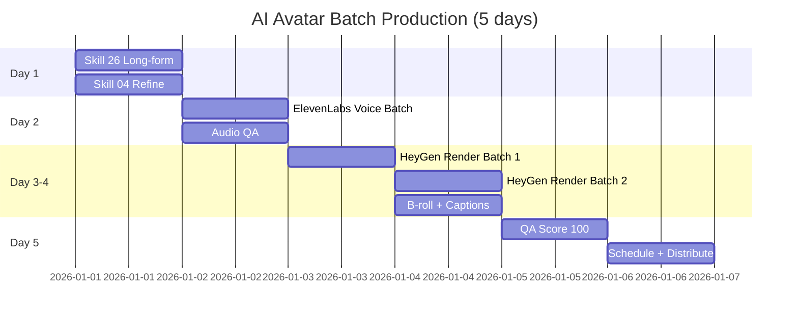

# Workflow: AI Avatar Batch Production (30 Videos / 5 Days)

> Batch san xuat 30 video AI avatar trong 5 ngay — huong dan tung ngay cho nguoi muon dump 1 thang content.

---

## 1. Workflow nay danh cho ai?

```
Doi tuong: Creator / Agency / Founder muon batch 30 video AI avatar trong 5 ngay
Ket qua sau 5 ngay:
  - 30 video AI avatar ready to publish (30-60s moi video)
  - QA score trung binh 85+/100
  - Cost per video <$2 (tong <$60)
  - Schedule day du tren 1-3 platform
Thoi gian: 5 ngay × 5 gio = 25 gio total
Skills su dung: 22 (or product) → 26 → 04 (Personal Brand) → 24 → 25 → 01
Output: 30 video files + audio + scripts + tracking sheet
```

**Phu hop voi:**
- Creator co batch content schedule (1 thang content/lan)
- Agency lam content cho client (deliverable hang thang)
- Founder muon dump 1 thang content roi tap trung viec khac

**Pre-requisite:**
- Da co `.agents/personal-brand-context.md` (skill 22) HOAC product context day du
- Da setup tool tier Pro: HeyGen Creator $30/thang ($30 ≈ 765,000 VND) hoac tuong duong
- Da co voice clone setup (skill 24 + 25) va test thanh cong 1 video

**KHONG danh cho:**
- Lan dau dung AI avatar — chay skill 24 truoc de hieu pipeline
- Khong co tool tier Pro (free tier khong du quota cho 30 video)
- Chua co context/strategy file (content se khong nhat quan)

---

## 2. Pre-flight Checklist

Hoan thanh 10 muc nay TRUOC khi bat dau Ngay 1:

- [ ] Da chay skill 22 (personal context) HOAC co product context file ro rang
- [ ] Da chay skill 24 — voice clone va avatar setup xong, da test 1 video pipeline
- [ ] Subscription HeyGen/Synthesia tier Pro (it nhat 10 video/thang quota)
- [ ] Co 30 ideas san sang (chay skill 26 thought-leadership hoac skill 04)
- [ ] Co disclosure template ready: `references/ai-video-disclosure-vn.md`
- [ ] Co backup storage 30GB free (~1GB/video × 30, MP4 1080p)
- [ ] Co landing page hoac noi dat link CTA (Linktree, Carrd, hoac website rieng)
- [ ] Da test 1 video pipeline xuyen suot (workflow 1 trong skill 24) — ket qua tot
- [ ] Co 5 ngay free trong lich (khong meeting bat ngo, khong travel)
- [ ] Tracking sheet (Google Sheet) ready voi cot: ID, script, audio, video, QA, schedule

> **Chua du?** Hoan thanh cac muc thieu roi quay lai. Skip pre-flight = burn budget + burn out.

---

## 3. Step-by-step: 5 Ngay × 25 Gio Total

### Ngay 1: Script Batch (5 gio)

**Muc tieu ngay:** 30 script 30-60s da viet xong, da QA, ready cho voice render.

**Sang (2.5 gio): Long-form ideas → Short scripts**
- Chay `/skill 26-thought-leadership-content` voi 15 long-form ideas
- Cut moi long-form thanh 2 angle ngan → tong 30 video script 30-60s
- Tap trung: 1 hook 3 giay + setup 10s + insight 25-30s + CTA 5-10s
- Output: `/scripts/batch-[date]/01.md` den `/scripts/batch-[date]/30.md`

**Chieu (2.5 gio): Refine theo Personal Brand structure**
- Chay `/skill 04-script-video` Personal Brand Mode
- Refine 30 scripts: kiem tra brand voice, tone, keywords nhat quan
- Cau truc cuoi: Hook + Setup + Insight + CTA (dung mau 30s)
- Doc to thanh tieng moi script — nghe tu nhien khong?

**QA gate cuoi ngay (10 phut):**
- [ ] Moi script co hook + setup + insight + CTA day du
- [ ] Do dai 30-60s (dem ~150-200 tu/script)
- [ ] Brand voice nhat quan (giong nhau giua 30 script)
- [ ] Khong co cau ban dam, khong sai chinh ta

> Burn day la script khong tot → 30 video sau cung khong cuu duoc. KHONG rush qua ngay 2.

---

### Ngay 2: Voice Batch (5 gio)

**Muc tieu ngay:** 30 audio file MP3 chat luong cao, da QA, ready cho avatar render.

**Sang (3 gio): ElevenLabs API batch render**
- Upload 30 script vao ElevenLabs (Pro tier $22/thang)
- Cost estimate: 30 × 60s × ~150 char/s = ~270K chars
- Cost ≈ $30 (su dung credit cua Pro tier = ~$22 base + extra credits)
- Render parallel — ElevenLabs API ho tro batch
- Output: 30 audio files MP3 in `/audio/batch-[date]/01.mp3` → `30.mp3`

**Chieu (2 gio): Audio QA — 5 tieu chi**
- Clarity (1-10): nghe ro tung tu khong, co bi mumble khong?
- Pace (1-10): toc do tu nhien, khong qua nhanh/cham?
- Pause (1-10): ngat cau tu nhien, khong robot-like?
- No clipping (pass/fail): khong co tieng vo dau (audio dao dong qua nguong)?
- Emotion match (1-10): cam xuc khop voi noi dung (humor, serious, excited)?

**Re-render rule:**
- Audio nao score < 7/10 hoac fail clipping → re-render voi prompt khac
- Toi da 2 lan re-render moi audio — neu van fail, edit script va render lai

> Dung skip QA — audio kem se kem theo lipsync kem va waste budget render avatar.

---

### Ngay 3: Avatar Render Batch Part 1 (5 gio)

**Muc tieu ngay:** 15 video AI avatar render xong, QA xong.

**Sang (1 gio): Setup batch render**
- Vao HeyGen → API Batch Render
- Upload 15 audio files dau tien (01-15)
- Match voi avatar template: dung 2-3 avatars (khong dung 1 cho tat ca de tranh "AI feel")
- Aspect ratio: 9:16 cho TikTok/Reels, 16:9 cho YouTube/LinkedIn
- Bat dau render → wait 2-3 gio

**Chieu (4 gio): Wait + QA from cua so render**
- Trong khi render: lam viec khac, check progress 30 phut/lan
- Moi video render xong: QA ngay theo 4 tieu chi:
  - Lipsync (1-10): mieng khop am thanh khong?
  - Gesture (1-10): cu chi tay/than tu nhien?
  - Eye contact (1-10): mat nhin camera tu nhien?
  - Background (pass/fail): background co glitch khong?
- Re-render rule: video < 7/10 → re-render voi avatar khac hoac trim audio

**Output:** 15 videos in `/videos/batch-[date]/01.mp4` → `15.mp4`

---

### Ngay 4: Avatar Render Batch Part 2 + B-roll (5 gio)

**Muc tieu ngay:** 30 video hoan chinh, co caption + brand overlay.

**Sang (3 gio): HeyGen render 15 video remaining (16-30)**
- Same flow nhu ngay 3: upload → render → QA
- Trong khi render: chuan bi B-roll assets (logo, CTA card, music bed)

**Chieu (2 gio): B-roll batch — caption + branding**
- Tool: Captions (auto-caption tieng Viet) + CapCut (edit final)
- Workflow:
  1. Import video vao Captions → auto-generate Vietnamese subtitles
  2. Review caption (ASR Vietnam ~85% accuracy → can fix)
  3. Export vao CapCut
  4. Add: brand logo (top-right), CTA card (cuoi video 3s), background music low-volume
- Batch: 30 video × 4 phut/video = 2 gio (dung CapCut template de speed up)

**Output:** 30 final videos ready trong `/videos/final/01.mp4` → `30.mp4`

---

### Ngay 5: QA + Schedule + Distribution (5 gio)

**Muc tieu ngay:** 30 video da QA score 100, da disclosure, da schedule.

**Sang (2.5 gio): QA Score 100**
- Chay QA Score 100 cho 30 videos (skill 24, chuong 12)
- 5 phut/video × 30 = 2.5 gio
- 5 dimensions: Lipsync (20) + Voice (20) + Visual (20) + Script (20) + CTA (20)
- Target: trung binh 85+/100, khong video nao < 70

**Chieu (1 gio): Disclosure check**
- Chuong 11 skill 24 — disclosure rules per platform
- TikTok: AIGC label trong setting
- Reels: Meta AI disclosure trong description
- LinkedIn: text disclosure trong post body
- Tat ca: caption co dong "Created with AI assistance" hoac tuong duong

**Chieu (1.5 gio): Schedule + Distribution**
- Tool: Buffer ($6/thang), Hootsuite, hoac native scheduler tung platform
- TikTok: 30 video × 1/ngay = 30 ngay (post 19-21h gio VN)
- Reels: cross-post 30 video same schedule
- LinkedIn: chon 10 video QA score >= 80 (post 8-9h sang gio VN)
- Tracking sheet update: post date, platform, expected reach, actual reach (fill sau)

**Final celebration:** Ban da co 30 ngay content trong 5 ngay. Time to focus on khac.

---

## 4. Skills Chain & Timeline

### Mermaid Gantt Chart



### Skills Chain (Text)

```
22 (Context) or product context
  → 26 (Thought Leadership)
  → 04 (Video Script - Personal Brand Mode)
  → 24 (AI Avatar - batch workflow)
  → 25 (Voice Clone)
  → 01 (Lich noi dung - schedule)
```

### Output Files Map

| Ngay | Skill | Output |
|------|-------|--------|
| 1 | 26 | 15 long-form ideas (mental model) |
| 1 | 04 | `/scripts/batch-[date]/01-30.md` |
| 2 | 25 | `/audio/batch-[date]/01-30.mp3` |
| 3-4 | 24 | `/videos/batch-[date]/01-30.mp4` raw |
| 4 | — | `/videos/final/01-30.mp4` (caption + brand) |
| 5 | 01 | Schedule sheet + distribution log |

---

## 5. Success Criteria

### Tieu chi sau 5 ngay batch

| Tieu chi | Min | Tot |
|----------|-----|-----|
| Videos completed | 25/30 | 30/30 |
| QA score average | 70 | 85+ |
| Cost per video | $5 | <$2 |
| Disclosure compliance | 100% (BAT BUOC) | 100% |
| Schedule done | 80% scheduled | 100% scheduled |

### KPI Tracking sau 30 ngay distribute

Sau khi 30 video da release het tren platform, do:

- **Avg view per video:** Trung binh view tren toan bo 30 video
- **Engagement rate per video:** (Like + Comment + Share) / View
- **Top 3 video by reach:** 3 video cao nhat — replicate angle/hook trong batch sau
- **Bottom 3 by reach:** 3 video thap nhat — analyze why (script? hook? thumbnail?)
- **Best posting time:** Gio post nao co engagement cao nhat?

> Dung data nay lam baseline cho `personal-brand-monthly` thang sau.

---

## 6. Common Pitfalls (10 Loi Batch Production)

### 1. Render fail giua chung
**Van de:** 5-10 video fail render giua chung, mat thoi gian re-upload.
**Nguyen nhan:** Voice file wrong format (sample rate, bit rate khong dung).
**Cach fix:** Check audio specs truoc upload — 44.1kHz, 16-bit, MP3/WAV.

### 2. Lipsync lech 50% videos
**Van de:** Mieng avatar khong khop am thanh, video xem rat fake.
**Nguyen nhan:** Voice clone qua khac giong goc hoac toc do noi qua nhanh.
**Cach fix:** Re-record voice sample ngon hon, slower pace. Test 1 video truoc batch.

### 3. Avatar look qua "AI"
**Van de:** Audience comment "fake", "AI generated", giam trust.
**Nguyen nhan:** Same avatar template all 30 videos → uncanny valley.
**Cach fix:** Rotate 2-3 avatars, them small variations (background, outfit).

### 4. Cost vuot ngan sach 3x
**Van de:** Du tinh $60, cuoi cung ton $180+.
**Nguyen nhan:** Chua tinh re-render cost. Moi re-render = full credit.
**Cach fix:** Reserve 30% budget for re-renders. Test 1 pipeline truoc khi batch full.

### 5. Disclosure quen 5 video
**Van de:** Bi platform flag, account warning, mat reach 50%.
**Nguyen nhan:** No checklist, dang bai vol, quen step disclosure.
**Cach fix:** Make disclosure mandatory step trong tracking sheet — khong tick = khong post.

### 6. Captions sai chinh ta VN
**Van de:** Caption tieng Viet sai 30%, audience laugh at typos.
**Nguyen nhan:** ASR (auto speech recognition) Vietnam chua chuan ~85%.
**Cach fix:** Review by human (5 phut/video). Khong skip step nay du dung Captions Pro.

### 7. Hashtag spam
**Van de:** Algorithm flag spam, reach giam dot ngot.
**Nguyen nhan:** Copy paste cung 1 set hashtag 30 video.
**Cach fix:** Research hashtag per topic. Trade off: 5-7 hashtag relevant > 30 hashtag generic.

### 8. Burn out ngay 4
**Van de:** Met moi, bo do giua chung, batch khong xong.
**Nguyen nhan:** Qua nhieu render wait time → cam giac stuck.
**Cach fix:** Batch render overnight. Ngay 4 chi can review ket qua ngay 3 va prepare B-roll.

### 9. Storage day
**Van de:** Computer day o, render fail, mat data.
**Nguyen nhan:** 30 video × 1GB = 30GB, chua tinh raw audio + drafts.
**Cach fix:** Use cloud sync (GDrive Pro 200GB $30/nam, Dropbox tuong duong). Sync lien tuc.

### 10. Audience met
**Van de:** Dump 30 video 30 ngay lien tuc → audience overwhelmed → unfollow.
**Nguyen nhan:** Khong space out. Khong mix format.
**Cach fix:** Space out: 4-5 video/tuan thay vi 1 video/ngay. Mix voi live content + carousel.

---

## 7. AI Research Prompts

5 prompts san sang dung trong qua trinh batch:

### Prompt 1: Phan tich viral patterns

```
Phan tich 30 video AI Avatar viral nhat thang [X]/2026 trong nganh [niche] tai VN.
Common pattern la gi? Hook nao tot nhat? Do dai trung binh? CTA placement?
Cho bang so sanh 30 video va 5 takeaways de ap dung vao batch cua toi.
```

**Muc dich:** Hieu xu huong viral truoc khi viet 30 script. Chay truoc Ngay 1.
**Output ky vong:** Bang phan tich + 5 actionable insights.

### Prompt 2: Cluster ideas thanh themes

```
Toi co 30 ideas: [paste 30 ideas].
Help me cluster vao 6 themes (5 video/theme) de batch theo theme.
Moi theme: ten, pillar, target audience, hook chung, CTA chung.
```

**Muc dich:** Co cau truc theo theme thay vi 30 ideas roi rac. Chay Ngay 1 sang.
**Output ky vong:** 6 theme clusters voi 5 video/theme.

### Prompt 3: So sanh tier subscription

```
Ngan sach $X de batch 30 video AI avatar tieng Viet trong 5 ngay.
So sanh: HeyGen Creator $30 vs Synthesia Starter $30 vs Captions Pro $24.
Tieu chi: tieng Viet quality, lipsync, avatar variety, batch API support.
Recommend top 1 va backup option.
```

**Muc dich:** Chon tier tot nhat truoc khi commit. Chay truoc pre-flight.
**Output ky vong:** Bang so sanh + recommend cu the.

### Prompt 4: Optimal post time per platform

```
Toi vua quay 30 video va dang scheduling.
Audience VN, age [X], gioi [Y], niche [Z].
Optimal post time per platform (TikTok / Reels / LinkedIn) cho audience nay?
Cho schedule template 30 ngay voi gio post toi uu.
```

**Muc dich:** Maximize reach voi optimal timing. Chay Ngay 5.
**Output ky vong:** Schedule template 30 ngay × 3 platform.

### Prompt 5: Detective mode cho video that bai

```
Toi co 1 video trong batch 30 that bai (< 100 view sau 48h).
Video: [paste link hoac script].
Audience: [mo ta]. Posting time: [gio].
Tro thanh detective: 5 nguyen nhan co the va 5 hypothesis test cho batch sau.
```

**Muc dich:** Hoc tu failure de cai thien batch sau. Chay sau khi distribute 7-14 ngay.
**Output ky vong:** Root cause analysis + actionable hypotheses.

---

## 8. Resources & Next Steps

### Workflow tiep theo

| Workflow | Khi nao dung | Mo ta |
|----------|-------------|-------|
| `personal-brand-monthly` | Cuoi thang sau distribute | Review data + plan thang sau |
| `content-production` | Hang tuan | San xuat content batch nho hon (5-10 video) |
| `monthly-cycle` | Cuoi thang | Bao cao + dieu chinh strategy |

### Skills lien quan

- `01-lich-noi-dung` — Schedule content tren platform
- `13-phan-tich-du-lieu` — Phan tich performance sau distribute
- `24-ai-avatar-production` — Chi tiet batch workflow + QA Score 100
- `25-voice-clone-podcast` — Voice clone setup
- `26-thought-leadership-content` — Long-form ideas

### Tool docs (placeholder)

- HeyGen API: https://docs.heygen.com (batch render endpoint)
- ElevenLabs API: https://elevenlabs.io/docs (voice clone + render)
- Captions API: https://www.captions.ai (auto-caption Vietnam)
- Cost calculator template: [Google Sheet link — TBD release]

### Video demo

```
Tutorial: 30 video AI Avatar trong 5 ngay
- Video se link sau khi quay — TBD YouTube link
- Quay khi: ~7 ngay sau khi v2.4.0 release
- Do dai du kien: 7-10 phut
- Noi dung: Walkthrough Ngay 1-5, demo HeyGen + ElevenLabs batch
```

---

## Checklist truoc khi bat dau

- [ ] Da hoan thanh Pre-flight Checklist (Section 2) — du 10/10 muc
- [ ] Da chay skill 24 va test 1 video pipeline thanh cong
- [ ] Da block 5 ngay × 5 gio trong lich
- [ ] Da doc qua toan bo workflow nay 1 lan
- [ ] San sang bat dau Ngay 1 voi `/skill 26-thought-leadership-content`

> **Ban da san sang!** Bat dau Ngay 1 bang lenh: `/skill 26-thought-leadership-content`
