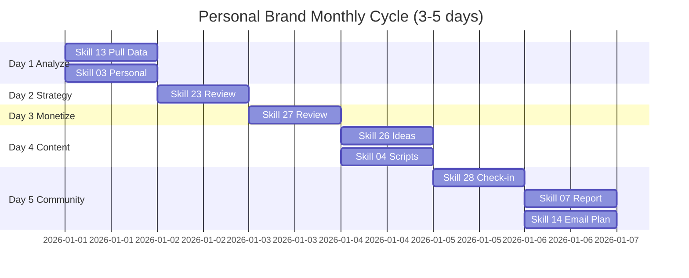

# Workflow: Personal Brand Monthly Cycle (Review + Adjust)

> Cuoi moi thang — review data, dieu chinh strategy, plan content cho thang sau. 3-5 ngay/cycle.

---

## 1. Workflow nay danh cho ai?

```
Doi tuong: Founder / Coach / Creator da hoan thanh `personal-brand-launch`
           va dang vao thang 2+ van hanh personal brand.
Ket qua sau 3-5 ngay:
  - Bao cao MoM growth chi tiet (followers, engagement, revenue)
  - Strategy file da update theo data thuc te
  - Offer ladder da review hieu suat
  - Lich content 30 ngay tiep theo da plan
  - Community check-in da xong (NPS + feedback)
Thoi gian: 3-5 ngay × 4-5 gio = 15-25 gio total
Skills su dung: 13 → 03 (Personal) → 23 → 27 → 26 → 04 (Personal) → 07 (Personal) → 28 → 14
Output: 5 file .md + 1 lich content + 1 community recap
```

**Pre-requisite:**
- Da chay xong workflow `personal-brand-launch` 30 ngay
- Co data thang truoc — toi thieu 1 thang full data
- Co `.agents/personal-brand-context.md` va `personal-brand-strategy-*.md` da fill
- Da identify duoc top 5 / bottom 5 posts thang truoc

**KHONG danh cho:**
- Nguoi moi launch (chua du 1 thang data) → quay lai `personal-brand-launch`
- Nguoi muon onboard client moi → dung `client-onboard` workflow
- Nguoi can batch san xuat content → dung `ai-avatar-batch`

---

## 2. Pre-flight Checklist

Hoan thanh 10 muc nay TRUOC khi bat dau Ngay 1:

- [ ] Co data thang truoc day du (followers count, engagement, post performance)
- [ ] Da export top 5 posts (highest engagement) tu nen tang chinh
- [ ] Da export bottom 5 posts (lowest engagement) tu nen tang chinh
- [ ] Co `.agents/personal-brand-context.md` (skill 22 da fill xong)
- [ ] Co `personal-brand-strategy-*.md` thang truoc (skill 23)
- [ ] Co `monetize-*.md` thang truoc (skill 27, neu co)
- [ ] Da ghi lai baseline KPI tu thang launch (followers/ngay, engagement rate)
- [ ] Co revenue data thang truoc (neu da launch offer)
- [ ] Co 3-5 ngay × 4-5 gio free trong lich tuan toi
- [ ] Da chuan bi tinh than: san sang KILL idea khong work, KHONG bao thu

> **Chua du data?** Cho them 2 tuan de tich luy. KHONG decide tren 1 tuan data.

---

## 3. Step-by-step: 3-5 Ngay × 4-5 Gio/Ngay

### Ngay 1: Analyze Data (4-5 gio)

**Muc tieu ngay:** Hieu sau du lieu thang truoc — dau la win, dau la lose.

**Sang (2 gio): Pull data + skill 13**
- Chay `/skill 13-phan-tich-du-lieu`
- Pull data tu nen tang chinh (LinkedIn Analytics / TikTok Analytics / FB Insights)
- Neu co MCP ads ket noi: pull tu Meta Official MCP / Pipeboard
- Metrics can co: Impressions, Reach, Engagement, Profile visits, Followers growth, Click rate
- Output: `phan-tich-du-lieu-personal-brand-thang-[M]-[YYYYMMDD].md`

**Chieu (2-3 gio): Skill 03 Personal Brand mode**
- Chay `/skill 03-danh-gia-hieu-suat` voi Personal Brand context
- Phan tich top 5 posts: hook nao? format nao? gio dang nao? topic nao?
- Phan tich bottom 5 posts: tai sao flop? hook yeu? sai audience? sai timing?
- Tim PATTERN — khong tap trung 1 post le te
- Cau hoi key: "Neu lam lai thang nay, toi se KHONG lam gi?"

**QA gate cuoi ngay (15 phut):**
- [ ] Da identify 3 thanh cong cu the (con so + ly do)
- [ ] Da identify 3 that bai cu the (con so + ly do)
- [ ] Da liet ke 5 hypothesis can test thang sau
- [ ] Khong rush sang Ngay 2 neu insight con mo ho

> Burn day la phan tich qua loa → dieu chinh sai → mat them 1 thang nua.

---

### Ngay 2: Update Strategy (4-5 gio)

**Muc tieu ngay:** Strategy file phan anh data thuc te, khong con la "ke hoach gia thuyet".

**Sang (2 gio): Skill 23 quick review**
- Chay `/skill 23-personal-brand-strategy` voi flag `--review-mode`
- Mo `personal-brand-strategy-*.md` thang truoc
- Doi voi tung phan, hoi: "Data co confirm phan nay khong?"
  - Niche positioning con phu hop? Audience response co dung target khong?
  - Story arc dang work? Audience engage chuong nao nhieu nhat?
  - 3 content pillars — pillar nao perform tot/te? Co can adjust ratio?
- KHONG xoa strategy cu — version it: tao file moi co suffix `-v2`

**Chieu (2-3 gio): Refine + finalize**
- Update niche neu can (thu hep them, hoac xoay 30-45 do)
- Adjust pillar ratio: vi du tu 33/33/33 → 50/30/20 neu co pillar dominate
- Update brand voice neu phat hien tone moi work tot
- Output: `personal-brand-strategy-[ten]-[YYYYMMDD]-v2.md`

**Nguyen tac:** Nho/SMALL adjustments. KHONG redo toan bo strategy thang nao cung. Brand build tu nhat quan, khong tu xoay quanh truc.

---

### Ngay 3: Update Monetize (4-5 gio)

**Muc tieu ngay:** Hieu offer ladder thuc te dang work nhu the nao, dieu chinh.

**Sang (2 gio): Review offer performance**
- Chay `/skill 27-personal-brand-monetize` voi flag `--review-mode`
- Mo file monetize thang truoc
- Voi moi nac offer (Free / Tripwire / Core / Premium / Elite):
  - Bao nhieu nguoi vao? (top of funnel)
  - Bao nhieu chuyen doi sang nac sau? (conversion rate)
  - Doanh thu thuc te vs target?
  - LTV trung binh moi nac?
- Tim bottleneck: nac nao lam roi qua nhieu nguoi?

**Chieu (2-3 gio): Adjust offer ladder**
- Neu nac Free hut nguoi nhung Tripwire convert thap → adjust price/value Tripwire
- Neu Core sold out nhung Premium khong ai mua → tao buoc trung gian
- Neu Elite sold out → tang gia hoac tao "VIP wait list"
- Update file: `monetize-[ten]-[YYYYMMDD]-v2.md`

**Soft sell content review:**
- Bai soft sell nao convert tot nhat? Pattern la gi (story? case study? framework?)
- Lam content theme tuong tu cho thang sau

---

### Ngay 4: Plan Next 30 Days Content (4-5 gio)

**Muc tieu ngay:** 30-day content plan cu the, khong con tu hoi "hom nay viet gi?"

**Sang (2 gio): Skill 26 — Long-form ideas**
- Chay `/skill 26-thought-leadership-content`
- Generate 12-15 long-form ideas cho thang sau
- Ưu tien topic dua tren top 5 posts thang truoc — extension/deepen
- Mix theo pillar ratio moi (vd 50/30/20)
- Moi idea: tieu de + hook + key message + CTA preview

**Chieu (2-3 gio): Skill 04 — Video scripts (Personal Brand mode)**
- Chay `/skill 04-script-video` Personal Brand Mode
- Cut moi long-form thanh 1-2 short video → tong 18-25 video script
- Neu dung AI avatar: chuan bi cho `ai-avatar-batch` workflow ngay sau
- Schedule preview tren Buffer/Later — drag-drop vao calendar

**Output:**
- `lich-noi-dung-thang-[M+1]-[YYYYMMDD].md`
- `script-video-batch-[YYYYMMDD].md` (12-15 long-form + 18-25 short)

---

### Ngay 5: Community Check-in (4-5 gio)

**Muc tieu ngay:** Hieu suc khoe community + report tong + plan thang sau ready.

**Sang (2 gio): Skill 28 — Community check-in**
- Chay `/skill 28-community-building` voi flag `--monthly-checkin`
- Pull data community: members tang/giam, post activity, response time
- Tao NPS poll trong group: "Tu 0-10, ban se gioi thieu group nay cho ban be?"
- Doc 20-30 comments gan day — ghi 5 themes lon nhat audience quan tam

**Chieu (2-3 gio): Skill 07 + Skill 14**
- Chay `/skill 07-bao-cao-marketing` Personal Brand mode
- Tong hop bao cao thang: growth + engagement + revenue + community NPS
- Format: 1-page executive summary + appendix data day du
- Chay `/skill 14-email-marketing` neu co newsletter — lap email plan thang sau
- Output cuoi: `bao-cao-personal-brand-thang-[M]-[YYYYMMDD].md`

**Final celebration (15 phut):**
- Doc lai bao cao tu dau den cuoi
- Ghi 3 dieu tu hao + 1 dieu can hoc
- Share milestone voi 1 nguoi than/mentor — accountability quan trong

**Milestone cycle:** 5 file output + 30-day content plan ready + offer ladder v2 + strategy v2.

---

## 4. Skills Chain & Timeline

### Mermaid Gantt Chart



### Skills Chain (Text)

```
13 (Phan tich du lieu) → 03 (Danh gia hieu suat - Personal mode)
  → 23 (Strategy review) → 27 (Monetize review)
  → 26 (Long-form ideas) → 04 (Video scripts - Personal mode)
  → 07 (Bao cao Personal mode) → 28 (Community check-in)
  → 14 (Email plan)
```

### Output Files Map

| Ngay | Skill | File output |
|------|-------|-------------|
| 1 | 13 | `phan-tich-du-lieu-personal-brand-thang-[M]-[YYYYMMDD].md` |
| 1 | 03 | `danh-gia-hieu-suat-personal-thang-[M]-[YYYYMMDD].md` |
| 2 | 23 | `personal-brand-strategy-[ten]-[YYYYMMDD]-v2.md` |
| 3 | 27 | `monetize-[ten]-[YYYYMMDD]-v2.md` |
| 4 | 26+04 | `lich-noi-dung-thang-[M+1]-[YYYYMMDD].md` + `script-video-batch-[YYYYMMDD].md` |
| 5 | 28 | `community-checkin-thang-[M]-[YYYYMMDD].md` |
| 5 | 07 | `bao-cao-personal-brand-thang-[M]-[YYYYMMDD].md` |

---

## 5. Success Criteria

### Tieu chi sau cycle (cuoi Ngay 5)

| Tieu chi | Min | Tot | Cach do |
|----------|-----|-----|---------|
| MoM Followers growth | +10% | +20%+ | (Followers cuoi - dau) / dau thang |
| Engagement trend | On dinh | Tang | Engagement rate thang nay vs thang truoc |
| Revenue MoM | On dinh | +30%+ | Doanh thu offer ladder thang nay vs truoc |
| Community NPS | 7+ | 9+ | Trung binh poll 0-10 |
| 30-day content plan | 80% xong | 100% xong | So bai/script da prep san |
| Strategy v2 published | Co | Co + share | File da save + da review |

### KPI Baseline cap nhat

Sau cycle, update baseline cho thang tiep theo:

- **Followers growth rate moi:** X followers/ngay (so voi thang truoc)
- **Engagement rate moi:** Y% (so voi benchmark cua chinh ban thang truoc)
- **Best content format:** Format nao tot nhat 2 thang lien tiep?
- **Best pillar:** Pillar nao on dinh perform top 2 thang lien tiep?
- **Top revenue offer:** Offer nao dem revenue cao nhat?

> Dung cac so nay lam baseline cho cycle tiep theo, hoac feed nguoc vao `personal-brand-launch` neu chuan bi launch them brand thu 2.

---

## 6. Common Pitfalls (10 Loi Newbie Hay Mac Khi Lam Monthly Review)

### 1. Chi nhin metric thang nay khong baseline
**Van de:** "1,000 followers — tot khong?" Khong biet vi khong so voi gi.
**Nguyen nhan:** Khong ghi lai baseline thang truoc, khong setup tracking sheet.
**Cach fix:** Tracking sheet co cot "Last month" + "This month" + "Delta %". Update moi monthly cycle.

### 2. Qua ambitious adjust strategy
**Van de:** Doi niche + doi audience + doi format trong 1 cycle → audience confused → unfollow.
**Nguyen nhan:** Thay 1 thang khong viral → panic → muon "reset toan bo".
**Cach fix:** Quy tac 80/20 — 80% giu, 20% adjust. Chi doi 1 yeu to lon mot luc, observe 30 ngay roi adjust tiep.

### 3. So sanh voi creator lon
**Van de:** "Anh A 100K followers thang nay — toi 1K, that bai!"
**Nguyen nhan:** Khong tinh den thoi gian build, ngan sach, va niche khac biet.
**Cach fix:** So voi BAN THAN thang truoc, khong so voi nguoi khac. Survivorship bias la ke thu lon nhat.

### 4. Skip community check-in
**Van de:** Chi nhin number — khong hieu audience cam thay sao → mat audience im lang.
**Nguyen nhan:** Number de do, sentiment kho do → bo qua.
**Cach fix:** Skill 28 BAT BUOC trong cycle. Doc 20-30 comments la minimum.

### 5. Khong action sau khi review
**Van de:** Review xong → file dep → khong thay doi gi cu the trong thang sau.
**Nguyen nhan:** Insight chung chung "engagement giam" → khong biet lam gi.
**Cach fix:** Moi insight phai co 1 hanh dong cu the cho thang sau, voi deadline.

### 6. Khong KILL idea khong work
**Van de:** Pillar A engagement -50% nhung van keep vi "toi yeu pillar nay".
**Nguyen nhan:** Emotional attachment voi y tuong cu.
**Cach fix:** Data dictate. Pillar engagement < 50% benchmark → kill hoac major adjust trong 2 cycle.

### 7. Bao cao chi cho minh, khong share
**Van de:** Bao cao long → minh quen → cycle sau van mac loi cu.
**Nguyen nhan:** Khong co accountability — minh tu doc tu phan.
**Cach fix:** Share executive summary voi 1 mentor/peer. Discuss 30 phut. Insight tang 3x.

### 8. Plan content thang sau qua chi tiet
**Van de:** Plan 30 ngay × 3 platform × 5 details/post → met → bo do giua tuan 1.
**Nguyen nhan:** Perfectionism. Plan qua chi tiet = burn out.
**Cach fix:** 30 idea + 50% script ready la du. Detail gan ngay dang.

### 9. Khong refresh creative format
**Van de:** Lam 1 format 3 thang lien tiep → audience boring → engagement decay.
**Nguyen nhan:** Format do work thang truoc → keep doing → diminishing return.
**Cach fix:** Moi cycle test 1 format moi (carousel/poll/live/podcast). 80% giu format work, 20% experiment.

### 10. Cycle qua dai
**Van de:** Lam 7-10 ngay → mat focus chinh → bo do giua chung.
**Nguyen nhan:** Qua chi tiet, qua perfectionism, qua nhieu sub-task.
**Cach fix:** Tap trung 5 ngay max. Khong xong → noi "75% du" — chuyen sang thang sau, hoan thien dan.

---

## 7. AI Research Prompts

5 prompts san sang dung trong qua trinh review:

### Prompt 1: Phat hien pattern tu top/bottom posts

```
Toi co top 5 va bottom 5 posts thang nay:
[Paste 10 posts: tieu de + hook + format + engagement number]
Tim 3 pattern khac biet giua top va bottom.
Hypothesis: tai sao top win, tai sao bottom flop?
Cho 5 idea ap dung pattern top vao thang sau.
```

**Muc dich:** Tim viet content tot hon thay vi guess. Chay Ngay 1 chieu.
**Output ky vong:** 3 pattern + 5 actionable ideas.

### Prompt 2: Strategy review checklist

```
Day la strategy thang truoc cua toi: [paste strategy]
Day la data thuc te thang nay: [paste data summary]
Tim 3 phan strategy KHONG match data.
Goi y: dieu chinh thu hep / mo rong / xoay 30-45 do?
Tao strategy v2 tu data nay (giu 80%, adjust 20%).
```

**Muc dich:** Strategy reflect data, khong la wishful thinking. Chay Ngay 2.
**Output ky vong:** Diff strategy v1 vs v2 + ly do tung thay doi.

### Prompt 3: Offer ladder bottleneck

```
Offer ladder cua toi: [paste ladder voi gia + capacity]
Data conversion thang nay: [paste so nguoi va doanh thu tung nac]
Tim bottleneck: nac nao mat nhieu nguoi nhat?
Cho 3 hypothesis va 3 thinghi can test thang sau.
```

**Muc dich:** Toi uu funnel thay vi guess. Chay Ngay 3.
**Output ky vong:** Bottleneck analysis + 3 test plans.

### Prompt 4: Content plan 30 ngay

```
Top 5 posts thang truoc: [paste 5 posts]
Pillar ratio dieu chinh: [vd 50/30/20]
Audience feedback chinh: [3 themes lon nhat tu comments]
Lap content plan 30 ngay sau:
- 12-15 long-form ideas (theo pillar ratio)
- 18-25 short video angles (cut tu long-form)
- Schedule template moi tuan
```

**Muc dich:** Content plan dua tren data, khong tu nhien sinh. Chay Ngay 4.
**Output ky vong:** 30-day plan ready de schedule.

### Prompt 5: NPS feedback synthesis

```
Toi co 30 phan hoi tu community NPS poll:
[paste 30 comments]
Synthesize:
- 5 thing audience love (keep doing)
- 5 thing audience want more (do more)
- 3 thing audience confused/dislike (fix or remove)
Cho 1-page action plan cho thang sau.
```

**Muc dich:** Lang nghe community thay vi guess. Chay Ngay 5 sang.
**Output ky vong:** 1-page action plan dua tren feedback that.

---

## 8. Resources & Next Steps

### Workflows tiep theo

| Workflow | Khi nao dung | Mo ta |
|----------|-------------|-------|
| `ai-avatar-batch` | Sau Ngay 4 cycle nay | Batch 30 video AI avatar tu scripts da prep |
| `content-production` | Hang tuan trong thang | San xuat content batch nho theo plan |
| `personal-brand-launch` | Khi launch brand thu 2 | Lap brand moi tu con so 0 (founder hoac coach 2nd brand) |

### Skills lien quan

- `13-phan-tich-du-lieu` — Pull va phan tich data tu nen tang
- `03-danh-gia-hieu-suat` — Personal mode focus on personal brand metrics
- `23-personal-brand-strategy` — Review + adjust strategy
- `26-thought-leadership-content` — Long-form ideas cho thang sau
- `27-personal-brand-monetize` — Offer ladder review
- `28-community-building` — Monthly check-in flow
- `07-bao-cao-marketing` — Personal mode executive summary

### Docs tham khao

- `docs/getting-started-personal-brand.md` — Cam nang 8 chuong cho nguoi moi
- `skills/references/mcp-ads-integration.md` — MCP ads de pull data tu dong
- `skills/references/hook-formulas-vn.md` — Re-use cho content plan thang sau

### Video demo

```
Tutorial Monthly Cycle Personal Brand:
- Video: [Se link sau khi quay — TBD YouTube link]
- Quay khi: ~14 ngay sau khi v2.4.0 release
- Do dai du kien: 6-8 phut
- Noi dung: Walkthrough 5 ngay, demo skill 13 + 03 + 23 review
```

---

## Checklist truoc khi bat dau

- [ ] Da hoan thanh Pre-flight Checklist (Section 2) — du 10/10 muc
- [ ] Da co data thang truoc day du (toi thieu 1 thang full)
- [ ] Da block 3-5 ngay × 4-5 gio trong lich tuan toi
- [ ] Da doc qua toan bo workflow nay 1 lan
- [ ] San sang bat dau Ngay 1 voi `/skill 13-phan-tich-du-lieu`

> **Ban da san sang!** Bat dau Ngay 1 bang lenh: `/skill 13-phan-tich-du-lieu`
